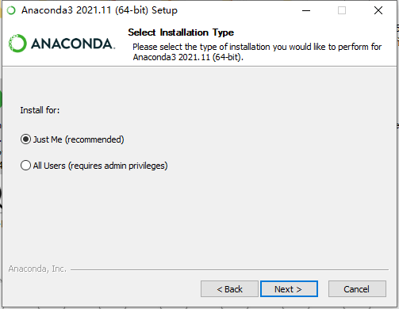
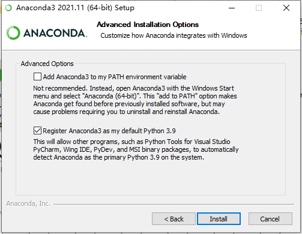
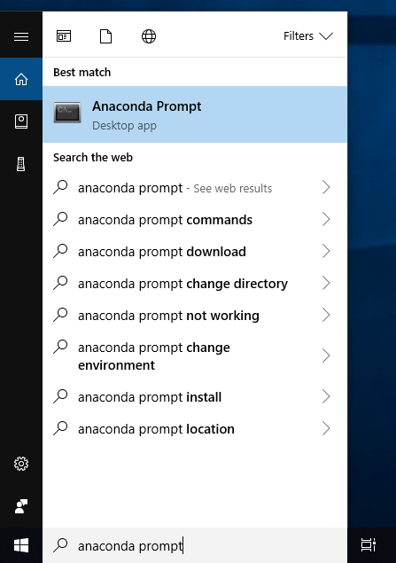
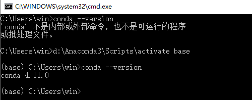
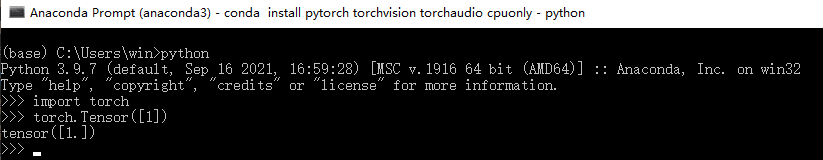
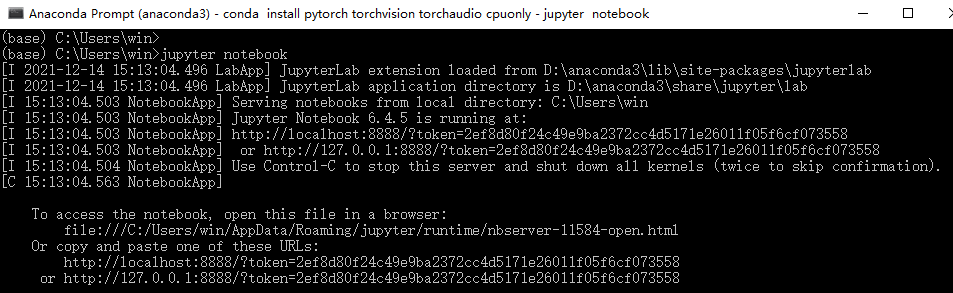
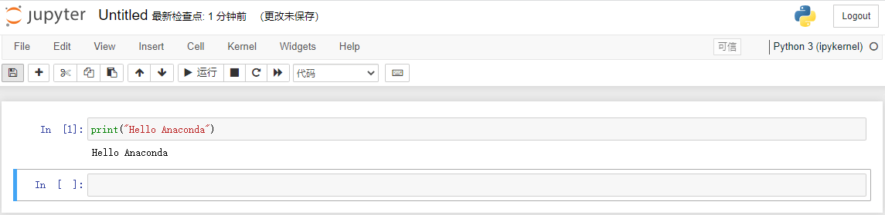

学习AI，首先我们需要安装相关开发环境。本文主要安装Anaconda、Pytorch、Jupyter NoteBook。

## Anaconda
Anaconda是一个开源的Python和R语言的发行版本，用于计算科学（数据科学、机器学习、大数据处理和预测分析）。
Anaconda是一个包管理器，也是一个环境管理器，个人版免费。

### 安装
参考[官网](https://docs.anaconda.com/anaconda/install/)，选择不同的环境安装。

使用推荐的仅为我安装，否则开启Anaconda终端需要管理员权限。



安装过程中，勾选将Anaconda作为默认的Python环境:


官方不推荐把Anaconda3加到环境变量中。
如果加到环境变量中，使用起来更方便，任意终端都可以输入conda命令，但是可能会造成一些问题需要卸载重装Anaconda。
推荐不加环境变量，从开始目录选择Anaconda终端打开：


验证是否安装成功，在终端中输入conda --version后回车


如果把Anaconda3加到环境变量中，运行python时可能会看见下面的警告：

```
Warning:
This Python interpreter is in a conda environment, but the environment has
not been activated. Libraries may fail to load. To activate this environment
please see https://conda.io/activation.
```

Windows上，要解决上面的警告，需要运行c:\Anaconda3\Scripts\activate base。
这里的c:\Anaconda3\Scripts\activate代表Anaconda是安装在c盘根目录下的，需要换成你自己的安装路径。
安装路径最好是全英文且无空格的，可以避免很多未知的坑。

比如我是装在d盘下：



### 源
修改源到国内镜像：

```
# 配置源
conda config --add channels http://mirrors.tuna.tsinghua.edu.cn/anaconda/pkgs/free
conda config --add channels http://mirrors.tuna.tsinghua.edu.cn/anaconda/pkgs/main

# 查看当前源
conda config --show channels
```

### 常用命令

```
conda create -n py38 python=3.8 #创建虚拟环境
conda info -e #查看环境列表
conda list #查看当前已安装的包
conda install pytorch #安装开源软件包,比如安装pytorch
```

## Pytorch
[PyTorch](https://pytorch.org/) 是一个 Python 包，它提供了两个高级特性:

- 具有强大的GPU加速的张量计算(如NumPy)
- 深度神经网络
需要时可以用别的Python包扩展PyTorch，比如NumPy、SciPy、Cython。

安装
先配置镜像，解决下载速度慢，有的包不存在的问题：

```
conda config --add channels https://mirrors.tuna.tsinghua.edu.cn/anaconda/cloud/conda-forge/
conda config --add channels https://mirrors.tuna.tsinghua.edu.cn/anaconda/cloud/msys2/
conda config --add channels https://mirrors.tuna.tsinghua.edu.cn/anaconda/cloud/bioconda/
conda config --add channels https://mirrors.tuna.tsinghua.edu.cn/anaconda/cloud/menpo/
conda config --add channels https://mirrors.tuna.tsinghua.edu.cn/anaconda/cloud/pytorch/
```

安装：

```
conda install pytorch torchvision torchaudio cpuonly
```

如果有安装失败的，就单独再安装一次。

验证：

```
python
import torch
torch.Tensor([1])
```



### Jupyter NoteBook
[Jupyter NoteBook](https://jupyter.org/install) 把基于控制台的方法扩展的一个交互式计算的新方向，提供一个基于web的应用，捕捉整个计算过程:开发、记录和执行代码，以及交流结果。

web应用：一个基于浏览器的工具，用于交互式编写文档，结合了文本、数学、计算和它们的富媒体输出。

记事本文档: web应用程序中所有可见内容的表示，包括计算的输入和输出、解释性文本、数学、图像和对象的富媒体表示。

### 安装

```
conda install jupyterlab
```

### 使用
在终端执行下面的命令，你将看到notebook打开了浏览器：

```
jupyter notebook
```

开启服务后，终端会打印一些信息，比如web应用的地址（默认是http://localhost:8888）：



