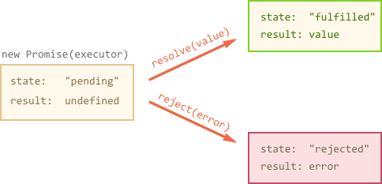

## Promise简介
Promise对象用于表示一个异步操作的最终状态（完成或失败），以及其返回的值。由浏览器直接支持。

打开Chrome的控制台输入`new Promise(function () {});`后可以看到浏览器的Promise对象:

下面创建一个Promise:

```javascript
let promise = new Promise(function(resolve, reject) {
  // executor (the producing code, "singer")
});
```

传给new Promise作为参数的函数叫做executor。Promise创建后自动运行。

promise有两个内部变量：
1、state — 初始值pending, 会变成fulfilled或rejected。
2、result — 初始值undefined，代码运行后的任意值。

当executor运作完毕，会执行它两个参数中的一个函数：

resolve(value) - 代表executor运作结果是成功的，并且：
1、把state变成fulfilled；
2、把result变成value。
reject(error) - 代表executor运作出错，并且：
1、把state变成rejected；
2、把result变成error。



Promise状态是resolved或rejected时叫做settled。

上面说到executor运行完毕会执行resolve或reject，其实executor只会执行一次resolve或reject，并且result改变后不能再改变。resolve/reject只会接收1个参数，后续的都会被忽略。

```javascript
let promise = new Promise(function(resolve, reject) {
  resolve("done");

  reject(new Error("…")); // ignored
  setTimeout(() => resolve("…")); // ignored
});
```

<div class="tip">
reject的参数推荐使用Error对象。
</div>

## demo

### 1、处理 rejection

有两种方式去处理 rejection

```javascript
let promise = new Promise((resolve, reject) => {
  setTimeout(() => reject(new Error("Whoops!")), 1000);
});

// .catch(f) is the same as promise.then(null, f)
promise.catch(alert); // shows "Error: Whoops!" after 1 second
```

<div class="tip">
.catch(f) 只是 .then(null, f)的简写。
</div>

```javascript
// 方式一
promise.then(f1, f2);

// 方式二
promise.then(f1).catch(f2);
```

<div class="tip">
注意方式一和二的不同：f1发生的错误只会在方式二的catch中处理。
</div>

### 2、Unhandled rejections
发生错误时，Promise状态变成reject，execution跳转到最近的rejection handler，如果没有rejection handler，错误就会变成stuck。
比如：

```javascript
new Promise(function() {
  noSuchFunction(); // Error here (no such function)
}); // no .catch attached

// catch ReferenceError: b is not defined
```

或者：

```javascript
// a chain of promises without .catch at the end
new Promise(function() {
  throw new Error("Whoops!");
}).then(function() {
  // ...something...
}).then(function() {
  // ...something else...
}).then(function() {
  // ...but no catch after it!
});
```

大多数js引擎会全局处理这种错误，我们可以在console中看到。

<div class="tip">
要尽量避免出现Unhandled rejections，可以在promise调用链末尾增加catch。
</div>

### 3、触发Promise异常
- 主动调用 reject 方法
- 抛出异常（exception）

```javascript
new Promise((resolve, reject) => {
  a = b;
}).catch((val) => {
  console.log('catch', val);
})

// catch ReferenceError: b is not defined
```

### 4、链式调用

```javascript
new Promise((resolve, reject) => {
  setTimeout(() => {
    resolve('成功1');
  }, 1000);
}).then((val) => {
  console.log('then1', val);
  return '成功2'
}).then((val) => {
  console.log('then2', val);
  return Promise.resolve('成功3')
}).then((val) => {
  console.log('then3', val);
  return '成功4'
})

// then1 成功1
// then2 成功2
// then3 成功3
```

<div class="tip">
注意then的返回值，链式调用时，前一个then的返回值决定后一个then的val。 通常而言，如果你不知道一个值是否是Promise对象，使用Promise.resolve(value) 来返回一个Promise对象,这样就能将该value以Promise对象形式使用。
</div>

### 5、.then/.catch是异步的

```javascript
console.log('javascript start');
setTimeout(() => {
  console.log('setTimeout');
}, 0);
new Promise((resolve) => {
  console.log('promise1');
  resolve();
}).then(() => {
  console.log('promise2');
});
console.log('javascript end');

// javascript start
// promise1
// javascript end
// promise2
// setTimeout
```

```javascript
new Promise((resolve) => {
  console.log('a')
  resolve('b')
  console.log('c')
}).then((data) => {
  console.log(data)
})

// a c b
```

构造函数中的executor执行是同步的，输出 a, 执行 resolve 函数，将 Promise 对象状态置为 resolved，输出 c。同时注册这个 Promise 对象的回调 then 函数。整个脚本执行完，stack 清空。event loop 检查到 stack 为空，再检查 microtask 队列中是否有任务，发现了 Promise 对象的 then 回调函数产生的 microtask，推入 stack，执行。输出 b，event loop的列队为空，stack 为空，脚本执行完毕。

microtask：在当前 task 执行完，准备进行 I/O，repaint，redraw 等原生操作之前，需要执行一些低延迟的异步操作(microtask)，使得浏览器渲染和原生运算变得更加流畅。假如每执行一个异步操作都要重新生成一个 task，将提高宿主平台的负担和响应时间。所以，需要有一个概念，在进行下一个 task 之前，将当前 task 生成的低延迟的，与下一个 task 无关的异步操作执行完，这就是 microtask。

原生的setTimeout就算是将延迟设置为 0 也会有 4 ms 的延迟，会将一个完整的 task 放进队列延迟执行，而且每个 task 之间会进行渲染等原生操作。

Promise 所说的异步执行，只是将 Promise 构造函数中 resolve，reject 方法和注册的 callback 转化为 eventLoop的 microtask/Promise Job，并放到 Event Loop 队列中等待执行，也就是Javascript单线程中的“异步执行”。

### Promise实现原理

自行阅读参考的后3个链接

## 参考
- [Promise - JavaScript | MDN](https://developer.mozilla.org/zh-CN/docs/Web/JavaScript/Reference/Global_Objects/Promise)
- [Promises, async/await](https://javascript.info/async)
- [Promises/A+](https://promisesaplus.com/#point-67)
- [剖析Promise内部结构，一步一步实现一个完整的、能通过所有Test case的Promise类 · Issue #3 · xieranmaya/blog](https://github.com/xieranmaya/blog/issues/3)
- [写一个符合 Promises/A+ 规范并可配合 ES7 async/await 使用的 Promise - 知乎](https://zhuanlan.zhihu.com/p/23312442)
