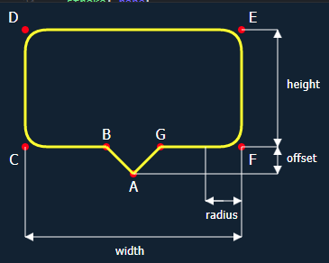

在地图指针之后，让我们来尝试下更多有趣的SVG Path形状：一个tooltip。[点击查看例子](https://jsfiddle.net/mrovinsky/mmmpe817/)



tooltip形状的path路径是由5个变量决定的：`width`,`height`,`pointer offset`,`corner radius`和`placement`(left,top,right或bottom)。

简单来说，我们先来完成一个没有圆角的向上的tooltip，我们需要这么做：
1、移动到点A：M aX,aY
2、连线到点B：L bX,bY
3、垂直连线到点C：H cX
4、水平连线到点D：V dY
5、垂直连线到点E：H eX
6、水平连线到点F：V fY
7、垂直连线到点G：H gX
8、连线到点A：L aX,aY
9、结束路径：z

点A的坐标是(0,0)，其他点的坐标由width,height和offset计算出来：

```javascript
bx =  -offset
by = -offset // cy,fy,gy也是一样的
cx = -width / 2 // dx也一样
dy = -offset - height // ey也一样
ex = width / 2 // fx也一样
gx = offset
```

整个路径实现出来就会是这样：

```javascript
function topTooltipPath(width, height, offset) {
  const left = -width / 2
  const right = width / 2
  const top = -offset - height
  const bottom = -offset
  return `M 0,0
    L ${-offset},${bottom}
    H ${left}
    V ${top}
    H ${right}
    V ${bottom}
    H ${offset}
    L 0,0 z`
}
```

上面的代码解释下就是：画笔移动到点M，再画直线到点B，再水平画直线到点C，再垂直画直线到点D，再水平画直线到点E，再垂直画直线到点F，再水平画直线到点G，再画直线到点M，并结束。 **需要注意的是坐标系是左上角为原点，x轴正方向朝右，y轴正方向朝下。**

实现圆角，我们有2个方案：弧(Arc)和二次贝塞尔曲线(Quadratic Bezier curve)。
弧需要使用7个变量，但是二次贝塞尔曲线就要简单得多：它在当前路径上取得起点，另外2个点是顶点`(vX,vY)`和终点`(tX,tY)`。在SVG中，二次贝塞尔曲线的写法是`Q vX,vY tX,tY`。

拿圆角C来举例，设圆角半径是r,圆角的起点在B到C的水平直线上，，故起点坐标是`(cX+r, cY)`,终点在出圆角去点D的垂直直线上，故终点坐标是`(cX,cY-r)`，顶点就是点`C(cX,cY)`，把上面例子中的直角变成圆角，我们只需要把`H cX V dY`换成`H cX+r Q cX, cY cX, (cY - r) V dY`，这样就得到了半径是`r`的圆角`C`，下面是优化后的代码：

```javascript
function topTooltipPath(width, height, offset, radius) {
  const left = -width / 2
  const right = width / 2
  const top = -offset - height
  const bottom = -offset
  return `M 0,0
    L ${-offset},${bottom}
    H ${left + radius}
    Q ${left},${bottom} ${left},${bottom - radius}
    V ${top + radius}
    Q ${left},${top} ${left + radius},${top}
    H ${right - radius}
    Q ${right},${top} ${right},${top + radius}
    V ${bottom - radius}
    Q ${right},${bottom} ${right - radius},${bottom}
    H ${offset}
    L 0,0 z`
}
```

获得圆角的向下的tooltip，我们只需要把路径中的Y坐标全部取反：

```javascript
function bottomTooltipPath(width, height, offset, radius) {
  const left = -width / 2
  const right = width / 2
  const bottom = offset + height
  const top = offset
  return `M 0,0
    L ${-offset},${top}
    H ${left + radius}
    Q ${left},${top} ${left},${top + radius}
    V ${bottom - radius}
    Q ${left},${bottom} ${left + radius},${bottom}
    H ${right - radius}
    Q ${right},${bottom} ${right},${bottom - radius}
    V ${top + radius}
    Q ${right},${top} ${right - radius},${top}
    H ${offset}
    L 0,0 z`
}
```

同样的可以得到朝左和朝右的tooltip:

```javascript
function leftTooltipPath(width, height, offset, radius) {
  const left = -offset - width
  const right = -offset
  const top = -height / 2
  const bottom = height / 2
  return `M 0,0
    L ${right},${-offset}
    V ${top + radius}
    Q ${right},${top} ${right - radius},${top}
    H ${left + radius}
    Q ${left},${top} ${left},${top + radius}
    V ${bottom - radius}
    Q ${left},${bottom} ${left + radius},${bottom}
    H ${right - radius}
    Q ${right},${bottom} ${right},${bottom - radius}
    V ${offset}
    L 0,0 z`
}
function rightTooltipPath(width, height, offset, radius) {
  const left = offset
  const right = offset + width
  const top = -height / 2
  const bottom = height / 2
  return `M 0,0
    L ${left},${-offset}
    V ${top + radius}
    Q ${left},${top} ${left + radius},${top}
    H ${right - radius}
    Q ${right},${top} ${right},${top + radius}
    V ${bottom - radius}
    Q ${right},${bottom} ${right - radius},${bottom}
    H ${left + radius}
    Q ${left},${bottom} ${left},${bottom - radius}
    V ${offset}
    L 0,0 z`
}
```

## 参考
- [SVG Paths | MDN](https://developer.mozilla.org/zh-CN/docs/Web/SVG/Tutorial/Paths)
