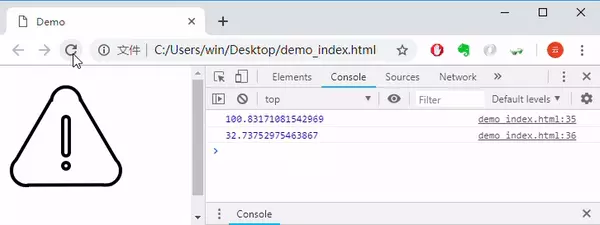

SVG线条动画原理
现在有一个svg，如何让它动起来呢？主要用到两个参数：

- stroke-dasharray：控制描边的点划线的图案范式。dasharray是一个长度和百分比的数列，数与数之间用逗号或者空白隔开，指定短划线和缺口的长度。如果提供了奇数个值，则这个值的数列重复一次，从而变成偶数个值。
- stroke-dashoffset：指定dash模式到路径开始的距离。如果使用了一个 <百分比> 值， 那么这个值就代表了当前viewport的一个百分比。值可以取为负值。

### 原理一
利用`stroke-dasharray`，假如svg路径长度是100，设置`stroke-dasharray: 0, 100`，表示路径上的实线长度为0，空隙为100，所以一开始整个路径都是空隙，什么也看不见，然后过渡到`stroke-dasharray: 100, 100`，由于整个路径的长度是100，实线从0变成100，看起来就像实线动起来了。

### 原理二
利用`stroke-dashoffset`，假如svg路径长度是100，设置`stroke-dasharray: 100, 100;stroke-dashoffset: 100，`表示100实线和100空隙，线条偏移100，于是100的实线被移出路径，路径上只剩100空隙，什么也看不见，然后慢慢修改偏移量，把实线一点点挪出来，就看到实线动起来了。

### 获取路径长度
上面原理都是假设路径长度100，实际需要使用js的`document.getElementById('path').getTotalLength()`获取路径长度。

## demo
st1使用stroke-dashoffset，st2使用stroke-dasharray。请查看[demo](https://codepen.io/lovelyun/pen/QoRrRz)。
