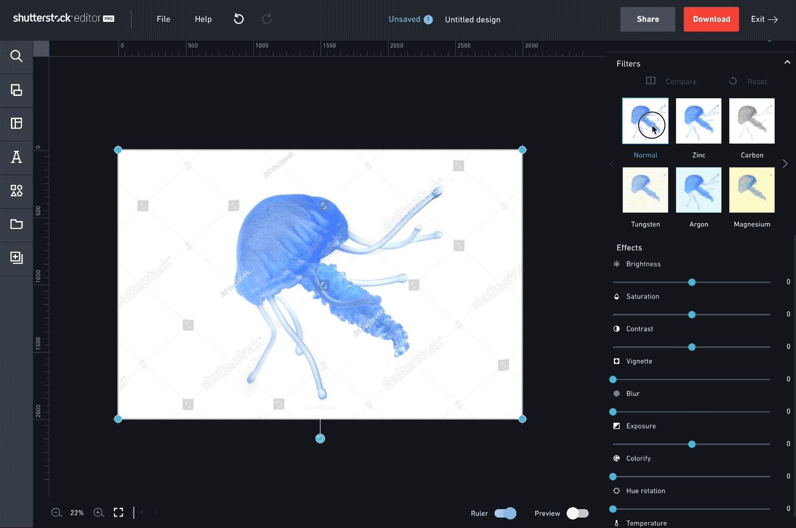
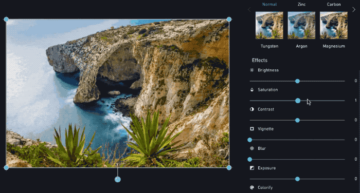
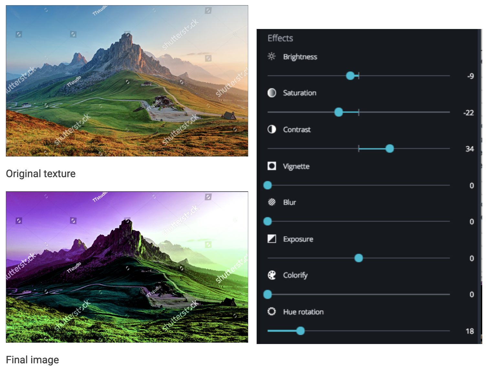
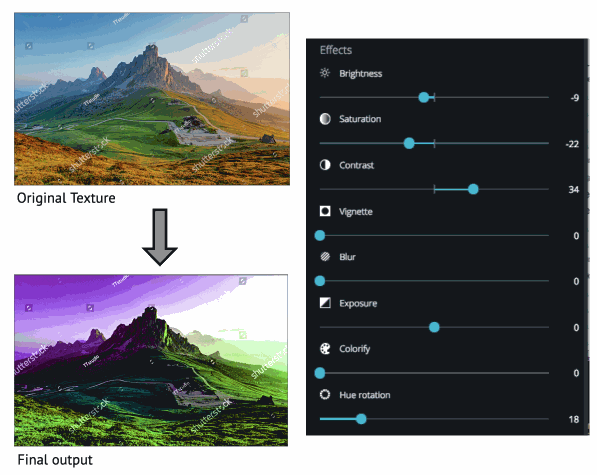
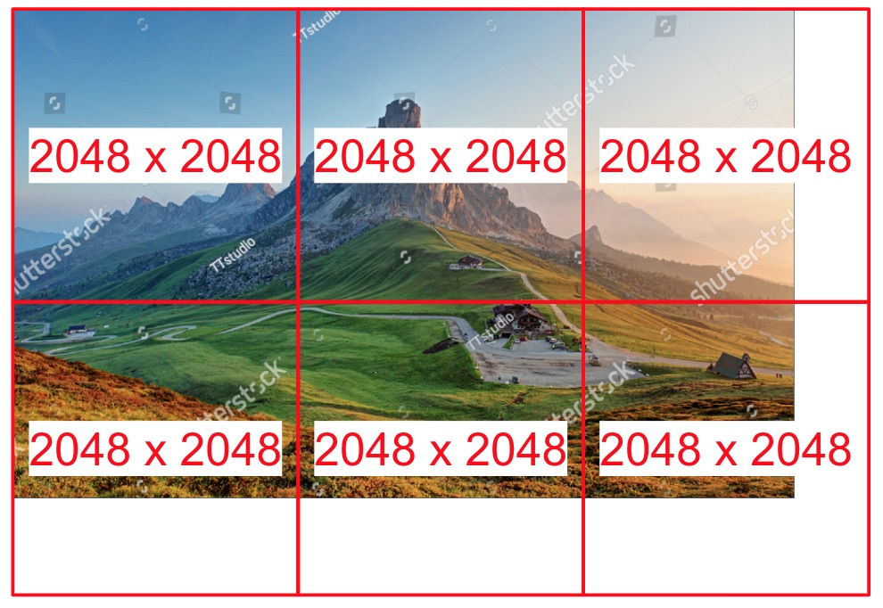
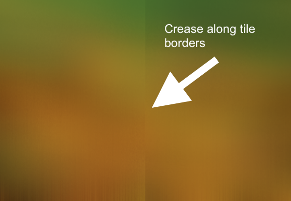
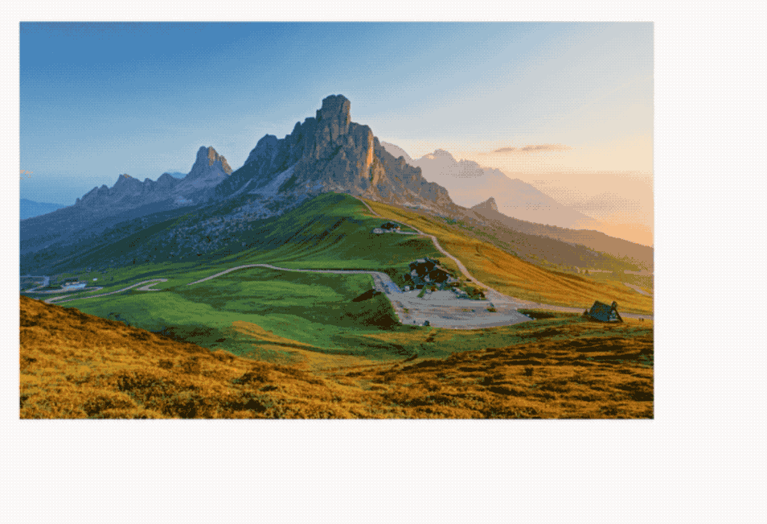

[Shutterstock Editor](https://www.shutterstock.com/zh/editor)是一个简单易用且专业的图片设计工具，对于这类工具来说，图片滤镜都是一个很重要的功能，Shutterstock Editor也提供了强大的支持，本文主要介绍Shutterstock Editor如何在各种浏览器和硬件的限制下实现图片滤镜。

## 最终效果

Shutterstock Editor有2种滤镜，一种是应用预设的滤镜效果，我们称为filters，另一种是应用一系列的滤镜，我们称为effects，比如对比度、亮度。filters通常由多个effects组成，用户可以在任何时候用filters和effects，所以处理步骤可能多达20步。

effects效果是通过滑杆控制，滤镜性能很影响用户体验。所以我们要尽量以60帧/秒的速度来处理图片，1000ms分成60帧后，每帧大概有16ms的时间，再把这16ms分给多个effects，每一步effects就只剩下不到1ms。JavaScript速度很快，但是用户速度更快，所以我们使用CPU来处理图片，才能尽可能达到这个速度，GPU不可用时，再降级到CPU来处理。

## 使用CPU
为了说明图片滤镜是怎么实现的，我们从CPU是如何处理的说起。
Shutterstock Editor的图片是绘制在canvas上的，这意味着图片数据可以通过`getImageData`得到，图片像素点以r（红）、g（绿）、b（蓝）、a（透明度）的顺序存在一维数组里，于是，使用CPU处理图片滤镜，我们要这样做：

- 通过`getImageData`获取图片数据。
- 遍历上一步获取到的像素点数组，对每个像素点应用滤镜算法。一个简单的滤镜算法，比如灰度，只是取颜色通道r、g、b的加权平均值，把均值再赋值给r、g、b。
- 再次遍历像素点，应用下一个滤镜算法。
- 通过`putImageData`把处理结果更新到canvas上。

比较好的电脑上（比如MacBook Pro i7、 Chrome 56），CPU处理1500px分辨率的图片，应用一次滤镜算法耗时约40到120ms，这些滤镜处理程序很快就会堆积起来，由于运行在UI线程，这会阻塞页面操作，所以使用CPU处理图片滤镜只是个备选，使用GPU来处理是更好的选择。

## 使用GPU
同样是canvas，我们可以通过WebGL来使用GPU处理图片：

- 为图片创建texture对象，存储到GPU中。
- 第一次使用滤镜时，GPU把代码编译成二进制格式。
- GPU对texture运行编译后的代码，同时处理大量像素。
- 对每个滤镜效果执行一次处理。
- 把最后的处理结果texture更新到canvas上。

跟CPU处理滤镜类似，但是速度快得多。同样的电脑，对同样的图片应用一次滤镜处理的时间变成0.2到0.4ms，时间更多的是消耗在canvas和GPU之间的图片数据传输上，甚至连续处理多个滤镜效果也不会影响到60fps的渲染目标。

### WebGL的缺点
WebGL的缺点如下：

- WebGL的实现因浏览器、操作系统的硬件驱动和硬件而异。
- 错误处理有限。
- 学习曲线陡峭。
- Texture的尺寸有限制，所以处理大尺寸的图片需要一些特殊处理。

因此，当WebGL不可用，或者不能实现我们的滤镜效果，或者抛出错误时，我们再用CPU来处理。

## WebGL滤镜原理
我们用一个例子来说明WebGL是怎么处理图片的，上图要变成下图，需要的设置如右图：

首先，把原图的texture（我们命名为originalTexture）传到GPU，再创建两个和原图宽高一样的texture（命名为textureA 和 textureB），当我们对图片应用不同的滤镜处理程序时，把处理结果在textureA 和 textureB之间来回传，直到所有的处理步骤都执行完。

最后一个滤镜程序一执行完，我们就把textureB的内容写到页面的canvas上，如果上图中的Brightness或者其他某个设置变了，我们就再运行一次所有的滤镜程序。出于内存的考虑，为了提升性能，可能不会每次都从第一个滤镜程序开始，但对于GPU来说，滤镜几乎不会有性能问题。

## 处理大图
Shutterstock处理的图片尺寸通常都大于8000x5000px，有的用户的图片会更大，为了保持处理速度，我们通常预览图用小图，只有最终效果图会用原图，所以处理大图也很重要，对此，我们先了解到一些限制：

- 不同的浏览器，对canvas的尺寸限制从5000px到12000px不等；
- 不同的硬件，WebGL的texture尺寸限制从2048px到16384px不等。

所以，对于大图，我们把它分成小片，每片是2048px x 2048px，这个尺寸在大多数硬件和浏览器上都没问题，并且可以让预览的小图在显示在一个小片上，这样除了最终的原始尺寸图片渲染，我们不需要再分片。

### 分片处理
分片后是怎么处理图片滤镜的呢？你的第一反应可能是这样的：

大图被分成挨着的小图，每个小图都可以用作WebGL的texture，但是这对Shutterstock Editor来说还不行，因为有的滤镜效果，比如模糊就有问题。
类似模糊这种滤镜效果，需要每个像素点周围的像素点一起做运算，上面这种分片方法，导致分片后小图周围的像素点丢失，对这些小图分别应用滤镜程序后，它们的拼接处会有明显的分割线：

为了能实现类似模糊的这种需要周围的像素点来运算的滤镜效果，我们让分片的小图重叠，就像下面这样：

这样分片有两个重要规则：
1、重叠部分是滤镜程序需要范围的2倍。比如模糊滤镜需要周围的10个像素点，那么重叠部分须大于20px；
2、切片没有与其他片重叠的边，须在原图的边上。这确保了切片中没有空白部分，使每个切片的处理程序更简单。

处理后，切分再拼接到一起，每个切片提供重叠部分的一半数据，这就是为什么重叠部分得是滤镜程序需要的2倍：在切片重叠的中心，两个切片的数据要一样，从而避免出现分割线。

## 总结
图片滤镜很简单，但对各种不同的尺寸都保持良好的性能，就比较困难，Shutterstock Editor通过使用WebGL，并尽可能复用GPU的texture，把大图分成重叠的小片，从而在任何硬件和浏览器上都可以表现得不错。
