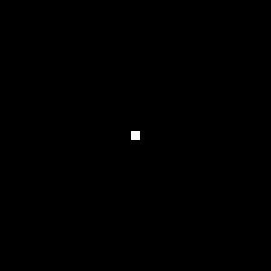
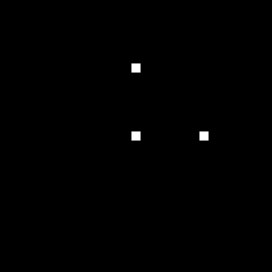
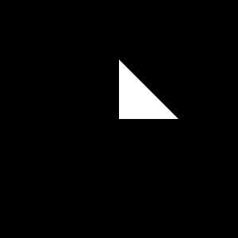
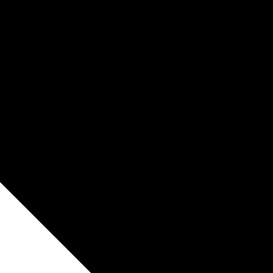
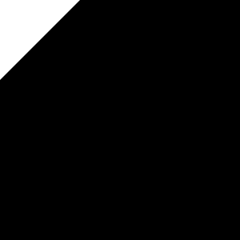
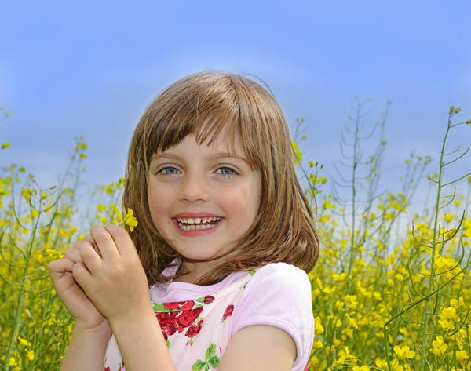
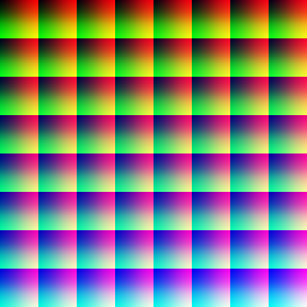
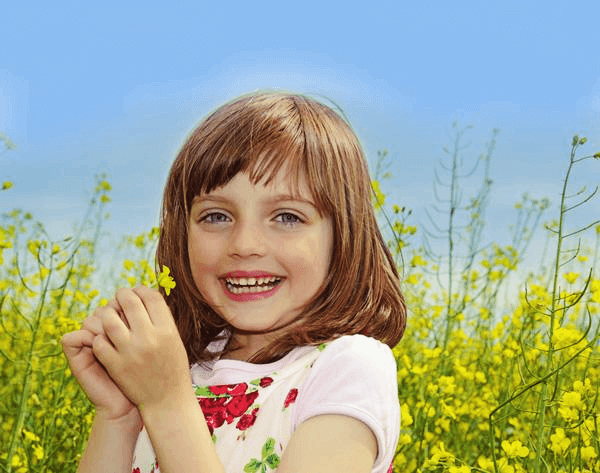
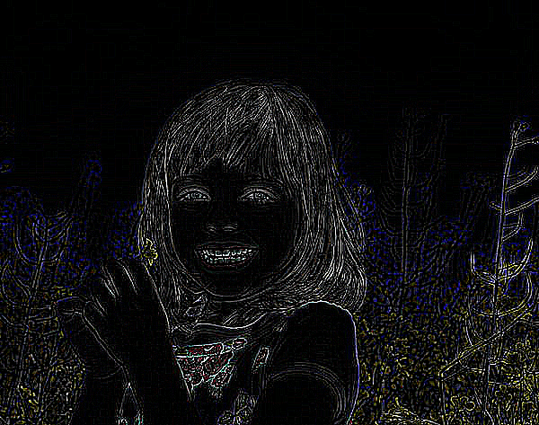

## 前言
WebGL仅仅是一个光栅化引擎，它可以根据你的代码绘制出点，线和三角形。
想要利用WebGL完成更复杂任务，取决于你能否提供合适的代码，组合使用点，线和三角形代替实现。

本文将带大家了解WebGL基础的绘制流程，并结合之前图片滤镜（基础滤镜和lut滤镜）和图像卷积（模糊、锐化等）的应用，用WebGL来实现。

## 获取WebGL
WebGL基于HTML5 Canvas，所以我们需要使用Canvas作为载体。

```html
<!DOCTYPE html>
<html>
    <head>
        <title>WebGL入门</title>
    </head>
    <body>
        <input type="file" id="fileInput" name="选择图片"/>
        <canvas id="canvas"></canvas>
        <script type="text/javascript">

        </script>
    </body>
</html>
```

再通过getContext方法来获取WebGL上下文。在上面的script标签内加入下面的代码：

```javascript
const canvas = document.getElementById('canvas');
const gl = canvas.getContext('webgl');
```

## 清空

```javascript
gl.clearColor(1.0, 1.0, 0.0, 1.0); // 设置清空颜色缓冲区时的颜色
gl.clear(gl.COLOR_BUFFER_BIT); // 清空颜色缓冲区
```

直接运行上面的2行代码清空，我们可以看到canvas被填充满了黄色。
因为gl.clearColor中接受RGBA四个值的范围是0~1，所以如果gl.clearColor(0.0, 0.0, 0.0, 1.0)就会填充黑色。

## 画点
```javascript
function drawPoint() {
  // 1、获取webgl
  const canvas = document.getElementById('canvas');
  const gl = canvas.getContext('webgl');
  if (!gl) {
    return;
  }
  // 2、清空屏幕
  gl.clearColor(0, 0, 0, 1);
  gl.clear(gl.COLOR_BUFFER_BIT);

  // 3、获取着色器资源
  const vertexSource = document.getElementById('vertex-shader-2d').innerHTML;
  const fragmentSource = document.getElementById('fragment-shader-2d').innerHTML;

  // 4、创建顶点着色器对象
  let vertexShader = gl.createShader(gl.VERTEX_SHADER);
  // 绑定资源
  gl.shaderSource(vertexShader, vertexSource);
  // 编译着色器
  gl.compileShader(vertexShader);

  let fragmentShader = gl.createShader(gl.FRAGMENT_SHADER);
  gl.shaderSource(fragmentShader, fragmentSource);
  gl.compileShader(fragmentShader);

  // 5、创建一个着色器程序
  let program = gl.createProgram();
  // 把前面创建的两个着色器对象加到着色器程序中
  gl.attachShader(program, vertexShader);
  gl.attachShader(program, fragmentShader);
  // 连接着色器程序
  gl.linkProgram(program);

  // 使用程序
  gl.useProgram(program);

  // 6、画点
  gl.drawArrays(gl.POINTS, 0, 1);
}
```

运行drawPoint函数后我们会看到300x300的canvas被填充成黑色，中间有一个10x10的白色点。



现在来解读下上面的代码。

分为6步来看，前两步获取webgl并清空屏幕。

第3步获取OpenGL Shading Language（GLSL）编写的着色程序。

该语言运行于GPU，是类似于C或C++的强类型语言，它总是成对出现，每对方法中一个叫顶点着色器，另一个叫片断着色器，组合起来称作一个 program（着色程序）

顶点着色器的作用是计算顶点的位置，根据位置对点， 线和三角形在内的一些图元进行光栅化处理。片断着色器的作用是计算出当前绘制图元中每个像素的颜色值。

可以利用JavaScript中创建字符串的方式创建GLSL字符串：

```javascript
// 顶点着色器
const vertexSource = `
  attribute vec4 a_position;
  void main () {
    // gl_Position为内置变量，表示当前点的位置
    gl_Position = a_position;
    // gl_Position为内置变量，表示当前点的大小，为浮点类型
    gl_PointSize = 10.0;
  }
`;
// 片段着色器
const fragmentSource = `
  // 设置浮点数精度
  precision mediump float;
  void main () {
    // vec4是表示四维向量，这里用来表示RGBA的值[0~1]，均为浮点数
    gl_FragColor = vec4(1.0, 0.5, 1.0, 1.0);
  }
`;
```

或者跟本文的例子一样，将它们放在非JavaScript类型的标签中：

```html
<!-- 顶点着色器 -->
<script type='x-shader/x-vertex' id='vertex-shader-2d'>
  attribute vec4 a_position;
  void main () {
    // gl_Position为内置变量，表示当前点的位置
    gl_Position = a_position;
    // gl_Position为内置变量，表示当前点的大小，为浮点类型，如果赋值是整数类报错
    gl_PointSize = 10.0;
  }
</script>
<!-- 片段着色器 -->
<script type='x-shader/x-fragment' id='fragment-shader-2d'>
  // 设置浮点数精度
  precision mediump float;
  void main () {
    // vec4是表示四维向量，这里用来表示RGBA的值[0~1]，均为浮点数，如为整数则错
    gl_FragColor = vec4(1.0, 1.0, 1.0, 1.0);
  }
</script>
```

这里a_position属性的数据类型是vec4，vec4是一个有四个浮点数据的数据类型。

> GLSL中命名约定：
> - a_ 代表属性，值从缓冲中提供；
> - u_ 代表全局变量，直接对着色器设置；
> - v_ 代表可变量，是从顶点着色器的顶点中插值来出来的。

获取到着色器资源后，接着创建着色器，绑定资源并编译，然后创建着色程序，把编译好的2个着色器加进来，再连接和使用该着色程序。
到这一步我们的着色程序就初始化完毕。
最后就是绘制drawArrays。

由于drawArrays之前的步骤应用频繁，下面我们把它们封装起来。

### 创建着色器
着色器都是成对出现的，比如本例中的vertexShader和fragmentShader。
获取着色器资源source后，根据type创建不同的着色器，vertexShader的type是gl.VERTEX_SHADER，fragmentShader的type是gl.FRAGMENT_SHADER。
然后绑定并编译。

```javascript
function createShader(gl, type, source) {
  const shader = gl.createShader(type); // 创建 shader 对象
  gl.shaderSource(shader, source); // 往 shader 中传入源代码
  gl.compileShader(shader); // 编译 shader
  // 是否编译成功
  const success = gl.getShaderParameter(shader, gl.COMPILE_STATUS);
  if (success) {
      return shader;
  }
  console.log(gl.getShaderInfoLog(shader));
  gl.deleteShader(shader);
}
```

### 创建着色程序
创建着色程序，把着色器加进来，链接程序。

```javascript
function createProgram(gl, vertexShader, fragmentShader) {
  const program = gl.createProgram(); // 创建 program 对象
  gl.attachShader(program, vertexShader); // 往 program 对象中传入 WebGLShader 对象
  gl.attachShader(program, fragmentShader);
  gl.linkProgram(program); // 链接 program
  // 是否链接成功
  const success = gl.getProgramParameter(program, gl.LINK_STATUS);
  if (success) {
      return program;
  }
  console.log(gl.getProgramInfoLog(program));
  gl.deleteProgram(program);
}
```

然后通过着色器script标签的id，创建连接好的着色程序：

```javascript
function createProgramFromScripts (gl, vertexShaderScriptId, fragmentShaderScriptId) {
  const vertexSource = document.getElementById(vertexShaderScriptId).innerHTML;
  const fragmentSource = document.getElementById(fragmentShaderScriptId).innerHTML;
  const vertexShader = createShader(gl, gl.VERTEX_SHADER, vertexSource); // 创建顶点着色器
  const fragmentShader = createShader(gl, gl.FRAGMENT_SHADER, fragmentSource); // 创建片元着色器
  const program = createProgram(gl, vertexShader, fragmentShader); // 创建 WebGLProgram 程序
  return program;
}
```

封装好之后，上面的drawPoint函数就可以优化成下面这样：

```javascript
// 1、获取webgl
const canvas = document.getElementById('canvas');
const gl = canvas.getContext('webgl');
if (!gl) {
  return;
}

// 2、清空屏幕
gl.clearColor(0, 0, 0, 1);
gl.clear(gl.COLOR_BUFFER_BIT);

// 3、创建连接好的着色程序
const program = createProgramFromScripts(gl, 'vertex-shader-2d', 'fragment-shader-2d');

// 4、使用上面的着色程序
gl.useProgram(program);

// 5、画点
gl.drawArrays(gl.POINTS, 0, 1);
```

### 画多个点
上面我们画了一个点，现在画多个点。
比如下面的3个点：

```javascript
const points = [
  0, 0.0,
  0.5, 0.0,
  0.0, 0.5
];
```

需要把这3个点的数据传给webgl:

```javascript
// 创建一个buffer，用来放3个点在裁剪空间的坐标
const buffer = gl.createBuffer();
// buffer和ARRAY_BUFFER绑定（可以理解成ARRAY_BUFFER = buffer）
gl.bindBuffer(gl.ARRAY_BUFFER, buffer);
gl.bufferData(gl.ARRAY_BUFFER, new Float32Array(points), gl.STATIC_DRAW);
```

接着获取shader中a_position的地址并做一些配置：

```javascript
const positionAttributeLocation = gl.getAttribLocation(program, "a_position"); // 获取shader中a_position的地址
gl.enableVertexAttribArray(positionAttributeLocation); // 开启attribute
// 告诉attribute如何从positionBuffer(ARRAY_BUFFER)中读取数据
gl.vertexAttribPointer(
  positionAttributeLocation, // 属性值a_position的位置
  2, // 每次迭代运行提取两个单位数据
  gl.FLOAT, // 每个单位的数据类型是32位浮点型
  false, // 不需要标准化
  0, // 用符合单位类型和单位个数的大小
  0， // 从缓冲起始位置开始读取
);
```

最后绘制3个点：

```javascript
gl.drawArrays(gl.POINTS, 0, 3); // 绘制3个点
```



把上面的绘制3个点改一下，可以绘制成三角形：

```javascript
gl.drawArrays(gl.TRIANGLES, 0, 3); // 绘制三角形
```


因为图元类型primitiveType为三角形gl.TRIANGLES， 顶点着色器每运行三次WebGL将会根据三个gl_Position值绘制一个三角形。

## 关于buffer和attribute
上面我们用到了buffer和attribute，那它们是干什么的呢？

其实，缓冲操作是GPU获取顶点数据的一种方式。
gl.createBuffer创建一个缓冲；gl.bindBuffer是设置缓冲为当前使用缓冲； gl.bufferData将数据拷贝到缓冲，这个操作一般在初始化完成。一旦数据存到缓冲中，还需要告诉WebGL怎么从缓冲中提取数据传给顶点着色器的属性。

首先，我们要获取WebGL给属性分配的地址，这一步一般在初始化时完成。

```javascript
// 询问顶点数据应该放在哪里
const positionAttributeLocation = gl.getAttribLocation(program, 'a_position');
```

绘制前还需要发出3个命令。

1、告诉WebGL我们想从缓冲中提供数据。

```javascript
gl.enableVertexAttribArray(location);
```

2、将缓冲绑定到 ARRAY_BUFFER 绑定点，它是WebGL内部的一个全局变量。

```javascript
gl.bindBuffer(gl.ARRAY_BUFFER, someBuffer);
```

3、告诉WebGL从 ARRAY_BUFFER 当前绑定点的缓冲获取数据。

```javascript
gl.vertexAttribPointer(
  location,
  numComponents,
  typeOfData,
  normalizeFlag,
  strideToNextPieceOfData,
  offsetIntoBuffer);
```

numComponents: 每个顶点有几个单位的数据(1 - 4)
typeOfData: 单位数据类型是什么(BYTE, FLOAT, INT, UNSIGNED_SHORT, 等等…)
normalizeFlag: 标准化
strideToNextPieceOfData: 从一个数据到下一个数据要跳过多少位
offsetIntoBuffer: 数据在缓冲的什么位置

如果每个类型的数据都用一个缓冲存储，stride 和 offset 都是 0 。
stride 为 0 表示 “用符合单位类型和单位个数的大小”。 offset 为 0 表示从缓冲起始位置开始读取。
它们用 0 以外的值会复杂得多，虽然这样会取得一些性能能上的优势， 但是一般情况下并不值得。

标准化标记（normalizeFlag）适用于所有非浮点型数据。如果传递false就解读原数据类型。

## 坐标转换
上面的例子中，我们的顶点坐标都是裁剪空间坐标，比如：

```javascript
const points = [
  0, 0.0,
  0.5, 0.0,
  0.0, 0.5
];
```

裁剪空间的x范围是[-1, 1]，正方向向右，y的范围也是[-1, 1]，正方向向上。


对于描述二维空间中的物体，比起裁剪空间坐标你可能更希望使用屏幕像素坐标。
所以我们来改造一下顶点着色器：

```html
<script type='x-shader/x-vertex' id='vertex-shader-2d'>
attribute vec2 a_position;
uniform vec2 u_resolution;
void main () {
  // 像素坐标转到 0.0 到 1.0
  vec2 zeroToOne = a_position.xy / u_resolution;

  //  0->1 转到 0->2
  vec2 zeroToTwo = zeroToOne * 2.0;

  //  0->2 转到 -1->+1 (即裁剪空间)
  vec2 clipSpace = zeroToTwo - 1.0;

  gl_Position = vec4(clipSpace, 0, 1);
}
</script>
```

然后我们用像素坐标表示新的3个点：

```javascript
const points = [
  0, 0,
  100, 0,
  0, 100
];
```

使用program后，我们需要获取vertex-shader-2d中添加的全局变量u_resolution的位置，并设置分辨率：

```javascript
const resolutionUniformLocation = gl.getUniformLocation(program, "u_resolution");
// 设置全局变量 分辨率
gl.uniform2f(resolutionUniformLocation, gl.canvas.width, gl.canvas.height);
```

然后绘制三角形：

```javascript
gl.drawArrays(gl.TRIANGLES, 0, 3);
```



这时，我们的坐标系原点在左下角，如果要像传统二维API那样原点在左上角，我们只需翻转y轴：

```javascript
// gl_Position = vec4(clipSpace, 0, 1);
gl_Position = vec4(clipSpace * vec2(1, -1), 0, 1); // 翻转y轴
```



## 画矩形
我们将通过绘制两个三角形来绘制一个矩形，每个三角形有三个点，所以一共有6个点：

```javascript
const points = [
  100, 100,
  200, 100,
  100, 200,
  200, 100,
  100, 200,
  200, 200
];
```

然后绘制时把次数改成6次：

```javascript
// 绘制
gl.drawArrays(gl.TRIANGLES, 0, 6);
```


## 画图
### 改造着色器
首先我们接着改造上面坐标转换后的顶点着色器，增加a_texCoord和v_texCoord。

```javascript
attribute vec2 a_texCoord;
...
varying vec2 v_texCoord;

void main() {
   ...
   // 将纹理坐标传给片断着色器
   // GPU会在点之间进行插值
   v_texCoord = a_texCoord;
}
```

然后用片断着色器寻找纹理上对应的颜色：

```html
<script id="fragment-shader-2d" type="x-shader/x-fragment">
precision mediump float;

// 纹理
uniform sampler2D u_image;

// 从顶点着色器传入的纹理坐标
varying vec2 v_texCoord;

void main() {
   // 在纹理上寻找对应颜色值
   gl_FragColor = texture2D(u_image, v_texCoord);
}
</script>
```

### 加载图片
点击选择图片按钮后，加载图片，图片加载完成后开始绘制图片。

```javascript
const inputElement = document.getElementById('fileInput');
const canvasElement = document.getElementById('canvas');
fileInput.addEventListener('change', async (e) => {
  const imgElement = document.getElementById('canvas');
  const img = new Image();
  img.src = URL.createObjectURL(e.target.files[0]);
  img.onload = function () {
    imgElement.width = img.width;
    imgElement.height = img.height;
    drawPic(img); // 绘制图片
  }
}, false);
```

### 绘制图片
绘制图片我们在drawPic函数中进行，首先获取gl并创建着色程序：

```javascript
function drawPic(image) {
  // 获取webgl
  const canvas = document.getElementById('canvas');
  const gl = canvas.getContext('webgl');
  if (!gl) {
    return;
  }

  // 创建连接好的着色程序
  const program = createProgramFromScripts(gl, 'vertex-shader-2d', 'fragment-shader-2d');
}
```

接着找2个顶点坐标位置（分别是矩形和纹理的坐标）：

```javascript
let positionLocation = gl.getAttribLocation(program, "a_position");
let texcoordLocation = gl.getAttribLocation(program, "a_texCoord");
```

再画一个和图片一样大小的矩形，首先我们获取画矩形需要的6个点：

```javascript
const x1 = 0;
const x2 = image.width;
const y1 = 0;
const y2 = image.height;
const points = [
  x1, y1,
  x2, y1,
  x1, y2,
  x1, y2,
  x2, y1,
  x2, y2,
]
```

再和上文一样，把点的数据传给webgl，并设置读取方式:

```javascript
let positionBuffer = gl.createBuffer();
gl.bindBuffer(gl.ARRAY_BUFFER, positionBuffer);
gl.bufferData(gl.ARRAY_BUFFER, new Float32Array(points), gl.STATIC_DRAW);
// 开启 position attribute
gl.enableVertexAttribArray(positionLocation);
// 告诉attribute如何从positionBuffer(ARRAY_BUFFER)中读取数据
gl.vertexAttribPointer(positionLocation, 2, gl.FLOAT, false, 0, 0);
```

然后创建纹理：

```javascript
// 创建纹理
let texture = gl.createTexture();
gl.bindTexture(gl.TEXTURE_2D, texture);
```

并对图片渲染做设置，保证可以渲染任何尺寸的图片：

```javascript
gl.texParameteri(gl.TEXTURE_2D, gl.TEXTURE_WRAP_S, gl.CLAMP_TO_EDGE);
gl.texParameteri(gl.TEXTURE_2D, gl.TEXTURE_WRAP_T, gl.CLAMP_TO_EDGE);
gl.texParameteri(gl.TEXTURE_2D, gl.TEXTURE_MIN_FILTER, gl.NEAREST);
gl.texParameteri(gl.TEXTURE_2D, gl.TEXTURE_MAG_FILTER, gl.NEAREST);
```

然后把图片加载到上面创建的纹理中：

```javascript
gl.texImage2D(gl.TEXTURE_2D, 0, gl.RGBA, gl.RGBA, gl.UNSIGNED_BYTE, image);
```

然后告诉webgl如何从裁剪空间转换到像素空间：

```javascript
gl.viewport(0, 0, gl.canvas.width, gl.canvas.height);
```

然后对a_texCoord的地址并做一些配置。
渲染纹理时需要纹理坐标，而不是像素坐标，无论纹理是什么尺寸，纹理坐标范围始终是 0.0 到 1.0：

```javascript
gl.enableVertexAttribArray(texcoordLocation);

// 给矩形提供纹理坐标
let texCoordBuffer = gl.createBuffer();
gl.bindBuffer(gl.ARRAY_BUFFER, texCoordBuffer);
gl.bufferData(gl.ARRAY_BUFFER, new Float32Array([
  0.0, 0.0,
  1.0, 0.0,
  0.0, 1.0,
  0.0, 1.0,
  1.0, 0.0,
  1.0, 1.0]), gl.STATIC_DRAW);

gl.vertexAttribPointer(texcoordLocation, 2, gl.FLOAT, false, 0, 0);
```

接着清空屏幕并使用着色程序：

```javascript
gl.clearColor(0, 0, 0, 0);
gl.clear(gl.COLOR_BUFFER_BIT);

gl.useProgram(program);
```

再设置全局变量分辨率：

```javascript
let resolutionLocation = gl.getUniformLocation(program, "u_resolution");
gl.uniform2f(resolutionLocation, gl.canvas.width, gl.canvas.height);
```

到现在就可以画矩形了(6个点画2个三角形组成矩形)：

```javascript
gl.drawArrays(gl.TRIANGLES, 0, 6);
```

到这里图片就出现了：




简单说就是，我们画了一个和图片一样大的矩形，创建了一个纹理并把图片传到纹理中，再把纹理贴到矩形上，这样图片就显示出来了。

## 操作像素
现在我们对图片做一些简单的像素操作。

### 换位
比如红蓝换位，我们只需要改片段着色器：

```javascript
gl_FragColor = texture2D(u_image, v_texCoord).bgra;
```


### 灰度
解析出颜色通道后，做加权算法，再重新设置颜色：

```javascript
vec4 color = texture2D(u_image, v_texCoord);
float gray = 0.2989 * color.r + 0.5870 * color.g + 0.1140*color.b;
gl_FragColor = vec4(gray, gray, gray, color.a);
```


更多改变像素颜色的风格算法，可以看看之前写的《[前端基础滤镜](https://lovelyun.github.io/%E5%9B%BE%E5%83%8F%E5%A4%84%E7%90%86/%E5%89%8D%E7%AB%AF%E5%9F%BA%E7%A1%80%E6%BB%A4%E9%95%9C/)》。

颜色查找表
颜色查找表又叫LUT(look up table)，可以实现自定义且多样的风格化滤镜，不清楚的可以看之前写的《[前端如何通过LUT实现图片滤镜](https://lovelyun.github.io/%E5%9B%BE%E5%83%8F%E5%A4%84%E7%90%86/LUT/)》。

首先需要创建一个新的片断着色器，实现LUT算法。（顶点着色器和上面画图的一样）

```html
<script type='x-shader/x-fragment' id='fragment-shader-2d'>
  precision mediump float;
  varying lowp vec2 v_texCoord;
  uniform sampler2D u_image0;
  uniform sampler2D u_image1;
  void main() {
    vec4 textureColor = texture2D(u_image0, v_texCoord);
    float blueColor = textureColor.b * 63.0;
    vec2 quad1;
    quad1.y = floor(floor(blueColor) / 8.0);
    quad1.x = floor(blueColor) - (quad1.y * 8.0);
    vec2 quad2;
    quad2.y = floor(ceil(blueColor) / 8.0);
    quad2.x = ceil(blueColor) - (quad2.y * 8.0);
    vec2 texPos1;
    texPos1.x = (quad1.x * 0.125) + 0.5/512.0 + ((0.125 - 1.0/512.0) * textureColor.r);
    texPos1.y = (quad1.y * 0.125) + 0.5/512.0 + ((0.125 - 1.0/512.0) * textureColor.g);
    vec2 texPos2;
    texPos2.x = (quad2.x * 0.125) + 0.5/512.0 + ((0.125 - 1.0/512.0) * textureColor.r);
    texPos2.y = (quad2.y * 0.125) + 0.5/512.0 + ((0.125 - 1.0/512.0) * textureColor.g);
    lowp vec4 newColor1 = texture2D(u_image1, texPos1);
    lowp vec4 newColor2 = texture2D(u_image1, texPos2);
    lowp vec4 newColor = mix(newColor1, newColor2, fract(blueColor));
    gl_FragColor = mix(textureColor, vec4(newColor.rgb, textureColor.w), 1.0);
  }
</script>
```

然后改造下我们的html，除了上传图片，我们还需要上传lut图片，再增加一个应用按钮：

```html
<input type="file" id="fileInput" />
<input type="file" id="lutInput" />
<div id="applyLUT">应用</div>
<canvas id="canvas"></canvas>
```

再给它们绑定事件，上传图片后设置图片地址，点击应用按钮时应用lut滤镜效果：

```javascript
const fileInput = document.getElementById('fileInput');
const lutInput = document.getElementById('lutInput');

const applyElement = document.getElementById('applyLUT');

let image = new Image();
let filterImage = new Image();

fileInput.addEventListener('change', (e) => {
    image.src = URL.createObjectURL(e.target.files[0]);
}, false);
lutInput.addEventListener('change', (e) => {
    filterImage.src = URL.createObjectURL(e.target.files[0]);
}, false);

applyElement.addEventListener('click', () => {
    applyLUT()
})
```

接下来就是应用lut滤镜函数applyLUT，首先获取gl并创建连接好的着色程序：

```javascript
function applyLUT() {
  // 获取webgl
  const canvas = document.getElementById('canvas');
  const gl = canvas.getContext('webgl');
  if (!gl) {
    return;
  }

  // 创建连接好的着色程序
  const program = createProgramFromScripts(gl, 'vertex-shader-2d', 'fragment-shader-2d');
}
```

接着找地址：

```javascript
const positionLocation = gl.getAttribLocation(program, 'a_position');
const texcoordLocation = gl.getAttribLocation(program, 'a_texCoord');

const resolutionLocation = gl.getUniformLocation(program, 'u_resolution');
const u_image0Location = gl.getUniformLocation(program, 'u_image0');
const u_image1Location = gl.getUniformLocation(program, 'u_image1');
```

然后设置canvas宽高和图片一样：

```javascript
canvas.width = image.width;
canvas.height = image.height;
```

再传图片和lut图片数据：

```javascript
const image_texture = gl.createTexture();
gl.bindTexture(gl.TEXTURE_2D, image_texture);
gl.texParameteri(gl.TEXTURE_2D, gl.TEXTURE_WRAP_CLAMP_TO_EDGE);
gl.texParameteri(gl.TEXTURE_2D, gl.TEXTURE_WRAP_CLAMP_TO_EDGE);
gl.texParameteri(gl.TEXTURE_2D, gl.TEXTURE_MIN_FILTER, gl.NEAREST);
gl.texParameteri(gl.TEXTURE_2D, gl.TEXTURE_MAG_FILTER, gl.NEAREST);
gl.texImage2D(gl.TEXTURE_2D, 0, gl.RGBA, gl.RGBUNSIGNED_BYTE, image);

const filterImage_texture = gl.createTexture();
gl.bindTexture(gl.TEXTURE_2D, filterImage_texture);
gl.texParameteri(gl.TEXTURE_2D, gl.TEXTURE_WRAP_CLAMP_TO_EDGE);
gl.texParameteri(gl.TEXTURE_2D, gl.TEXTURE_WRAP_CLAMP_TO_EDGE);
gl.texParameteri(gl.TEXTURE_2D, gl.TEXTURE_MIN_FILTER, gl.NEAREST);
gl.texParameteri(gl.TEXTURE_2D, gl.TEXTURE_MAG_FILTER, gl.NEAREST);
gl.texImage2D(gl.TEXTURE_2D, 0, gl.RGBA, gl.RGBUNSIGNED_BYTE, filterImage);
```

然后设置positionLocation和texcoordLocation：

```javascript
const positionBuffer = gl.createBuffer();
gl.bindBuffer(gl.ARRAY_BUFFER, positionBuffer);
gl.bufferData(gl.ARRAY_BUFFER, new Float32Array([
  0, 0,
  canvas.width, 0,
  0, canvas.height,
  0, canvas.height,
  canvas.width, 0,
  canvas.width, canvas.height,
]), gl.STATIC_DRAW);
gl.enableVertexAttribArray(positionLocation);
gl.vertexAttribPointer(positionLocation, 2, gl.FLOAT, false, 0, 0);

const texcoordBuffer = gl.createBuffer();
gl.bindBuffer(gl.ARRAY_BUFFER, texcoordBuffer);
gl.bufferData(gl.ARRAY_BUFFER, new Float32Array([
  0.0, 0.0,
  1.0, 0.0,
  0.0, 1.0,
  0.0, 1.0,
  1.0, 0.0,
  1.0, 1.0,
]), gl.STATIC_DRAW);
gl.enableVertexAttribArray(texcoordLocation);
gl.vertexAttribPointer(texcoordLocation, 2, gl.FLOAT, false, 0, 0);
```

最后就是清空、使用着色程序、设置窗口等配置及画矩形了：

```javascript
gl.clearColor(0, 0, 0, 0);
gl.clear(gl.COLOR_BUFFER_BIT);
gl.useProgram(program);
gl.viewport(0, 0, gl.canvas.width, gl.canvas.height);

gl.uniform2f(resolutionLocation, gl.canvas.width, gl.canvas.height);
gl.uniform1i(u_image0Location, 0);
gl.uniform1i(u_image1Location, 1);
gl.activeTexture(gl.TEXTURE0);
gl.bindTexture(gl.TEXTURE_2D, image_texture);
gl.activeTexture(gl.TEXTURE1);
gl.bindTexture(gl.TEXTURE_2D, filterImage_texture);
gl.drawArrays(gl.TRIANGLES, 0, 6);
```

到这里我们就能看到应用滤镜后的图片，比如我们应用下面这个lut文件：



点击应用后效果：


### 卷积
卷积在图片处理上应用广泛，可以实现比如边缘检测、锐化、模糊等等
我们将在片断着色器中计算卷积，所以创建一个新的片断着色器。

```html
<script id="fragment-shader-2d" type="x-shader/x-fragment">
precision mediump float;

// 纹理
uniform sampler2D u_image;
uniform vec2 u_textureSize;
uniform float u_kernel[9];
uniform float u_kernelWeight;

// 从顶点着色器传入的纹理坐标
varying vec2 v_texCoord;

void main() {
  vec2 onePixel = vec2(1.0, 1.0) / u_textureSize;
  vec4 colorSum =
    texture2D(u_image, v_texCoord + onePixel * vec2(-1, -1)) * u_kernel[0] +
    texture2D(u_image, v_texCoord + onePixel * vec2( 0, -1)) * u_kernel[1] +
    texture2D(u_image, v_texCoord + onePixel * vec2( 1, -1)) * u_kernel[2] +
    texture2D(u_image, v_texCoord + onePixel * vec2(-1,  0)) * u_kernel[3] +
    texture2D(u_image, v_texCoord + onePixel * vec2( 0,  0)) * u_kernel[4] +
    texture2D(u_image, v_texCoord + onePixel * vec2( 1,  0)) * u_kernel[5] +
    texture2D(u_image, v_texCoord + onePixel * vec2(-1,  1)) * u_kernel[6] +
    texture2D(u_image, v_texCoord + onePixel * vec2( 0,  1)) * u_kernel[7] +
    texture2D(u_image, v_texCoord + onePixel * vec2( 1,  1)) * u_kernel[8] ;

  // 只把rgb值求和除以权重
  // 将阿尔法值设为 1.0
  gl_FragColor = vec4((colorSum / u_kernelWeight).rgb, 1.0);
}
</script>
```

在JavaScript中，我们继续改造上面的drawPic函数，首先找到下面3个地址：

```javascript
let textureSizeLocation = gl.getUniformLocation(program, "u_textureSize");
let kernelLocation = gl.getUniformLocation(program, "u_kernel[0]");
let kernelWeightLocation = gl.getUniformLocation(program, "u_kernelWeight");
```

然后在drawArrays前设置图片大小，提供卷积核，并设置卷积核及其权重：

```javascript
// 设置图片大小
gl.uniform2f(textureSizeLocation, width, image.height);

const kernel = [
    -1, -1, -1,
    -1, 8, -1,
    -1, -1, -1
]
// 设置卷积核及其权重
gl.uniform1fv(kernelLocation, kernel);
gl.uniform1f(kernelWeightLocation, computeKernelWeight(kernel));
```

```javascript
function computeKernelWeight(kernel) {
  let weight = kernel.reduce(function (prev, curr) {
    return prev + curr;
  });
  return weight <= 0 ? 1 : weight;
}
```

上传图片后就能看到应用卷积核后的效果：



下面是一些常见的卷积核：

```javascript
let kernels = {
  normal: [
    0, 0, 0,
    0, 1, 0,
    0, 0, 0
  ],
  gaussianBlur: [
    0.045, 0.122, 0.045,
    0.122, 0.332, 0.122,
    0.045, 0.122, 0.045
  ],
  gaussianBlur2: [
    1, 2, 1,
    2, 4, 2,
    1, 2, 1
  ],
  gaussianBlur3: [
    0, 1, 0,
    1, 1, 1,
    0, 1, 0
  ],
  unsharpen: [
    -1, -1, -1,
    -1,  9, -1,
    -1, -1, -1
  ],
  sharpness: [
     0,-1, 0,
    -1, 5,-1,
     0,-1, 0
  ],
  sharpen: [
     -1, -1, -1,
     -1, 16, -1,
     -1, -1, -1
  ],
  edgeDetect: [
     -0.125, -0.125, -0.125,
     -0.125,  1,     -0.125,
     -0.125, -0.125, -0.125
  ],
  edgeDetect2: [
     -1, -1, -1,
     -1,  8, -1,
     -1, -1, -1
  ],
  edgeDetect3: [
     -5, 0, 0,
      0, 0, 0,
      0, 0, 5
  ],
  edgeDetect4: [
     -1, -1, -1,
      0,  0,  0,
      1,  1,  1
  ],
  edgeDetect5: [
     -1, -1, -1,
      2,  2,  2,
     -1, -1, -1
  ],
  edgeDetect6: [
     -5, -5, -5,
     -5, 39, -5,
     -5, -5, -5
  ],
  sobelHorizontal: [
      1,  2,  1,
      0,  0,  0,
     -1, -2, -1
  ],
  sobelVertical: [
      1,  0, -1,
      2,  0, -2,
      1,  0, -1
  ],
  previtHorizontal: [
      1,  1,  1,
      0,  0,  0,
     -1, -1, -1
  ],
  previtVertical: [
      1,  0, -1,
      1,  0, -1,
      1,  0, -1
  ],
  boxBlur: [
      0.111, 0.111, 0.111,
      0.111, 0.111, 0.111,
      0.111, 0.111, 0.111
  ],
  triangleBlur: [
      0.0625, 0.125, 0.0625,
      0.125,  0.25,  0.125,
      0.0625, 0.125, 0.0625
  ],
  emboss: [
     -2, -1,  0,
     -1,  1,  1,
      0,  1,  2
  ]
 ;
```

也可以看看之前写的《[卷积在前端图像处理上的应用](https://lovelyun.github.io/%E5%9B%BE%E5%83%8F%E5%A4%84%E7%90%86/%E5%8D%B7%E7%A7%AF%E5%9C%A8%E5%89%8D%E7%AB%AF%E5%9B%BE%E5%83%8F%E5%A4%84%E7%90%86%E4%B8%8A%E7%9A%84%E5%BA%94%E7%94%A8/)》。

## 参考
- [WebGL 基础概念](https://webglfundamentals.org/webgl/lessons/zh_cn/webgl-fundamentals.html)
- [WebGL 图像处理](https://webglfundamentals.org/webgl/lessons/zh_cn/webgl-image-processing.html)
- [webgl-lut-filter](https://github.com/lijialiang/webgl-lut-filter/blob/master/src/main.js)
- [webgl-utils](https://webglfundamentals.org/webgl/resources/webgl-utils.js)
