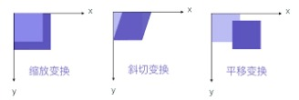
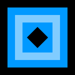

## 前言
在计算机图形学的各种应用中都能找到矩阵的身影。它广泛应用于计算机视觉过滤器、图像处理（比如边缘检测）、锐化以及模糊变换。随着你不断地深入到更加高级的计算图形编程中，你会发现更多有关矩阵的应用。
本文主要写如何在canvas中进行变换（平移、缩放、倾斜），再延伸到矩阵的应用。

## 状态的保存和恢复
canvas中有两个绘制复杂图形时必不可少的方法：save()和restore()。
save()保存画布所有状态。调用后，将当前画布状态存到栈中。
restore()调用时将上一次save的状态从栈中取出并应用。
在做变形之前先保存状态是一个良好的习惯，做完变形再restore恢复即可。

当前画布状态包括：
1、当前应用的变形（即移动，旋转和缩放）
2、下列属性：
strokeStyle, fillStyle, globalAlpha, lineWidth, lineCap, lineJoin, miterLimit, lineDashOffset, shadowOffsetX, shadowOffsetY, shadowBlur, shadowColor, globalCompositeOperation, font, textAlign, textBaseline, direction, imageSmoothingEnabled
3、当前的裁切路径（clipping path）

如果对save和restore应用还不够清楚，接下来一起看看MDN上的例子：

```javascript
function draw() {
  var ctx = document.getElementById('canvas').getContext('2d');

  ctx.fillRect(0, 0, 150, 150);
  ctx.save();

  ctx.fillStyle = '#09F';
  ctx.fillRect(15, 15, 120, 120);
  ctx.save();

  ctx.fillStyle = '#FFF';
  ctx.globalAlpha = 0.5;
  ctx.fillRect(30, 30, 90, 90);

  ctx.restore();
  ctx.fillRect(45, 45, 60, 60);

  ctx.restore();
  ctx.fillRect(60, 60, 30, 30);
}
```

代码中共绘制了5次方形，每次fillRect之后对应下面的5张图：


## translate
translate(x, y)用来移动 canvas 和它的原点到一个不同的位置。


```javascript
// ctx.fillRect(60,60,30,30);
// 可以改成下面的写法
ctx.translate(60, 60);
ctx.fillRect(0, 0, 30, 30);
```

## rotate
rotate(angle)，顺时针方向，以原点为中心旋转把canvas旋转angle弧度。
（注意旋转中心是原点，单位是弧度，方向是顺时针）


### 弧度与角度
2PI 弧度 = 360 度

```javascript
// degrees 角度
// radians 弧度
function degreesToRadians (deg) {
  return deg * Math.PI / 180
}
function radiansToDegrees (rad) {
  return rad * 180 / Math.PI
}
```

## scale
scale(x, y)缩放画布的水平和垂直的单位。x/y可以是负数，负数时以x/y轴镜像翻转。

默认情况下，canvas 的 1 个单位为 1 个像素。
如果我们设置缩放因子是 0.5，1 个单位就变成对应 0.5 个像素，这样绘制出来的形状就会是原先的一半。同理，设置为 2.0 时，1 个单位就对应变成了 2 像素，绘制的结果就是图形放大了 2 倍。
scale(1,-1)就以y轴作为对称轴镜像翻转。canvas画布左上角是原点，如果translate(0, canvas.height)将原点沿x轴移到画布底部，再scale(1, -1)将画布以y轴翻转，就可以得到笛卡尔坐标系（左下角为原点）。

## transform
transform(a, b, c, d, e, f)对当前画布应用该矩阵，其中：
- a: 水平方向的缩放scaleX
- b: 竖直方向的倾斜偏移skewY
- c: 水平方向的倾斜偏移skewX
- d: 竖直方向的缩放scaleY
- e: 水平方向的移动translateX
- f: 竖直方向的移动translateY



setTransform(a, b, c, d, e, f)取消当前变形，然后设置为指定的变形。
resetTransform()重置当前变形为单位矩阵，即取消当前变形。等同于setTransform(1, 0, 0, 1, 0, 0)，即scale都是1，无旋转，无平移。

补充完上面这些基础，下面我们来看看矩阵数学的应用。

## 矩阵
矩阵被大量应用于 3D 系统中，以实现旋转、缩放以及平移 3D 坐标的功能。它也常用于各种 2D 图形的变换。

首先我们复习下线代中学到的矩阵的基本算法。

矩阵加/减法就是相同位置的数字相加/减：

矩阵乘以矩阵：

结果矩阵第m行与第n列交叉位置的那个值，等于第一个矩阵第m行与第二个矩阵第n列，对应位置的每个值的乘积之和:


矩阵的加减可以用于平移。
比如一个点(x, y, z),看作是1x3的矩阵(x y z)，假如dx、dy、dz 分别为 x、y、z 轴上的移动距离，距离也看作一个1x3的矩阵(dx dy dz)。那么我们将这两个矩阵相加，就可以得到平移后的点。

矩阵乘法通常用于缩放和旋转。
比如，(w h d)分别对应一个物体现在3条轴上的值（宽、高、深）。
应用下面的缩放矩阵（sx、sy、sz 分别为对应轴上的缩放比例）：

就需要用乘法：

如果要把点(x, y, z)旋转，我们需要一个旋转矩阵，通过旋转矩阵，在3条轴中任意一条轴上旋转。
比如围绕x轴的旋转矩阵：

这里的 cos 与 sin 代表要旋转的角度（以弧度为单位）的余弦和正弦值。

和点(x, y, z)相乘：


所以点(x, y, z)以x轴旋转后的点是(x, y * cos - z * sin, y * sin + z * cos)。
假设绕x轴旋转45°，45°转成弧度是π / 4，所以用js表示就是：

```javascript
x = x
y = y * Math.cos(Math.PI / 4) - z * Math.sin(Math.PI / 4)
z = y * Math.sin(Math.PI / 4) + z * Math.cos(Math.PI / 4)
```

围绕 y 轴旋转的矩阵：


围绕 z 轴旋转的矩阵：


## 仿射变换
canvas 的context变换使用下面这个 3x3 的变换矩阵，也叫做仿射变换：


为了能应用仿射变换，二维向量 (x, y) 需要改写为三维向量 (x, y, 1)。由于 (u, v, w) 并不会用到，他们会直接设为 (0, 0, 1)，并保持不变。
可以通过调用ctx.setTransform(a, b, c, d, dx, dy)设置 canvas 上下文的变换矩阵，或者ctx.transform(a, b, c, d, dx, dy)累计变换效果（不取消当前变形）。

如果没有为 canvas 设置任何变换矩阵，那么 canvas 会认为我们使用了一个单位矩阵（identity matrix）或一个空矩阵，就是类似下面这样一个矩阵：


应用空矩阵，相当于ctx.setTransform(1, 0, 0, 1, 0, 0)。

仿射变换矩阵中的dx 和 dy 控制 canvas 上下文将要在 x 与 y 轴上平移的距离，而 a、b、c、d 则有点复杂，还可以将 a、b、c、d 联合起来设置成下面这个我们熟悉的旋转矩阵(上文的绕z轴旋转矩阵):


文章开头的例子中，最后我们绘制了一个小的黑色方形：

```javascript
ctx.fillRect(60, 60, 30, 30);
```

如果我们要以方形的中心点旋转45度，可以将上面的ctx.fillRect(60, 60, 30, 30)换成下面的写法：

```javascript
var sin = Math.sin(Math.PI / 4);
var cos = Math.cos(Math.PI / 4);
ctx.transform(cos, sin, -sin, cos, 75, 75);
ctx.fillRect(-15, -15, 30, 30);
```



这里的Math.PI / 4改成直接调上面写过的角度与弧度的换算函数degreesToRadians(45)，会更好理解是旋转45°。

## 推导旋转公式
下面我们以2D平面旋转为例，推导旋转公式（即canvas旋转矩阵的推导）。
首先我们回顾下canvas旋转矩阵：


点(x, y)应用该矩阵：


结果是点(x, y)变成点(x * cos - y * sin, x * six + y * cos)

下面我们就一步步推导。

我们已知点(x, y)要围绕中心点(0, 0)旋转rotation角度。
求旋转后的点的坐标(x1, y1)。

设点(x, y)到原点的距离是radius，与x轴的夹角是angle。
那么：

```javascript
x = radius * cos(angle)
y = radius * sin(angle)

x1 = radius * cos(angle + rotation)
y1 = radius * sin(angle + rotation)
```

接下来运用cos(a + b)和sin(a + b)的展开公式把x1和y1展开：

```javascript
x1 = radius * cos(angle) * cos(rotation) - radius * sin(angle) * sin(rotation)
y1 = radius * sin(angle) * cos(rotation) + radius * cos(angle) * sin(rotation)
```

再把x = radius * cos(angle)和y = radius * sin(angle)带入得：

```javascript
x1 = x * cos(rotation) - y * sin(rotation)
y1 = y * cos(rotation) + x * sin(rotation)
```

可以看到(x1, y1)的值和运用旋转矩阵后的值一致。
矩阵只是组织各种公式与方程的另一种方法而已，所以并没有什么不同。

## 参考
- [变形 Transformations](https://developer.mozilla.org/zh-CN/docs/Web/API/Canvas_API/Tutorial/Transformations)
- [HTML5 + JavaScript 动画基础](https://github.com/JChehe/blog/issues/40)
- [理解矩阵乘法](https://www.ruanyifeng.com/blog/2015/09/matrix-multiplication.html)
