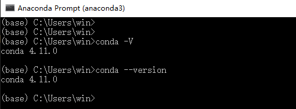
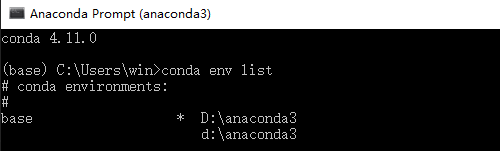
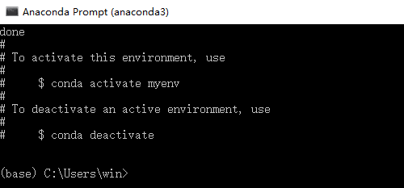
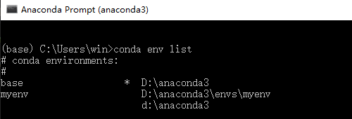
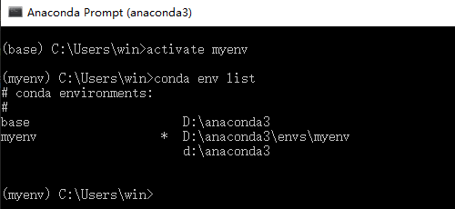
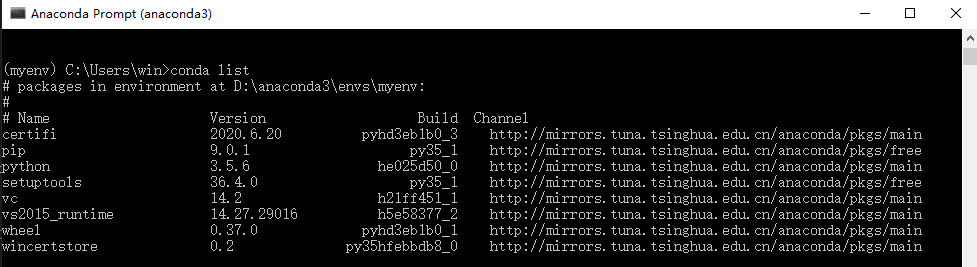
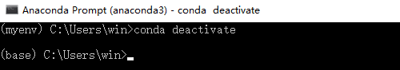
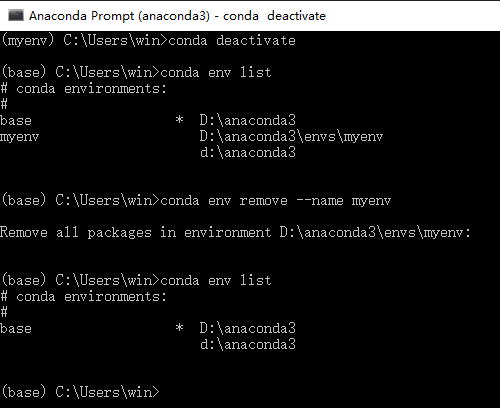

前文我们安装了Anaconda，本文主要介绍如何利用conda建立及管理Python虚拟环境。

## 前言
开发python时，经常会需要不同的python版本以及不同的packages，如果你只需要使用特定的包，或者想要尝试不同的开发环境，但又不想彼此的开发环境受到影响，那么 Anaconda 的管理系统conda将是一个不错的方案。

conda命令是管理不同package时使用的，可以建立(create)、输出(export)、罗列(list)、删除(remove)和更新(update)环境中的包，还可以分享你的虚拟环境。

下面将通过5个步骤来说明conda如何建立及管理虚拟环境。


## 安装及更新
安装部分可参考前文《[AI入门之环境安装](https://lovelyun.github.io/AI/AI%E5%85%A5%E9%97%A8%E4%B9%8B%E7%8E%AF%E5%A2%83%E5%AE%89%E8%A3%85/)》或[官网](https://docs.anaconda.com/anaconda/install/)，从开始菜单中打开Anaconda Prompt后，可以通过下列命令查看当前版本：

```
conda -V
conda --version
```



通过下列命令更新：

```
conda update conda
```

## 建立虚拟环境
查看当前已安装的虚拟环境：

```
conda env list
```



假设我们要建立一个叫myenv的虚拟环境，并且安装python 3.5的版本，我们可以执行下面的命令：

```
conda create --name myenv python=3.5
```

安装完成后会出现下面的提示，提醒启动和关闭该环境的命令：


这时，我们conda env list可以看到多了一个刚刚建立的虚拟环境myenv。


## 启动虚拟环境

```
activate myenv
```



当前环境已经切换到myenv。
我们可以看到命令行最前面的括号内显示myenv，而且conda env list可以看到myenv后面有星号。

如果是Linux或者macOS，启动虚拟环境的命令将是：

```
source activate myenv
```

还可以通过下列命令看当前的虚拟环境安装了哪些东西：

```
conda list
```



如果要在当前环境安装新的包，比如安装numpy，那么只需要执行下列命令：

```
conda install numpy
```

## 离开虚拟环境
windows中可以执行下列命令关闭虚拟环境：

```
conda deactivate
```


Linux或者macOS则是：

```
source deactivate
```

## 删除虚拟环境或package
删除myenv环境中的numpy包：

```
conda remove --name myenv numpy
```

如果要删除整个虚拟环境，比如删除上面创建的myenv，需要先deactivate关闭该环境，再执行下列命令：

```
conda env remove --name myenv
```



## 总结
为不同的需求建立独立的虚拟环境是个很好的习惯。
因为它不会影响其它的系统配置，如果某个版本出现了问题，可以很轻易的删除某个package，或者重新搭建虚拟环境。
