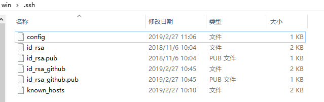

## 下载
[下载git bash](https://gitforwindows.org/)
[下载meld](http://meldmerge.org/)

## 基础配置
新建.gitconfig和meld.sh文件放到C:\Users\win

.gitconfig文件内容如下：

```bash
[user]
  email = youremail@xxx.xx
  name = yourname
[gui]
  encoding = UTF-8
[core]
  autocrlf = true
[color]
  ui = auto
[branch]
  autosetuprebase = always
[alias]
  st = status
  ci = commit
  co = checkout
  br = branch
  rb = reset --hard ORIG_HEAD
  unstage = reset HEAD
  lg = log --graph --oneline --decorate
  last = log --graph --oneline --decorate origin/master..HEAD
[merge]
  tool = meld
[diff]
  external = C:/Users/win/meld.sh
```

meld.sh文件内容如下：

```bash
#!/bin/sh
meld $2 $5
```

## 升级配置

### 设置SSH Key

```bash
#生成公钥
ssh-keygen -t rsa -C "youremail@xxx.xx"

#查看公钥（复制公钥后到git仓库公钥管理页面添加key）
cat ~/.ssh/id_rsa.pub

#验证是否添加成功
ssh -T git@xxx.xxx.xxx
#Welcome to GitLab, xx! // 成功会出现这行欢迎
```

### 多个ssh-key的管理
假设你已经完成了上面的步骤，现在要给github添加一个用户和ssh-key。

```bash
#生成公钥
ssh-keygen -t rsa -C "youremail@gmail.com"
```

现在进入.ssh目录，比如我的电脑用户名是win，我的目录就是C:\Users\win\.ssh，把刚刚生成的id_rsa_github和id_rsa_github.pub都放进来。
新建config文件，内容如下：

```bash
Host github.com
  HostName github.com
  IdentityFile C:\\Users\\win\\.ssh\\id_rsa_github
  PreferredAuthentications publickey
  User youremail@gmail.com
```

现在.ssh目录结构如下：

现在本地都配置完毕，去github添加刚刚生成的id_rsa_github.pub。然后验证ssh-key是否都添加成功。

因为有多个用户了，上面的.gitconfig全局配置了用户信息。那么在特殊项目，就需要局部设置用户信息：

```bash
#局部配置，优先使用局部配置,如果没有局部配置，默认用全局配置
cd ~/workspace/github_project/
git config user.name 'yourename'
git config user.email 'youremail@gmail.com'
```

### 解决LF和CRLF问题
推荐使用方法2。

1、.gitconfig文件里的autocrlf设置为true

> true会在git commit的时候自动把commit的内容里的CRLF转成LF，保证远端代码都是LF

2、vscode用户，在USER SETTINGS里增加配置项"files.eol": "\n"

> files.eol配置项含义：The default end of line character. Use \n for LF and \r\n for CRLF.

3、vscode安装插件，保存是自动转换成LF。比如EditorConfig for VS Code.

### 统一commit message格式

根据 angular 规范提交 commit， 这样 history 看起来更加清晰，还可以自动生成 changelog。

提交 commit 的类型，包括以下几种：

- feat: 新功能
- fix: 修复问题
- docs: 修改文档
- style: 修改代码格式(空格、换行、分号等)，不影响代码逻辑
- refactor: 重构代码（既不是修复bug，也不是增加新特性），理论上不影响现有功能
- perf: 提升性能
- test: 增加修改测试用例
- chore: 修改工具相关（包括但不限于文档、代码生成等）
- deps: 升级依赖,修改版本号

还可以借助插件来写符合规范的message:

```bash
# Making your repo Commitizen-friendly
# For this example, we'll be setting up our repo to use AngularJS's commit message convention also known as conventional-changelog.
# First, install the Commitizen cli tools:
npm install commitizen -g

# Next, initialize your project to use the cz-conventional-changelog adapter by typing:
commitizen init cz-conventional-changelog --save-dev --save-exact

# commit codes(use git cz to instead git commit)
# For detailed explanation on how things work, checkout the [guide](https://github.com/commitizen/cz-cli).
git cz
```

## 常用命令

### 基础操作

```bash
# init
git clone git@git.xxx.xx:xx/xxx.git

# add codes
git add

# push codes
git push origin feature-name

# new branch
git checkout master
git checkout -b feature-new

# merge branches(use rebase to instead merge)
# For example, merge feature-new to master(please make master up-to-date with 'origin/master' at first)
git checkout feature-new
git rebase master
git checkout master
git rebase feature-new
```

### tag
```bash
#新建标签
git tag v1.0 // 打在最近的commit上
git tag v0.9 f52c633 // 打在f52c633上
git tag -a v0.9 -m "blablabla..." // 指定标签信息

#查看标签
git tag // 查看所有标签
git show v0.9 // 查看单个标签，可以看到标签信息

#删除标签
git tag -d v0.1 //删除本地标签
git push origin :refs/tags/v0.1 //删除远程标签

#推送标签
git push origin v1.0 // 推送单个标签
git push origin --tags // 推送所有标签
```
