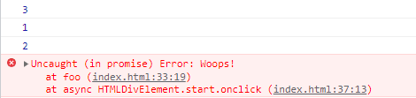

本文主要总结javascript异步error的抛出和捕获。

首先我们有一个耗时的操作wait：

```javascript
const wait = (ms) => {
    return new Promise((resolve) => setTimeout(resolve, ms))
}
```

有一个函数`foo`调用了上面的`wait`：

```javascript
const foo = async () => {
    console.log(1)
    await wait(2000)
    console.log(2)
}

console.log(3)
await foo()
console.log(4)

// 3
// 1
// 等待约2秒
// 2
// 4
```

async函数`foo`发生异常的话，可以通过`throw`一个`Error`来抛出：

```javascript
const foo = async () => {
    await wait(2000)
    throw new Error('Woops!')
}
```



或者返回一个`Promise.reject`，不过`throw error`的方式更常用。

```javascript
const foo = async () => {
    await wait(2000)
    return Promise.reject(new Error('Whoops!'))
}
```

`foo`发生异常后，可以通过`catch`来捕获，这样就不会报`Uncaught`错误。

```javascript
const bar = async () => {
    await foo().catch((e) => {
        console.log(e) // caught
    })
}
```

因为`foo`是一个`async`函数，返回的是一个`Promise`，所以可以像`Promise`捕获异常一样，直接在函数`foo`后面跟`catch`。

或者用`try-catch`来捕获：

```javascript
const bar = async () => {
    try {
        await foo() // caught
    } catch(e) {
        console.log(e)
    }
}
```

对于异步函数，比如上面的`foo`，尽量在执行的时候用`await`，可以避免很多问题。比如用`try-catch`捕获异常时，如果没有`await`，就捕获不到：

```javascript
const bar = async () => {
    try {
        foo() // uncaught
    } catch(e) {
        console.log(e)
    }
}
```

上面这些操作基本就能捕获到异常，然后做一些异常处理逻辑，比如提示操作失败，隐藏处理中的提示等等。
编码时注意对异步逻辑的处理，最后就都能通过上面的方式捕获异常，更复杂的问题，可以试试`Promise.all`。
