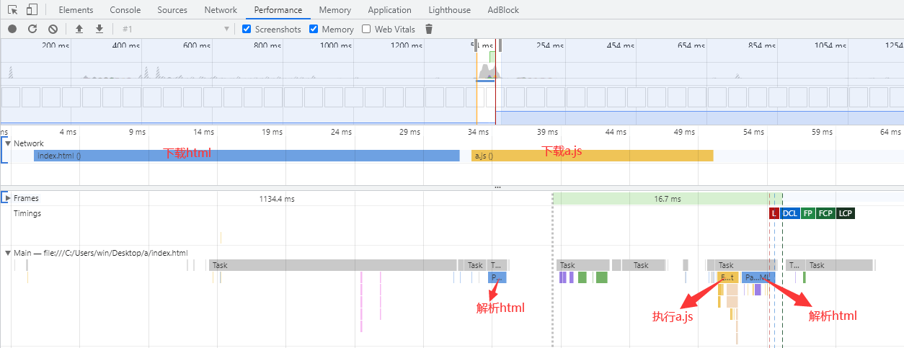
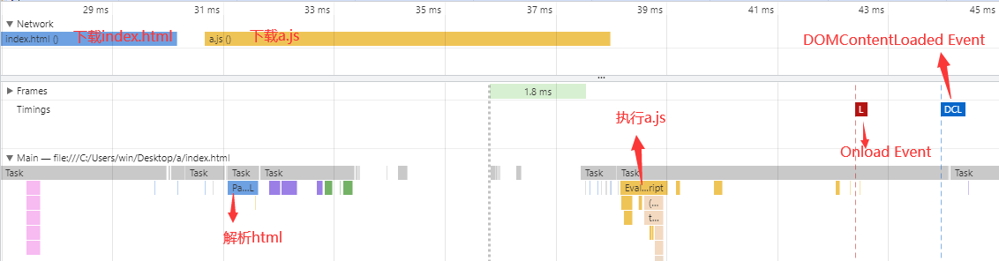
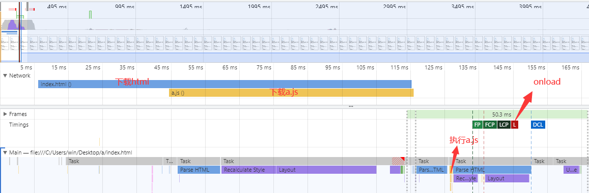
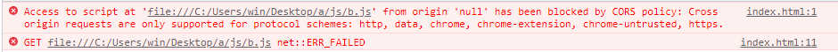
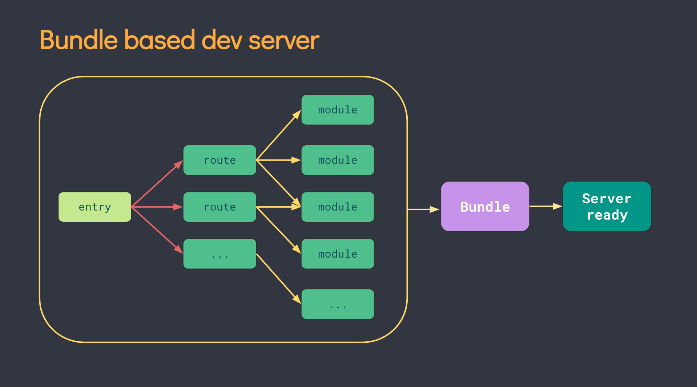

## 前言
本文主要理理js模块化相关知识。
涉及到内联脚本、外联脚本、动态脚本、阻塞、defer、async、CommonJS、AMD、CMD、UMD、ES Module。顺带探究下Vite。

## 内联脚本
假设你是一个前端新手，现在入门，那么我们创建一个html页面，需要新建一个index.html文件：

```html
<!DOCTYPE html>
<html>
<head>
  <title>test</title>
</head>
<body>
  <p id="content">hello world</p>
</body>
</html>
```

如果需要在页面中执行javascript代码，我们就需要在 HTML 页面中插入 `<script>` 标签。

有2种插入方式：
1、放在`<head>`中
2、放在`<body>`中

比如，点击hello world之后，在hello world后面加3个感叹号的功能，我们在head中加入script标签，并给hello world绑定点击事件：

```html
<!DOCTYPE html>
<html>
<head>
  <title>test</title>
  <script>
    function myFunction() {
      document.getElementById('content').innerHTML = 'hello world!!!'
    }
  </script>
</head>

<body>
  <p id="content" onclick="myFunction()">hello world</p>
</body>
</html>
```

如果加在body中，一般放在body的最后面：

```html
<!DOCTYPE html>
<html>
<head>
  <title>test</title>
</head>

<body>
  <p id="content" onclick="myFunction()">hello world</p>
  <script>
    function myFunction() {
      document.getElementById('content').innerHTML = 'hello world!!!'
    }
  </script>
</body>
</html>
```

简单的逻辑我们可以用这2种方式写，这种方式叫做内联脚本。

## 外联脚本
当逻辑复杂时，我们可以把上面的script标签中的代码抽取出来，比如在html的同级目录创建一个js文件夹，里面新建一个a.js的文件。

a.js中写上面script标签中的代码：

```javascript
function myFunction() {
  document.getElementById('content').innerHTML = 'hello world!!!'
}
```

上面的script标签则可以改成：

```html
<script src="./js/a.js"></script>
```

## 阻塞
上面的2种写法，浏览器在加载html时，遇到script标签，会停止解析html。
内联脚本会立刻执行；外联脚本会先下载再立刻执行。
等脚本执行完毕才会继续解析html。
（html解析到哪里，页面就能显示到哪里，用户也能看到哪里）

比如下面的代码：

```html
<p>...content before script...</p>

<script src="./js/a.js"></script>

<p>...content after script...</p>
```

解析到第一个p标签，我们能看到`...content before script...`显示在了页面中，然后浏览器遇到script标签，会停止解析html，而去下载a.js并执行，执行完a.js才会继续解析html，然后页面中才会出现`...content after script...`。

我们可以通过Chrome的Developer Tools分析一下index.html加载的时间线：



这会导致2个问题：
1、脚本无法访问它下面的dom；
2、如果页面顶部有个笨重的脚本，在它执行完之前，用户都看不到完整的页面。

对于问题2，我们可以把脚本放在页面底部，这样它可以访问到上面的dom，且不会阻塞页面的显示：

```html
<body>
  ...all content is above the script...

  <script src="./js/a.js"></script>
</body>
```

但这不是最好的办法，我们接着往下看。

## defer
我们给script标签加defer属性，就像下面这样：

```html
<p>...content before script...</p>

<script defer src="./js/a.js"></script>

<p>...content after script...</p>
```

defer 特性告诉浏览器不要等待脚本。于是，浏览器将继续解析html，脚本会并行下载，然后等 DOM 构建完成后，脚本才会执行。

这样script标签不再阻塞html的解析。

这时再看时间线：



需要注意的是，具有 defer 特性的脚本保持其相对顺序。

比如：

```html
<script defer src="./js/a.js"></script>
<script defer src="./js/b.js"></script>
```

上面的2个脚本会并行下载，但是不论哪个先下载完成，都是先执行a.js，a.js执行完才会执行b.js。
这时，如果b.js依赖a.js，这种写法将很有用。

另外需要注意的是，defer 特性仅适用于外联脚本，即如果 script标签没有 src属性，则会忽略 defer 特性。

## async
我们可以给script标签加async属性，就像下面这样：

```html
<script async src="./js/a.js"></script>
```

这会告诉浏览器，该脚本完全独立。
独立的意思是，DOM 和其他脚本不会等待它，它也不会等待其它东西。async 脚本就是一个会在加载完成时立即执行的完全独立的脚本。

这时再看时间线：



可以看到，虽然下载a.js不阻塞html的解析，但是执行a.js会阻塞。

还需要注意多个async时的执行顺序，比如下面这段代码：

```html
<p>...content before script...</p>

<script async src="./js/a.js"></script>
<script async src="./js/b.js"></script>

<p>...content after script...</p>
```

两个p标签的内容会立刻显示出来，a.js和b.js则并行下载，且下载成功后立刻执行，所以多个async时的执行顺序是谁先下载成功谁先执行。
一些比较独立的脚本，比如性能监控，就很适合用这种方式加载。

另外，和defer一样，async 特性也仅适用于外联脚本。

## 动态脚本
我们可以动态的创建一个script标签并append到文档中。

```javascript
let script = document.createElement('script')
script.src = '/js/a.js'
document.body.append(script)
```

append后脚本就会立刻开始加载，表现默认和加了async属性一致。
我们可以显示的设置script.async = false来改变这个默认行为，那么这时表现就和加了defer属性一致。

上面的这些写法，当script标签变多时，容易导致全局作用域污染，还要维护书写顺序，要解决这个问题，需要一种将 JavaScript 程序拆分为可按需导入的单独模块的机制，即js模块化，我们接着往下看。

## CommonJS
很长一段时间 JavaScript 没有模块化的概念，直到 Node.js 的诞生，把 JavaScript 带到服务端，这时，CommonJS诞生了。

CommonJS定义了三个全局变量：

```
require，exports，module
```

require 读入并执行一个 js 文件，然后返回其 exports 对象；
exports 对外暴露模块的接口，可以是任何类型,指向 module.exports；
module 是当前模块，exports 是 module 上的一个属性。

Node.js 使用了CommonJS规范。

比如：

```
// a.js
let name = 'Lily'
export.name = name

// b.js
let a = require('a.js')
console.log(a.name) // Lily
```

由于CommonJS不适合浏览器端，于是出现了AMD和CMD规范。

## AMD
AMD（Asynchronous Module Definition） 是 RequireJS 在推广过程中对模块定义的规范化产出。

基本思想是，通过 define 方法，将代码定义为模块。当这个模块被 require 时，开始加载依赖的模块，当所有依赖的模块加载完成后，开始执行回调函数，返回该模块导出的值。

使用时，需要先引入require.js：

```html
<script src="require.js"></script>
<script src="a.js"></script>
```

然后可以这样写：

```javascript
// a.js
define(function() {
    let name = 'Lily'
    return {
        name
    }
})
// b.js
define(['a.js'], function(a) {
    let name = 'Bob'
    console.log(a.name) // Lily
    return {
        name
    }
})
```

## CMD
CMD（Common Module Definition） 是 Sea.js 在推广过程中对模块定义的规范化产出。

使用时，需要先引入sea.js：

```html
<script src="sea.js"></script>
<script src="a.js"></script>
```

然后可以这样写：

```javascript
// a.js
define(function(require, exports, module) {
    var name = 'Lily'
    exports.name = name
})

// b.js
define(function(require, exports, module) {
    var name = 'Bob'
    var a = require('a.js')
    console.log(a.name) // 'Lily'
    exports.name = name
})
```

## UMD
UMD (Universal Module Definition) 目的是提供一个前后端跨平台的解决方案(兼容全局变量、AMD、CMD和CommonJS)。

实现很简单，判断不同的环境，然后以不同的方式导出模块：

```javascript
(function (root, factory) {
    if (typeof define === 'function' && (define.amd || define.cmd)) {
        // AMD、CMD
        define([], factory);
    } else if (typeof module !== 'undefined' && typeof exports === 'object') {
        // Node、CommonJS
        module.exports = factory();
    } else {
        // 浏览器全局变量
        root.moduleName = factory();
  }
}(this, function () {
    // 只需要返回一个值作为模块的export
    // 这里我们返回了一个空对象
    // 你也可以返回一个函数
    return {};
}));
```

## ES Module
AMD 和 CMD 是社区的开发者们制定的模块加载方案，并不是语言层面的标准。从 ES6 开始，在语言标准的层面上，实现了模块化功能，而且实现得相当简单，完全可以取代上文的规范，成为浏览器和服务器通用的模块解决方案。

ES6 的模块自动采用严格模式。模块功能主要由两个命令构成：export和import。

export命令用于规定模块的对外接口；
import命令用于输入其他模块提供的功能。

比如上面的代码，我们可以这样写：

```javascript
// a.js
const name = 'Lily'

export {
  name
}

// 等价于
export const name = 'Lily'

// b.js
import { name } from 'a.js'
console.log(name) // Lily

// b.js
import * as a from 'a.js'
console.log(a.name) // Lily
```

此外，还可以用export default默认导出的写法：

```javascript
// a.js
const name = 'Lily'

export default {
  name
}

// b.js
import a from 'a.js'
console.log(a.name) // Lily
```

如果只想运行a.js，可以只import:

```javascript
// b.js
import 'a.js'
```

我们可以给script标签加type=module让浏览器以 ES Module 的方式加载脚本：

```html
<script type="module" src="./js/b.js"></script>
```

这时，script标签会默认有defer属性（也可以设置成async），支持内联和外联脚本。

这时我们运行打开index.html，会发现浏览器报错了：



这是因为 type=module 的 script 标签加强了安全策略，浏览器加载不同域的脚本资源时，如果服务器未返回有效的 Allow-Origin 相关 CORS 头，会禁止加载改脚本。而这里启动的index.html是一个本地文件（地址是file://路径），将会遇到 CORS 错误，需要通过一个服务器来启动 HTML 文件。

## Vite
在浏览器支持 ES Module 之前，我们用工具实现JavaScript模块化的开发，比如webpack、Rollup 和 Parcel 。但是当项目越来越大后，本地热更新越来越慢，而 Vite 旨在利用ESM解决上述问题。



Vite使用简单，可以去[官网](https://cn.vitejs.dev/)看看。

## 总结
老的规范了解即可，未来是ES Module的，用Vite可以极大的提升开发时的体验，生产环境用Rollup打包。
