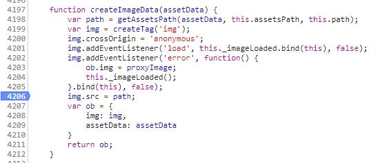

[Web动画之AE+Bodymovin](https://lovelyun.github.io/animation/Web%E5%8A%A8%E7%94%BB%E4%B9%8BAE+Bodymovin/)文中的应用过程最近找到了2点优化空间：

1、图片资源加载2次，增加了CDN流量。优化方向：图片加载次数减小到1次；
2、设计输出的图片资源多且零散，有9张小图片。优化方向：多张图片合并成1张雪碧图，减少网络请求。

## 加载次数

上图可以看到，同一张图加载了2次，且返回的status都是200。

首先分析同一张图片加载2次的原因。

查看源码发现图片加载主要有预加载逻辑和页面元素创建逻辑两处：



预加载逻辑中会调用`creatimagedata`，这里会将所有的图片提前下载，后面创建svg页面元素时调用了`creatcontent`也会加载图片。

点击图片查看请求Headers，发现Request Headers中的Cache-Control值为no-cache,表示客户端缓存内容，但是是否使用缓存则需要经过协商缓存来验证决定。协商缓存的概念和协商过程这里就不叙述了，但很明显，这里的协商缓存没有命中，如果协商缓存命中，请求响应返回的http状态为304并且会显示一个Not Modified的字符串。

这就体现了协商缓存的缺陷：
如果资源更新的速度是秒以下单位，那么该缓存是不能被使用的，因为它的时间单位最低是秒。

而我们这里的资源下载速度最慢的也只有293ms，所以预加载的图片缓存并没有体现出预计的效果。所以图片被加载了2次。

如果不做上面方案二雪碧图的优化，可以简单的把预加载逻辑去掉。那么图片就不会加载2次了。

## 雪碧图
查看[lottie-web](https://github.com/airbnb/lottie-web)的文档和源码，发现并不支持雪碧图。
参阅开源项目[lottie-web-sprite](https://github.com/newbieYoung/lottie-web-sprite)源码后，对我们用到的lottie_svg做改造：

### 生成雪碧图
生成雪碧图使用[lia](https://github.com/cupools/lia)。步骤如下：

创建精灵图配置文件`sprite_conf.js`。（使用lia init命令可以自动生成配置文件，只不过因为需要使用自定义模版，所以这里手动创建）

```javascript
'use strict';

module.exports = [{
    src: ['*.png'], // 图片素材路径匹配规则
    image: 'sprite.png', // 生成的精灵图的路径
    style: 'sprite.js', // 生成的图片素材和精灵图的位置关系数据文件的路径
    tmpl: './template.ejs' // 图片素材和精灵图的位置关系数据文件模版
}];
```

创建图片素材和精灵图的位置关系数据模版文件template.ejs。

```
var opt = {
  width: <%= size.width %>,
  height: <%= size.height %>,
  src: '<%= realpath %>',
  count: <%= items.length %>,
  items: [
      <% items.forEach(function(item, idx) { -%>
      {
          index: <%= idx %>,
          name: '<%= item.name %>',
          width: <%= item.size.width %>,
          height: <%= item.size.height %>,
          x: <%= item.x %>,
          y: <%= item.y %>
      },
      <% }) -%>
  ]
}

module.exports = opt;
```

运行下面2行命令得到精灵图sprite.png以及位置关系数据文件sprite.js：

```bash
npm i -g lia
lia
```

把位置关系数据文件sprite.js中的绝对路径改为相对路径：`src: './sprite.png',`。

<div class="tip">
此文基础：所有文件都在同一目录层级，否则需要注意修改相对目录结构。
</div>

### 修改data.json
data.json新增字段_sprite，将sprite.js中的数据复制给_sprite。此时data.json中的数据看起来类似这样：

```json
{
  "v": "5.5.0",
  "fr": 25,
  "ip": 0,
  ...
  "assets": [{
    "id": "image_0",
    "w": 66,
    "h": 55,
    "u": "",
    "p": "img_0.png",
    "e": 0
  }
  ...
  ],
  "layers": [...],
  "markers": [],
  "_sprite": {
    "width": 733,
    "height": 568,
    "src": "./sprite.png",
    "count": 9,
    "items": [{
        "index": 0,
        "name": "img_0",
        "width": 66,
        "height": 55,
        "x": 243,
        "y": 310
      }
      ...
    ]
  }
}
```

### 更改源码
更改configAnimation方法，增加preloadSprite方法和loadAssetsFromSprite方法，这些可参考lottie-web-sprite。

另外需要更改getAssetsPath方法，如果有_spriteSrc，图片路径取雪碧图生成的base64编码。方法里的其他逻辑不变。

```javascript
AnimationItem.prototype.getAssetsPath = function (assetData) {
    var path = '';
    if (this._spriteSrc) {
        this.imagePreloader.images.assetData
        var i = 0, len = this.imagePreloader.images.length;
        while (i < len) {
            if(assetData.id == this.imagePreloader.images[i].assetData.id){
                return this.imagePreloader.images[i].img.src;
            }
            i += 1;
        }
    } else if(assetData.e) {
        path = assetData.p;
    } else if(this.assetsPath){
        var imagePath = assetData.p;
        if(imagePath.indexOf('images/') !== -1){
            imagePath = imagePath.split('/')[1];
        }
        path = this.assetsPath + imagePath;
    } else {
        path = this.path;
        path += assetData.u ? assetData.u : '';
        path += assetData.p;
    }
    return path;
};
```

### 总结
现在就可以应用雪碧图了。


<div class="tip">lia自动生成的雪碧图还可以再压缩的哦</div>


优化效果总结（以童话故事吊牌数据为例）：

| | webp格式动图 | HTML | HTML格式优化后 |
| --- | --- | --- | --- |
| 总流量 | 2M	| 258.2k | 139.3k |
| 图片请求次数 | 1 | 18 | 1 |

webp格式动图主要缺点是太大，接近2M。
做成HTML吊牌后，利用第三方库实现动效，但是这种方式的缺点是设计直接输出的图多且零散，比如童话故事有9张图，第三方库会预加载图片，发起9次请求，由于CDN缓存机制导致预加载功能失效，会重复加载，一共发起18次图片资源请求。
HTML吊牌优化后，效果最佳。主要更改了第三方库的源码，多张图片合并成1张，图片资源大小和请求次数都大幅减小。

<div class="tip">本文修改的是lottie-web-5.5.0版本的lottie_svg.js源码</div>

## 参考
- [lottie-web-sprite](https://github.com/newbieYoung/lottie-web-sprite)
- [精灵图在 Lottie Web 动画中的应用 - 知乎](https://zhuanlan.zhihu.com/p/52456720)
- [lia](https://github.com/cupools/lia)
- [一文读懂前端缓存 - 知乎](https://zhuanlan.zhihu.com/p/44789005)
