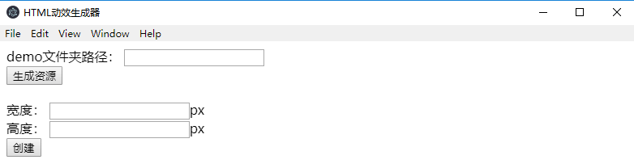

[前文](https://lovelyun.github.io/js/lottie-web%E5%BA%94%E7%94%A8%E4%BC%98%E5%8C%96/)的优化中，主要把设计输出的多张图片合并成1张雪碧图，减小了图片请求次数和资源大小。
每次新的动效出来，还需要开发介入处理。

本文的优化主要解决2个问题：
1、资源文件多，不方便发布。
前文优化后，有3个文件，1个html，1个json，1个png的雪碧图。
本文优化后，只有1个html文件。

2、需要开发介入。
前文优化后，需要开发处理雪碧图生成、json数据改造、雪碧图压缩等等。
本文优化后，不需要开发介入。设计用AE导出资源后，通过前端提供的工具，自动生成html代码，这个html文件直接发布即可。

优化方案：通过Electron，开发出一个桌面应用，这个应用将自动处理所有需要开发介入的事情。

## Electron
Electron 是一个使用 JavaScript, HTML 和 CSS 等 Web 技术创建原生程序的框架。
【[打造你的第一个 Electron 应用](https://electronjs.org/docs/tutorial/first-app)】一文可以让你快速上手Electron。

## 动效生成器
### 界面
启动Electron应用，会打开一个界面，本文叫做HTML动效生成器，界面中收集3个信息：
1、AE导数的demo文件夹；
2、动效尺寸宽
3、动效尺寸高

比如demo文件在桌面，那么在demo文件夹路径的输入框中直接填入地址：C:\Users\win\Desktop\demo
因为默认导出的数据尺寸宽高是100%，大小不固定，所以还需收集尺寸信息。动效宽高填设计元素的宽高即可（单位px）。

### 生成逻辑
逻辑写在`renderer.js`中。
设计输出资源的目录demo文件夹的结构是这样的：
.
├── images
│ ├── img_0.png
│ ├── img_1.png
│ ├── img_2.png
│ ├── …
├── demo.html
├── lottie.js
└── data.json

点击生成资源按钮时，
1、获取images文件夹下的图片资源。主要用到node文件系统fs的readdirSync。
2、将图片转成Base64。主要用到readFileSync来读取文件、Buffer.from将读取到的文件转成Base64。
3、更改data.json中的assets字段，将代表图片相对路径的p字段置空，将代表图片的u字段改成Base64。这样png图片文件就Base64编码整个进data.json文件了。更改字段主要是先readFileSync读取utf8格式文件，然后将读取的数据转成json格式，重新将要更改的字段赋值，然后转成字符串writeFileSync写入data.json。
然后点击创建按钮，
1、重写index.html文件，把动效尺寸宽高重写，把data.json文件的数据整个进html。
2、把重写后的index.html文件输出到demo文件夹下，这个index.html就是我们最终想要的文件。

1、注意本地文件相对路径的写法，需要用path来拼接，如果直接写相对路径，在打包后相对路径发生变化会导致文件找不到

2、重写，复制等文件操作其实主要就是node fs文件系统的读和写，必要的时候做一个格式转换。

`static/index.html`是index.html的模版文件，主要是删除设计输出的demo.html文件的多余信息，lottie库通过script引入而不是直接在html中，animationData置空，生成的时候会重写。

### 打包
参考官网的[应用程序打包](https://electronjs.org/docs/tutorial/application-packaging)，选择[electron-packager](https://github.com/electron-userland/electron-packager)来打包，打包后生成`.exe`可执行文件，双击即可启动该桌面应用。
至此，自动生成代码的小工具就完成啦。

## 总结
数据对比：
| | webp格式动图|HTML|HTML格式雪碧图优化|HTML格式Base64优化 |
| --- | --- | --- | --- | --- |
|总流量| 2M|258.2k|139.3k|161k|
|图片请求次数|1|18|1|0|
|总请求次数|1|21|3|2|
