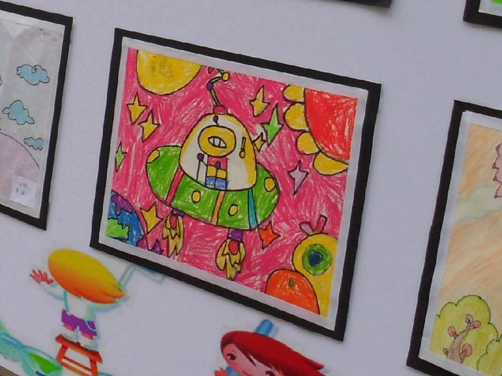
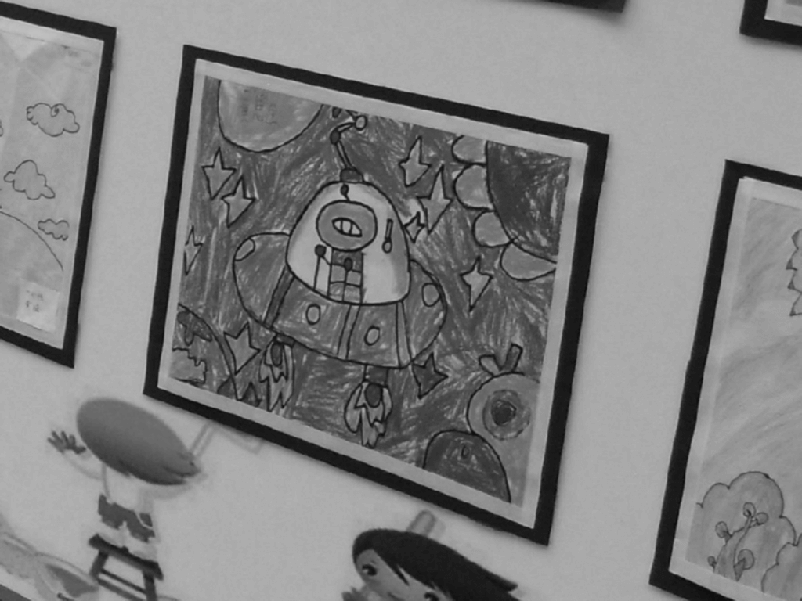
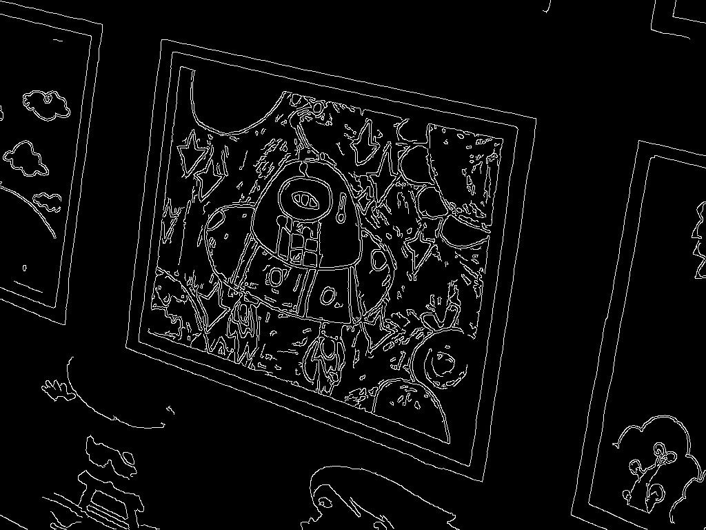
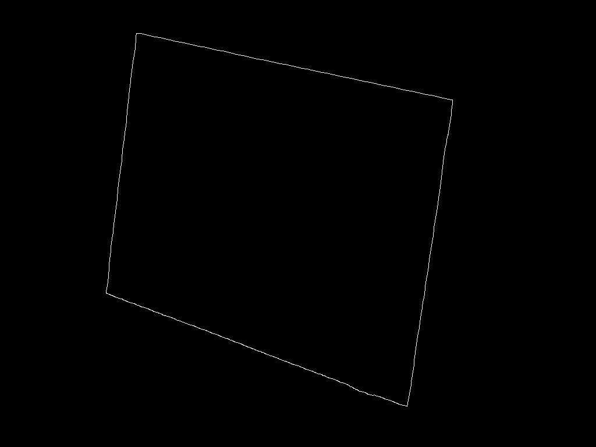
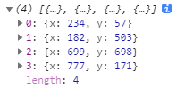
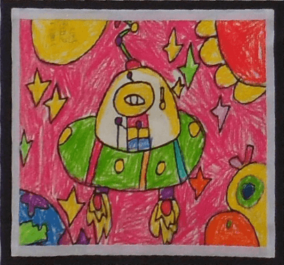

[前文](https://lovelyun.github.io/%E5%9B%BE%E5%83%8F%E5%A4%84%E7%90%86/openCVjs%E5%9B%BE%E5%83%8F%E5%A4%84%E7%90%86%E4%B9%8B%E6%89%8B%E5%8A%A8%E7%9F%AB%E6%AD%A3/)我们写了如何做手动矫正，那需要用户手动框选需要矫正的四边形，而本文，我们简单的实现一种自动矫正，程序检测出图像中的四边形后，自动矫正，不需要手动框选四边形。

跟上文一样，我们的图片处理程序放在处理按钮的点击事件中：

```javascript
changeImageElement.onclick = function () {
    // 图片处理
}
```

首先读取图片：

```javascript
let src = cv.imread("imageUpload");
```



接着做一些预处理，先灰度：

```javascript
let dst = new cv.Mat();
cv.cvtColor(src, dst, cv.COLOR_BGR2GRAY, 0); // 转灰度
```


再高斯模糊：

```javascript
cv.GaussianBlur(dst, dst, new cv.Size(3, 3), 0); // 高斯模糊
```



再Canny检测边缘：

```javascript
cv.Canny(dst, dst, 75, 200); // 边缘检测
```



检测出边缘后，通过findContours找出所有轮廓：

```javascript
let contours = new cv.MatVector();
let hierarchy = new cv.Mat();
cv.findContours(dst, contours, hierarchy, cv.RETR_CCOMP, cv.CHAIN_APPROX_SIMPLE)
```

然后从所有轮廓中找到面积最大的闭合轮廓：

```javascript
let index = 0, maxArea = 0;
for (let i = 0; i < contours.size(); ++i) {
    let tempArea = Math.abs(cv.contourArea(contours.get(i)));
    if (tempArea > maxArea) {
        index = i;
        maxArea = tempArea;
    }
}
```

如果把这个找到的轮廓显示出来，就是这样：



然后通过上面找到的轮廓进行多边形拟合，从而得到4个顶点：

```javascript
const foundCours = contours.get(index);
const arcL = cv.arcLength(foundCtrue);
let tmp = new cv.Mat();
// 逼近多边形
cv.approxPolyDP(foundCours, tmp, 0.01 * arcL, true);
let points = [];
if (tmp.total() === 4) {
    const data32S = tmp.data32S;
    for (let i = 0, len = data32S.length / 2; i < len; i++) {
        points[i] = { x: data32S[i * 2], y: data32S[i * 2 + 1] };
    }
}
```

把points打印出来可以看到，已经得到了4个顶点坐标：


接着对4个顶点进行排序，从左上角开始，顺时针排序：

```javascript
function getSortedVertex(points) {
    const center = {
        x: points.reduce((sum, p) => sum + p.x, 0) / 4,
        y: points.reduce((sum, p) => sum + p.y, 0) / 4
    }
    let sortedPoints = []
    sortedPoints.push(points.find(p => p.x < center.x && p.y < center.y))
    sortedPoints.push(points.find(p => p.x > center.x && p.y < center.y))
    sortedPoints.push(points.find(p => p.x > center.x && p.y > center.y))
    sortedPoints.push(points.find(p => p.x < center.x && p.y > center.y))
    return sortedPoints
}
```

调用上面的getSortedVertex可以得到排序后的顶点，我们将顶点依次放入数组srcPoints中：

```javascript
let srcPoints = []
getSortedVertex(points).forEach(p => {
    srcPoints.push(p.x, p.y)
})
```

接着和上文一样，进行透视变换即可，假设我们输出的图像宽408，高380，那么：

```javascript
const dstPoints = [0, 0, 408, 0, 408, 380, 0, 380]
const srcTri = cv.matFromArray(4, 1, cv.CV_3srcPoints);
const dstTri = cv.matFromArray(4, 1, cv.CV_3dstPoints);
const M1 = cv.getPerspectiveTransform(srcTri, dstTri)
const dsize = new cv.Size(408, 380);
cv.warpPerspective(src, dst, M1, dsize)
```

最后把处理过的图像显示到画布中，不要忘记删除不用的Mat：

```javascript
cv.imshow('canvasOutput', dst);
tmp.delete; src.delete(); dst.delete();
```



总结：
该算法实现比较简单。
在预处理中，还可以缩小图片，从而加快处理速度，最后找的的顶点坐标再放大。
也可能无法检测到四边形，从而无法得到4个顶点。
可以往两个方向优化。
1、检测时通过识别直线，再筛选直线，来找到四边形；
2、边缘检测神经网络。
但复杂的图像识别总有误差的可能，这时候手动就派上用场了。
不过简单的图像基本ok，比如银行卡照片的矫正：


