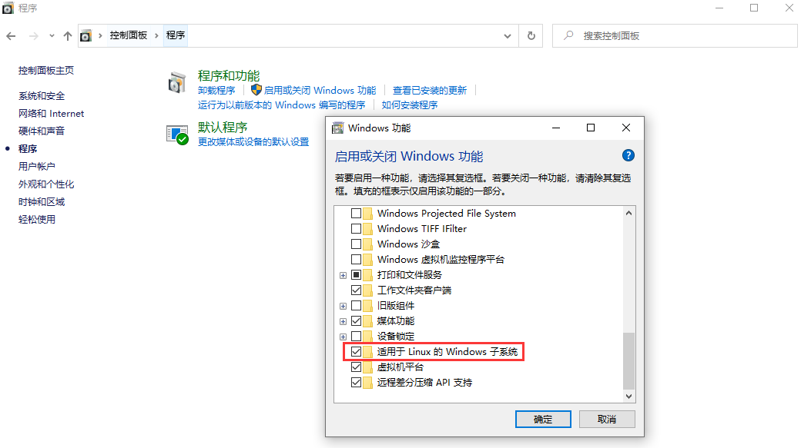
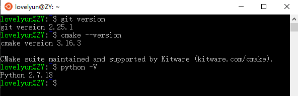
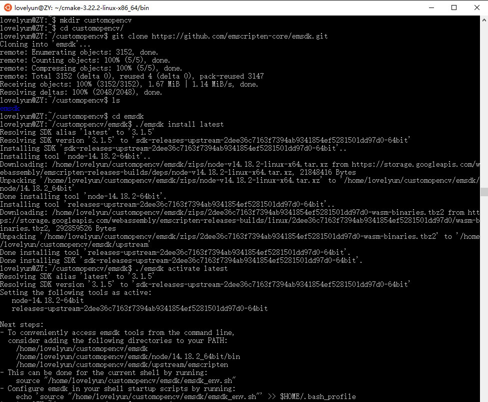
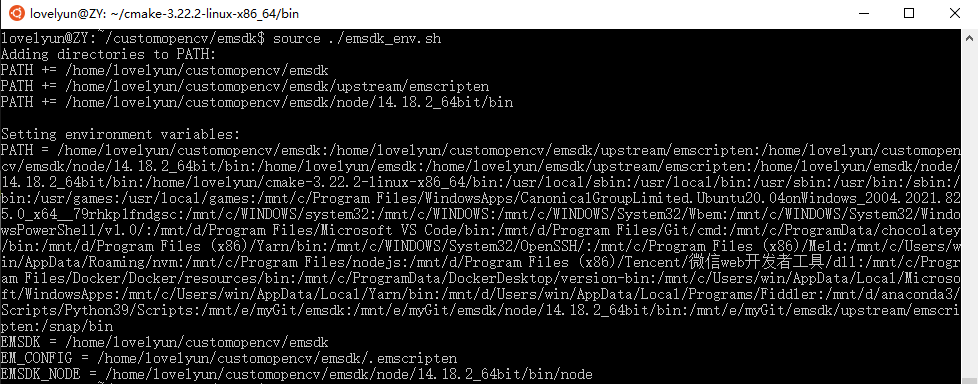
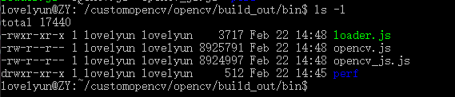
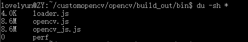
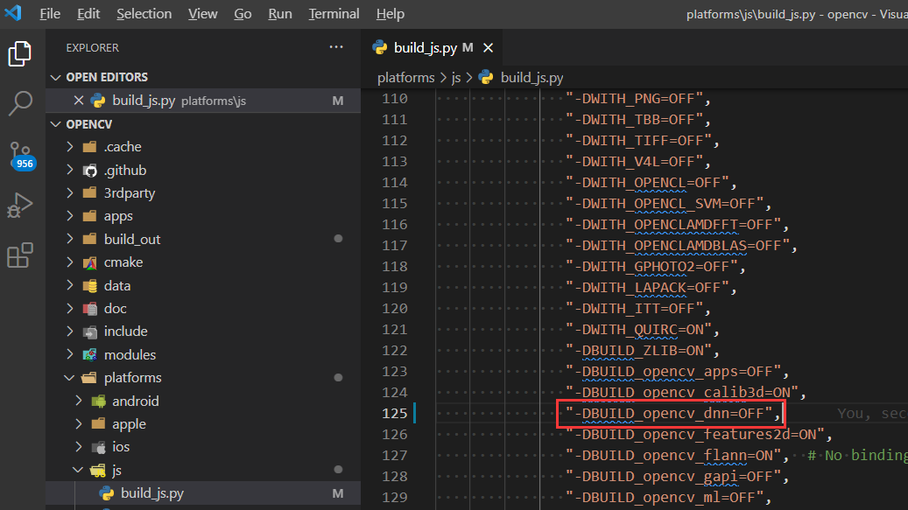
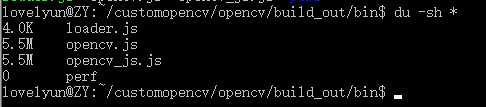
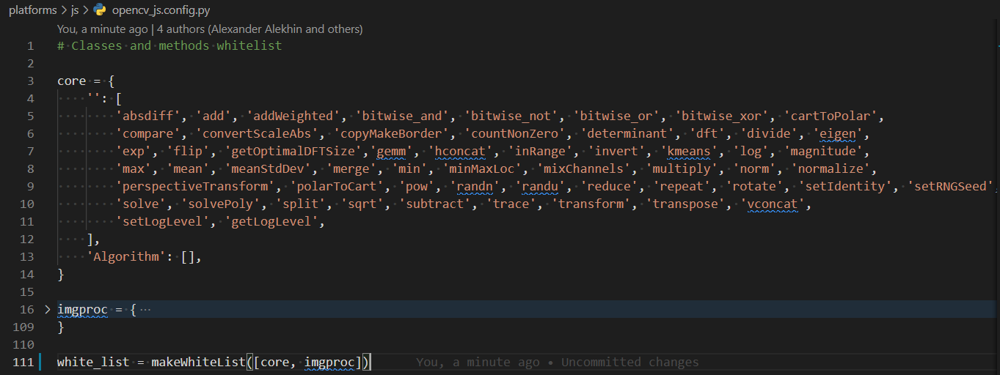
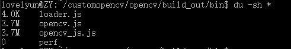

## 前言
本文主要讲win10系统怎么编译出opencv.js。
主要编译过程跟[官网](https://docs.opencv.org/4.5.5/d4/da1/tutorial_js_setup.html)一样，先安装[Emscripten](https://emscripten.org/docs/getting_started/downloads.html)，再获取opencv源码，再编译opencv源码。
本文主要解决的问题是在win10上怎么完成编译。

## WSL
先说一下背景，公司的电脑是win10，构建opencv.js需要用到[Emscripten](https://emscripten.org/docs/getting_started/downloads.html)，而Emscripten官网不推荐直接在windows系统上运行，对windows用户推荐了windows的Linux子系统。


一开始我不了解什么是window的Linux子系统，即WSL，于是我直接在windows中运行了（我不想装虚拟机，也不想重装系统，也不想把mac带到公司来），结果捣腾了2天也没把编译时的各种报错解决完，报错一个接一个，解决完一个又出现一个……

最后我决定去看一下WSL，发现非常好用，编译opencv.js一举成功！

### 安装WSL
1、勾选适用于Linux的windows子系统
路径是「控制面板」-「程序」-「启用或关闭Windows功能」


2、打开 Microsoft Store，搜索「WSL」，选1个安装，比如我装的第一个Ubantu 20.04。


3、安装完成后自动打开终端，没有自动打开就手动打开，跟linux系统一样，设置好用户名和密码，就进入linux系统了。

## 编译opencvjs
1、确保安装了git、cmake、python，没有安装的话运行下列命令安装：

```
sudo apt install git
sudo apt install cmake
sudo apt install python
```

安装后可以通过下列命令查看安装的版本：


2、安装Emscripten

```
# 创建customopencv目录
mkdir customopencv

# 进入customopencv目录
cd customopencv/

# 拉取emscripten源码
git clone https://github.com/emscripten-core/emsdk.git

# 进入emsdk目录
cd emsdk/
# 安装emsdk
./emsdk install latest
# 激活emsdk
./emsdk activate latest
# 设置环境变量
source ./emsdk_env.sh
```



3、获取opencv

回到上级目录，clone opencv源码：

```
# 拉取opencv源码
git clone https://github.com/opencv/opencv.git
```


4、编译opencvjs

运行下面的命令来编译：

```
python platforms/js/build_js.py build_out --emscripten_dir /home/lovelyun/customopencv/emsdk/upstream/emscripten --build_wasm --clean_build_dir
```

接下来去喝杯水，然后就可以看到编译成功了：

```
=====
===== Build finished
=====
OpenCV.js location: /home/lovelyun/customopencv/opencv/build_out/bin/opencv.js
```

进入到上面的bin文件夹，运行ls -l可以看到文件详情：



或者用du -sh *查看它们占用的空间：


这里的opencv.js就是我们最后需要的文件，现在在Linux子系统中，怎么传到windows系统中呢？

最简单的是在文件资源管理器的地址栏输入`\\wsl$`，回车就可以看到所有的子系统。


点进去就可以看到上面的文件，比如我的路径是`\\wsl$\Ubuntu-20.04\home\lovelyun\customopencv\opencv\build_out\bin`。


## 自定义opencv构建模块
接下来我们去掉DNN模块，首先用vscode打开子系统中的opencv文件夹，打开`/platforms/js/build_js.py`文件，把`get_cmake_cmd(self)`函数中的`-DBUILD_opencv_dnn=ON`改为`-DBUILD_opencv_dnn=OFF`。


重新构建后可以看到，opencv.js从一开始的8.6M减小到了5.5M。


我们还可以修改opencv_js.config.py，去掉没用到的函数，比如只保留core和imgproc。


此时编译出来的opencv.js就只有3.7M。


或许你觉得3.7M也很大，当然大啦，但是core和imgproc中没用到的函数还可以接着删除呀。

### demo
直接把bin目录中的opencv.js复制到项目中，比如下面这样引用：

```html
<script src="js/opencv.js" onload="onOpenCvReady();" type="text/javascript"></script>
```

然后发现调用cv的api会报错，比如`cv.imread is not a function`。
打印发现cv是一个promise，这里我们简单的处理一下，把cv重新赋值为promise返回的结果，就可以运行起来了。

```javascript
async function onOpenCvReady() {
  window.cv = await window.cv
}
```

按照官网的说法，应该是可以直接使用编译出来的opencv.js的，即直接替换官网编译的opencv.js。这里实测直接替换有问题，那就解决它，我们暂时不纠结为什么会有问题了，

## 总结
需要Linux环境的问题，就用Linux，不要用windows环境瞎折腾。

这次编译的大部分时间都在解决windows上的报错问题，虽然windows上安装都是成功的，校验是否安装成功的结果都是ok的，但编译时各种报错，最后用了WSL，一开始为了省时间直接把windows上下载的emsdk文件夹cp过去用，而且WSL中的python环境默认是python3，这些因素也导致了编译报错，最后我想完全重新来一次，在WSL中重新下载emscripten，重新安装python，最后用的python2，编译一次性成功。

用Linux编译，感觉就是超幸运，干什么都是一次成功。

虽然觉得这种环境问题导致的报错解决起来浪费时间还没什么意义，但是编译成功的那一刻还是挺兴奋的，哈哈哈……

