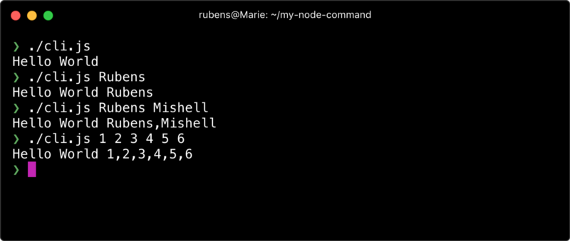
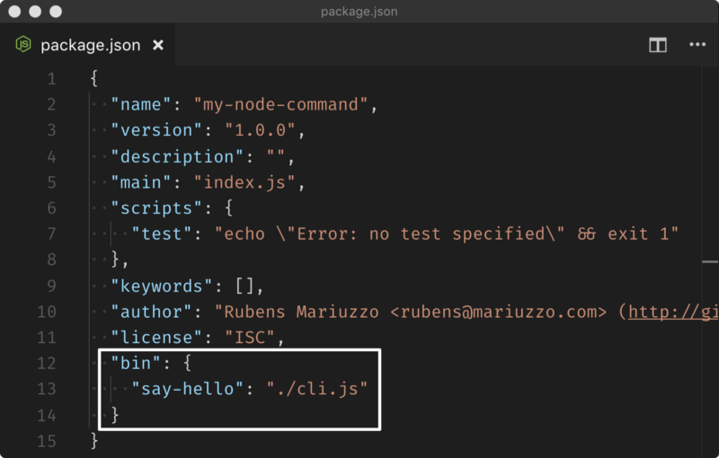
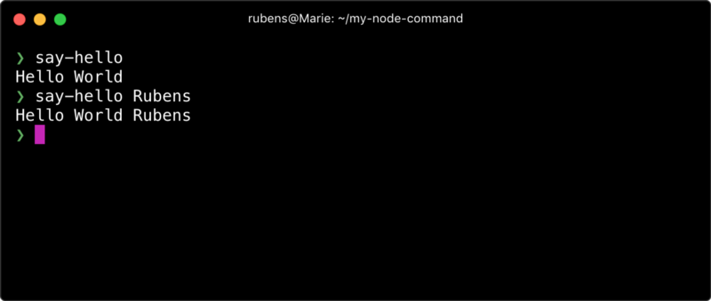

受到启发要创建一个NodeJS命令行脚本来解决特定的问题？您想要将命令行作为可安装包发布吗？这应该很简单，对吧?幸运的是,它确实很简单！

下面是关于创建NodeJS命令行包的简明指南。

本指南将引导您创建、映射和链接NodeJS命令行脚本。

## 创建node包
首先，我们需要创建NodeJS包，比如只包含一个`package.json`文件的目录。我们可以简单地分两步来做：
1、创建一个空目录；
2、在目录下运行`npm init`。

这对于创建NodeJS命令行包并不是什么新鲜事，也不是特殊的，因为它是任何NodeJS包的起点。下面让我们创建NodeJS命令行脚本。

## 创建NodeJS命令行脚本
你可能已经知道我们可以通过运行`node script.js`来执行一段NodeJS脚本，这在大多数情况下是可行的，但是NodeJS命令行脚本除了包含一个特殊的shell指令外，就是一个常规的JavaScript文件，这个稍后再详细介绍。首先，让我们创建一个JavaScript文件，它将成为NodeJS命令行脚本。

### 创建JavaScript文件
[npm官方文档](https://docs.npmjs.com/files/package.json#bin)和流行的NodeJS项目通常将JavaScript命令行文件命名为`cli.js`。这个命名非常好，因为它的名字就说明了它的作用。

### JavaScript文件转成NodeJS命令行脚本
和其他shell脚本类似，我想通过本地安装的node来运行我们的JavaScript文件，所以我们在JavaScript文件的顶部添加一个[shebang](https://en.wikipedia.org/wiki/Shebang_%28Unix%29)字符序列：

```javascript
#!/usr/bin/env node
```

这样，我们就告诉*nix系统，JavaScript文件的解释器应该是`/usr/bin/env node`，它查找本地安装的node。
在Windows系统中,这行会被忽略，因为它被看成注释，但是它是必须的，因为在Windows机器上`npm`会在NodeJS命令行包安装的时候读取它。

### 让JavaScript命令行文件可执行
在大多数情况下，不允许执行新文件。在创建将要执行的NodeJS命令行脚本时，我们需要修改它的文件权限。在*nix系统中，您可以这样做:

```
chmod +x cli.js           # 让cli.js文件可执行
```

现在我们给脚本文件加点儿代码，我们将创建一个简单的`Hello World`，并打印一些提供的变量。

### 给NodeJS命令行文件增加代码

```javascript
#!/usr/bin/env node

const [,,...args] = process.argv // 取变量
console.log(`Hello World ${args}`) // 打印Hello World和变量
```

现在我们可以运行它，在Linux 和 Mac OS X系统运行`./cli.js`，在Windows系统运行`node.cmd cli.js`。
试试看！试试传递一些变量给它。


到现在为止，我们在Linux和Mac OS X上可以像普通的javascript文件一样运行我们的NodeJS命令行文件，但是在Windows中我们仍然需要增加`node.cmd`。此外，我们使用文件名来执行命令行脚本，这并不好。在下一节中，我们将避开这些问题。

## 命令行脚本映射到命令名
到现在为止，我们将JavaScript文件变成了NodeJS命令行文件，然而，我们希望给它一个更有意义的名字，而不是NodeJS命令行脚本文件的名字。为此，我们需要配置`package.json`来映射命令行脚本和命令名。[npm官网](https://docs.npmjs.com/files/package.json#bin)是这么说的：

> 在`package.json`中提供一个bin字段，表示命令名到本地文件名的映射。

这意味着我们可以为本地的JavaScript脚本指定一个命令名称，比如我们像让`cli.js`脚本映射到`say-hello`命令，我们可以像上面提到的那样增加`bin`字段到`package.json`：



我们为bin字段分配了一个对象，其中键成为命令名，值是映射到NodeJS命令行脚本文件的对象。这种格式允许我们作为开发人员提供多个脚本映射。但是，如果我们想提供一个与它的文件同名的NodeJS命令行脚本，我们可以设置一个字符串表示本地文件路径，而不是一个对象。

### 命令命名
我们可以为命令选择任何名称，但我们不希望它与现有的流行命令名称(如ls、cd、dir等)发生冲突。如果我们使用一个现有的名称，脚本很可能不会被执行，而是执行现有现有的命令(结果可能不同)。

## 链接开发命令
`npm link`命令允许我们在本地“符号链接一个包文件夹”，根据我们的需要，它将在本地安装package.json里bin字段中列出的任何命令。换句话说，`npm link`就像一个NodeJS包安装模拟器。值得一提的是，`npm link`有更广泛的用途，超出了本指南的范围。

`npm link`命令是从我们想符号链接的NodeJS包目录中使用的:

```
npm link
```

执行后，我们将看到命令被全局符号链接。现在，我们可以用它自己的命令名称say-hello来执行NodeJS命令行脚本:



非常简洁有没有？这样我们就能在`npm publish`之前本地运行NodeJS命令行脚本。

### npm link说明
在底层，npm链接(也适用于npm安装)符号链接package.json bin字段中指定的所有文件。npmjs文档说:

> 在安装时，npm将符号链接文件到prefix/bin中用于全局安装，或者./node_modules/.bin/用于本地安装。

在*nix系统上，npm链接过程类似于为指定的命令文件创建快捷方式，该命令文件将由shell执行，然后由node执行(因为指定了#!/usr/bin/env node)。
在Windows上，npm会做相同的事情（如果指定了运行环境），然而它还会创建`{command-name}.cmd`来让`node`执行我们特殊的命令行文件/

### 保持目录整洁
当我们的符号链接命令测试通过后，可能会想删除它。
为此，我们可以在包目录下运行下面的代码：

```
npm unlink                   // 不再安装
```

## 总结
以上就是关于创建NodeJS命令行包的简明指南。
通过这四个步骤，我们已经具备了发布NodeJS包的基础知识，该包将安装命令行包。
现在，你可以commit,push你的NodeJS命令行包代码来解放你的创造力了。如果您这样做了，请在评论中通过GitHub链接给我留言，这样我就可以偷看了。

## 推荐
最后，这些是我在自己的命令行项目中用到的工具：

- [meow – 简单的命令行工具](https://github.com/sindresorhus/meow)
- [chalk - 终端字符样式](https://github.com/chalk/chalk)
- [yargs - 命令行options解析](https://github.com/yargs/yargs)
