## 前言
[前文](https://lovelyun.github.io/%E5%9B%BE%E5%83%8F%E5%A4%84%E7%90%86/openCV/)我们讲了openCV如何在前端应用，本文我们跟着官方文档的[图片处理](https://docs.opencv.org/4.5.4/d2/df0/tutorial_js_table_of_contents_imgproc.html)部分，看看能做些什么。

我们继续在上文的基础上编码，这里简单的回顾一下。

页面中有个上传图片的按钮：

```html
<input type="file" id="fileInput"/>
```

点击按钮上传图片，触发input的onchange事件：

```javascript
let imgElement = document.getElementById('imageUpload');
let inputElement = document.getElementById('fileInput');
inputElement.onchange = function() {
  imgElement.src = URL.createObjectURL(event.target.files[0]);
}
```

上传事件中我们设置页面中img标签的图片地址：

```html

```

由于我们给img绑定了onload事件，设置图片地址后就会触发：

```javascript
imgElement.onload = function() {
  // 图片处理程序
};
```

我们的图片处理程序放在onload中，所以上传图片后就自动处理，
然后页面中有个canvas:

```html
<canvas id="canvasOutput"></canvas>
```

我们通过imshow把处理结果显示到canvas中：

```javascript
cv.imshow('canvasOutput', dst);
```

这样我们修改onload中的图片处理程序，就可以在上传图片后看到自动处理后的图片，下面我们来看一些例子。

## 改变颜色
转换图片的颜色通道，比如RGB↔Gray，RGB↔HSV等等
cvtColor
cv.cvtColor (src, dst, code, dstCn = 0)改变图片的颜色通道。
其中code参数是颜色转换码，在OpenCV中有150多种可以使用，可以在cv.ColorConversionCodes中查询，比如COLOR_BGR2BGRA、COLOR_BGR2HSV、COLOR_BGR2HLS、COLOR_BayerBG2BGR_EA等等。
现在我们看看应用最广泛的RGB↔Gray：

```javascript
let src = cv.imread('canvasInput');
let dst = new cv.Mat();
cv.cvtColor(src, dst, cv.COLOR_RGBA2GRAY, 0);
cv.imshow('canvasOutput', dst);
src.delete(); dst.delete();
```

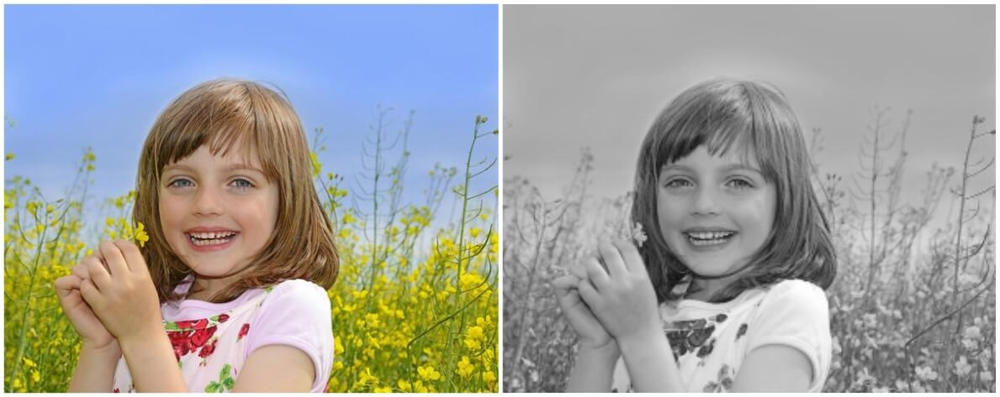

### inRange
cv.inRange (src, lowerb, upperb, dst)检查颜色是否在范围内。

```javascript
let src = cv.imread('canvasInput');
let dst = new cv.Mat();
let low = new cv.Mat(src.rows, src.cols, src.type(), [0, 0, 0, 0]);
let high = new cv.Mat(src.rows, src.cols, src.type(), [150, 160, 200, 255]);
cv.inRange(src, low, high, dst);
cv.imshow('canvasOutput', dst);
src.delete(); dst.delete(); low.delete(); high.delete();
```

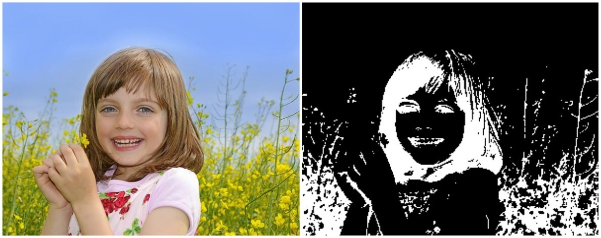

## 几何变换
对图片应用不同的几何变换，比如平移、旋转、仿射变换等等
### 缩放
缩放其实就是改变图片大小，OpenCV中用cv.resize (src, dst, dsize, fx = 0, fy = 0, interpolation = cv.INTER_LINEAR)实现缩放，图片大小可以手动填写任意值，或者是缩放系数。

```javascript
let src = cv.imread('imageUpload');
let dst = new cv.Mat();
let dsize = new cv.Size(300, 80);
cv.resize(src, dst, dsize, 0INTER_AREA);
cv.imshow('canvasOutput', dst);
src.delete(); dst.delete();
```

这里我们通过直接设置图片宽高的方式，把600x473的图片，变成了300x80.

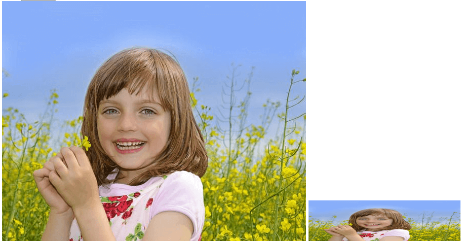

### 平移

```javascript
cv.warpAffine (src, dst, M, dsize, flags = cv.INTER_LINEAR, borderMode = cv.BORDER_CONSTANT, borderValue = new cv.Scalar())
```

```javascript
let src = cv.imread('imageUpload');
let dst = new cv.Mat();
let M = cv.matFromArray(2, 3, cv.CV_64FC1, [1, 0, 50, 0, 1, 100]);
let dsize = new cv.Size(src.cols, src.rows);
cv.warpAffine(src, dst, M, dsize, cv.INTER_LINEAR, cv.BORDER_CONSTANT, new cv.Scalar());
cv.imshow('canvasOutput', dst);
src.delete(); dst.delete(); M.delete();
```

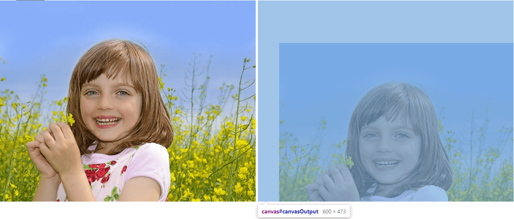

### 旋转
和平移一样，也是warpAffine函数，只是M代表的矩阵不同，这里用cv.getRotationMatrix2D(center, angle, scale)计算出旋转矩阵，比如下面以图片中心为旋转点，旋转45°：

```javascript
let src = cv.imread('imageUpload');
let dst = new cv.Mat();
let dsize = new cv.Size(src.cols, src.rows);
let center = new cv.Point(src.cols / 2, src.rows / 2);
let M = cv.getRotationMatrix2D(center, 45, 1);
cv.warpAffine(src, dst, M, dsize, cv.INTER_LINEAR, cv.BORDER_CONSTANT, new cv.Scalar());
cv.imshow('canvasOutput', dst);
src.delete(); dst.delete(); M.delete();
```

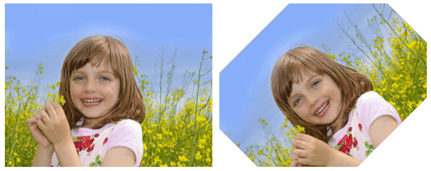

### 仿射变换
通过cv.getAffineTransform (src, dst)得到仿射变换的矩阵M，然后调用warpAffine函数。
getAffineTransform需要输入图像中的3个点在输出图像中的对应点，比如下面的srcTri中的3个点[0, 0, 0, 1, 1, 0]对应dstTri中的[0.6, 0.2, 0.1, 1.3, 1.5, 0.3]。

```javascript
let src = cv.imread('imageUpload');
let dst = new cv.Mat();
let srcTri = cv.matFromArray(3, 1, cv.CV_32FC2, [0, 0, 0, 1, 1, 0]);
let dstTri = cv.matFromArray(3, 1, cv.CV_32FC2, [0.6, 0.2, 0.1, 1.3, 1.5, 0.3]);
let M = cv.getAffineTransform(srcTri, dstTri);
let dsize = new cv.Size(src.cols, src.rows);
cv.warpAffine(src, dst, M, dsize, cv.INTER_LINEAR, cv.BORDER_CONSTANT, new cv.Scalar());
cv.imshow('canvasOutput', dst);
src.delete(); dst.delete(); M.delete(); srcTri.delete(); dstTri.delete();
```

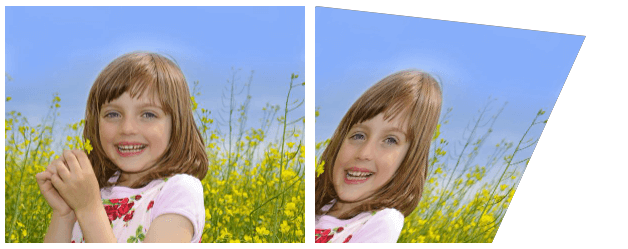

## 图像阈值化
cv.threshold(src, dst, thresh, maxval, type)
如果像素值大于阈值，它被赋一个值(可能是白色)，否则被赋另一个值(可能是黑色)。

```javascript
let src = cv.imread('imageUpload');
let dst = new cv.Mat();
cv.cvtColor(src, dst, cv.COLOR_RGBA2GRAY, 0);
cv.threshold(dst, dst, 0, 255, cv.THRESH_BINARY_INV + cv.THRESH_OTSU);
cv.imshow('canvasOutput', dst);
src.delete(); dst.delete();
```

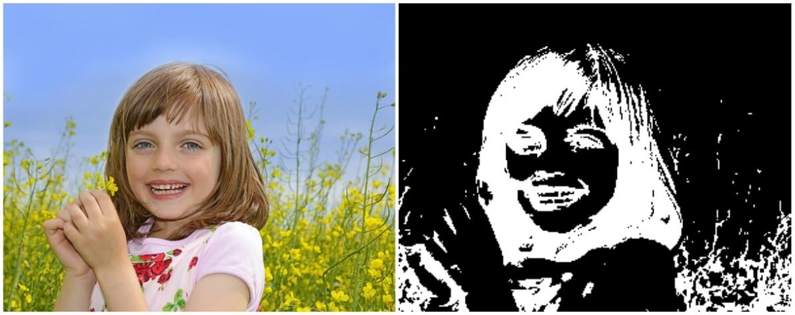

## 图像模糊
- 自定义滤波
- 低通滤波模糊图片
### 卷积滤波
和一维信号一样，图像也可以用各种低通滤波器(LPF)、高通滤波器(HPF)等进行滤波。
LPF有助于去除噪声，模糊图像等。HPF有助于在图像中找到边缘。

OpenCV提供cv.filter2D(src, dst, ddepth, kernel[, anchor[, delta[, borderType]]])函数来对图片进行卷积核运算。关于卷积，可以看看之前写的《[卷积在前端图像处理上的应用](https://lovelyun.github.io/%E5%9B%BE%E5%83%8F%E5%A4%84%E7%90%86/%E5%8D%B7%E7%A7%AF%E5%9C%A8%E5%89%8D%E7%AB%AF%E5%9B%BE%E5%83%8F%E5%A4%84%E7%90%86%E4%B8%8A%E7%9A%84%E5%BA%94%E7%94%A8/)》，比如前文的模糊卷积核：

```javascript
const kernel = [1 / 9, 1 / 9, 1 / 9,
                1 / 9, 1 / 9, 1 / 9,
                1 / 9, 1 / 9, 1 / 9]; // 模糊卷积核
```

这里可以这么用：

```javascript
let src = cv.imread('imageUpload');
let dst = new cv.Mat();
let M = cv.matFromArray(3, 3, cv.CV_64FC1, [1 / 9, 1 / 9, 1 / 9, 1 / 9, 1 / 9, 1 / 9, 1 / 9, 1 / 9, 1 / 9]);
cv.filter2D(src, dst, cv.CV_8U, M);
cv.imshow('canvasOutput', dst);
src.delete(); dst.delete(); M.delete();
```
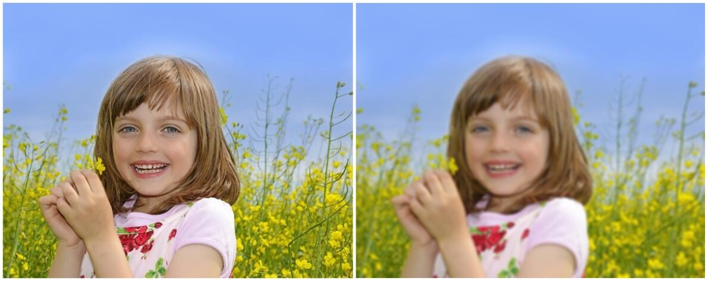

下面看看OpenCV内置的4个模糊处理。

### 均值模糊
上面例子中的模糊卷积核，OpenCV提供了cv.blur()函数直接调用。下面的两种写法效果一致。

```javascript
// 运用filter2D
let M = cv.matFromArray(3, 3, cv.CV_64FC1, [1 / 9, 1 / 9, 1 / 9, 1 / 9, 1 / 9, 1 / 9, 1 / 9, 1 / 9, 1 / 9]);
cv.filter2D(src, dst, cv.CV_8U, M);

// 运用blur
let ksize = new cv.Size(3, 3);
cv.blur(src, dst, ksize);
```

### 高斯模糊
cv.GaussianBlur(src, dst, ksize, sigmaX[, sigmaY[, borderType]])

不同于均值模糊直接取周围像素的平均值，高斯模糊取像素周围的高斯加权平均值。

```javascript
let src = cv.imread('imageUpload');
let dst = new cv.Mat();
let ksize = new cv.Size(3, 3);
cv.GaussianBlur(src, dst, ksize, 0);
cv.imshow('canvasOutput', dst);
src.delete(); dst.delete();
```

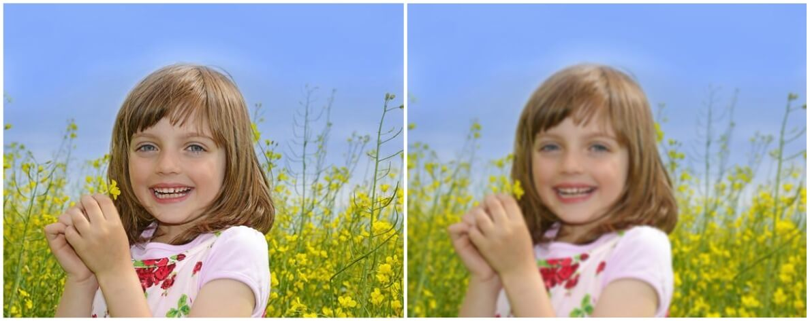

### 中值模糊
cv.medianBlur (src, dst, ksize)
中值模糊取核内所有像素的中值，中心元素被替换为这个中值。
这对图像中的椒盐噪声非常有效。
上面的过滤器，中心元素是一个新计算的值，它可能是图像中的一个像素值，也可能是一个新值。但在中值模糊中，中心元素总是被图像中的某个像素值所替代。它有效地降低了噪声。

```javascript
let src = cv.imread('imageUpload');
let dst = new cv.Mat();
cv.medianBlur(src, dst, 5);
cv.imshow('canvasOutput', dst);
src.delete(); dst.delete();
```
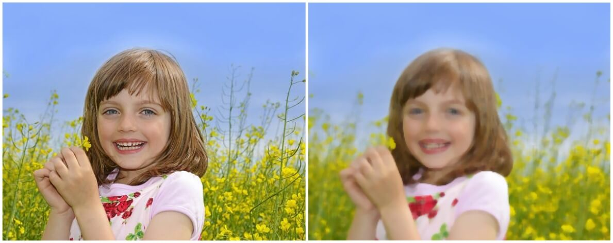

### 双边滤波
cv.bilateralFilter(src, dst, d, sigmaColor, sigmaSpace[, borderType])
双边滤波在保持边缘锐利的同时对去除噪音非常有效。
但与其他过滤器相比，该操作较慢。
比如高斯滤波器取像素周围的一个邻域并找到它的高斯加权平均值，在滤波时考虑附近的像素，但不考虑像素是否具有几乎相同的强度，不考虑像素是否是边缘像素。所以边缘也会模糊，这不是我们想要的。

双边滤波器实际上是2个高斯滤波器组成，一个对周围像素进行模糊，一个确保只有强度差别不大的像素会被模糊处理，所以能在模糊的同时保留边缘。

```javascript
let src = cv.imread('imageUpload');
let dst = new cv.Mat();
cv.cvtColor(src, src, cv.COLOR_RGBA2RGB, 0);
cv.bilateralFilter(src, dst, 9, 75, 75);
cv.imshow('canvasOutput', dst);
src.delete(); dst.delete();
```

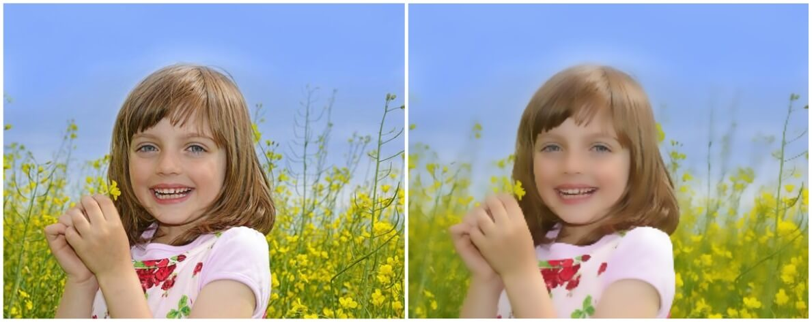

## 形态变换
形态变换是对图片形状的简单运算。它通常在二进制图像上执行。
它需要两个输入，一个是我们的原始图像，另一个是卷积核。
两个基本的形态学运算是侵蚀和膨胀。然后它的进阶形式有打开，关闭，梯度等。

### 侵蚀
cv.erode(src, dst, kernel[, anchor[, iterations[, borderType[, borderValue]]]])
卷积运算时，核内所有像素都为1时运算结果为1，否则为0。所以靠近边缘的像素都被丢弃，图像尺寸会变小。

```javascript
let src = cv.imread('imageUpload');
let dst = new cv.Mat();
let M = cv.Mat.ones(5, 5, cv.CV_8U);
cv.erode(src, dst, M);
cv.imshow('canvasOutput', dst);
src.delete(); dst.delete(); M.delete();
```
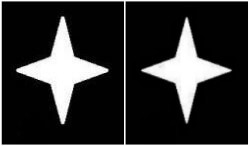

### 膨胀
cv.dilate(src, dst, kernel[, anchor[, iterations[, borderType[, borderValue]]]])
与侵蚀相反，卷积运算时，核内有一个像素为1时，结果就为1，否则为0。所以图片尺寸会变大。
通常，在消除噪音时，侵蚀之后是膨胀，因为侵蚀消除了白噪音，但它也缩小了我们的目标，所以需要再放大。

```javascript
let src = cv.imread('imageUpload');
let dst = new cv.Mat();
let M = cv.Mat.ones(5, 5, cv.CV_8U);
cv.dilate(src, dst, M);
cv.imshow('canvasOutput', dst);
src.delete(); dst.delete(); M.delete();
```
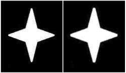

### 打开

```javascript
cv.morphologyEx(src, dst, op, kernel[, anchor[, iterations[, borderType[, borderValue]]]])
```

打开只是侵蚀之后是再膨胀的另一个说法，常在去除噪音时使用。

```javascript
let src = cv.imread('imageUpload');
let dst = new cv.Mat();
let M = cv.Mat.ones(5, 5, cv.CV_8U);
cv.morphologyEx(src, dst, cv.MORPH_OPEN, M);
cv.imshow('canvasOutput', dst);
src.delete(); dst.delete(); M.delete();
```

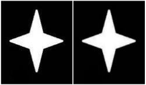

### 关闭
关闭和打开相反，是膨胀之后再侵蚀，对去除图片中的小黑点比较有用。

```javascript
let src = cv.imread('imageUpload');
let dst = new cv.Mat();
let M = cv.Mat.ones(5, 5, cv.CV_8U);
cv.morphologyEx(src, dst, cv.MORPH_CLOSE, M);
cv.imshow('canvasOutput', dst);
src.delete(); dst.delete(); M.delete();
```
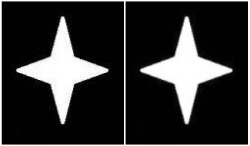

### 梯度
与侵蚀和膨胀不同，它的处理结果看起来是形状的边缘。

```javascript
let src = cv.imread('imageUpload');
let dst = new cv.Mat();
let M = cv.Mat.ones(5, 5, cv.CV_8U);
cv.cvtColor(src, src, cv.COLOR_RGBA2RGB);
cv.morphologyEx(src, dst, cv.MORPH_GRADIENT, M);
cv.imshow('canvasOutput', dst);
src.delete(); dst.delete(); M.delete();
```
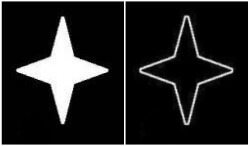

## 图像梯度
OpenCV提供3种图像梯度过滤器：Sobel、Scharr 和 Laplacian。

```javascript
let src = cv.imread('imageUpload');
let dstx = new cv.Mat();
let dsty = new cv.Mat();
cv.cvtColor(src, src, cv.COLOR_RGB2GRAY, 0);
cv.Sobel(src, dstx, cv.CV_8U, 1, 0); // 下图一左
// cv.Sobel(src, dsty, cv.CV_8U, 0, 1); // 下图一右
// cv.Scharr(src, dstx, cv.CV_8U, 1, 0); // 下图二左
// cv.Scharr(src, dsty, cv.CV_8U, 0, 1); // 下图二右
cv.imshow('canvasOutput', dstx);
src.delete(); dstx.delete(); dsty.delete();
```

下面4张图分别是Sobel和Scharr算子取横向和纵向：
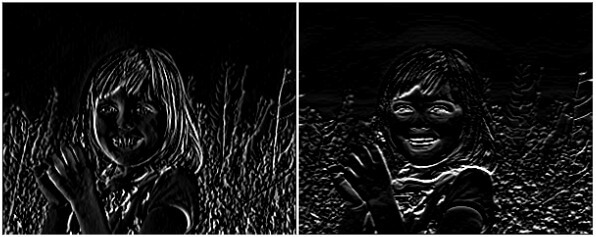
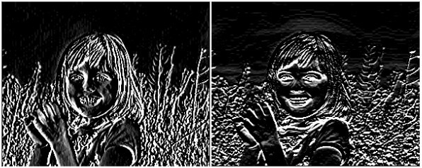

Laplacian使用的卷积核是：

```javascript
const kernel = [0, 1, 0,
                1, -4, 1,
                0, 1, 0];
```

先灰度，再Laplacian:

```javascript
cv.cvtColor(src, src, cv.COLOR_RGB2GRAY, 0);
cv.Laplacian(src, dst, cv.CV_8U);
```
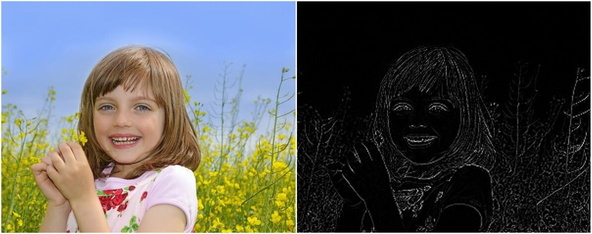

> 注意输出的cv.CV_8U数据类型会导致检测结果不准确，需要用其他格式，比如 cv.CV_16S， cv.CV_64F等等，然后取绝对值再输出。具体的可以参考官网。

## Canny边缘检测
Canny边缘检测是一种流行的边缘检测算法，由John F. Canny在1986年开发。算法的实现及原理这里就不讲了，我们可以直接调用cv.Canny函数：

```javascript
let src = cv.imread('imageUpload');
let dst = new cv.Mat();
cv.cvtColor(src, src, cv.COLOR_RGB2GRAY, 0);
cv.Canny(src, dst, 50, 100);
cv.imshow('canvasOutput', dst);
src.delete(); dst.delete();
```
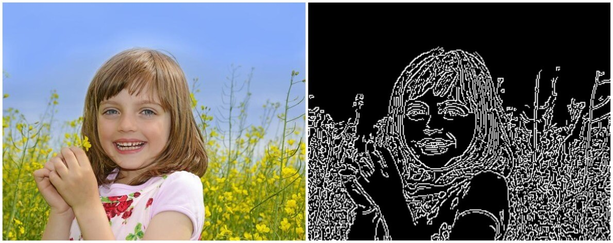

### 图像金字塔
通常，我们使用固定大小的图像。但有时，我们需要使用不同分辨率的图像。
例如，当我们在一幅图像中搜索某物时，比如人脸，我们不确定人脸在图像中的大小。
这时我们需要创建一组具有不同分辨率的图像，并在所有图像中搜索对象。
这些不同分辨率的图像集合被称为图像金字塔(因为当它们被保存在一个堆栈中，高分辨率高的在底部，分辨率低的在顶部，它看起来像一个金字塔)。

### 降低分辨率

```javascript
let src = cv.imread('imageUpload');
let dst = new cv.Mat();
cv.pyrDown(src, dst, new cv.Size(0, 0));
cv.imshow('canvasOutput', dst);
src.delete(); dst.delete();
```
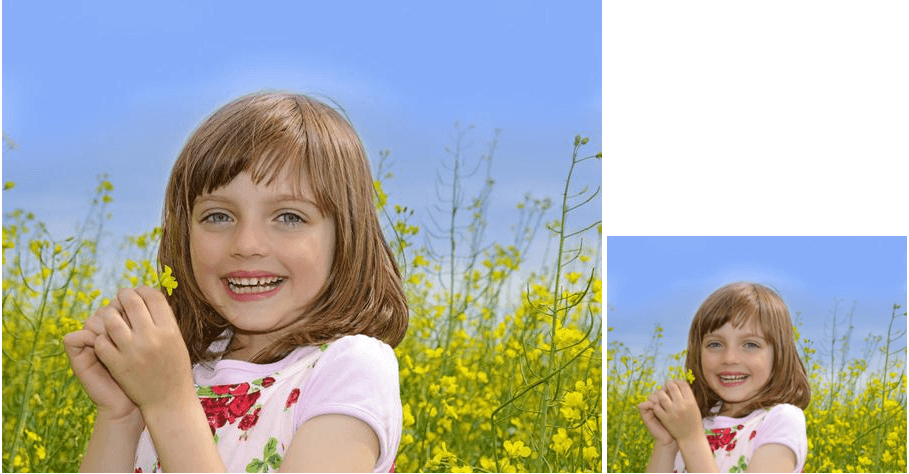

### 提高分辨率

```javascript
cv.pyrUp(src, dst, new cv.Size(0, 0));
```

## 傅里叶变换
傅里叶变换常用于图片的频域分析。
代码较多，这里就不详细分析了。
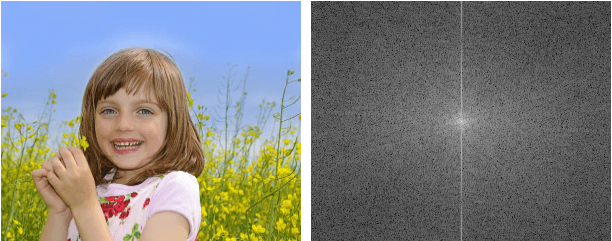

## 总结
上面列了OpenCV的一些基础的图像处理接口，比如几何变换、阈值化、形态变换等等，在实际应用中，通过这些接口，可以实现图片频域分析及处理、图像分割、图片匹配、图片轮廓或边缘检测等等。比如对图片频域加盲水印会用到傅里叶变换。
