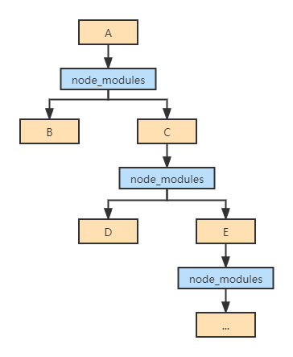
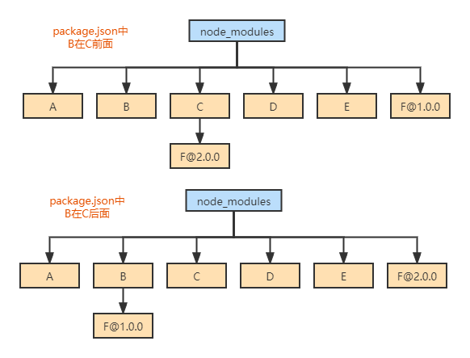
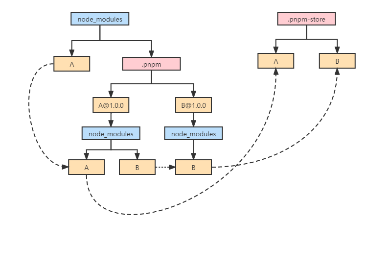
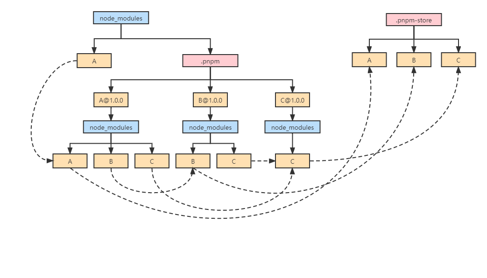

## 前言
本文将从前端包管理器的发展开始说起，然后对比npm、yarn和pnpm。

## 没有包管理器
依赖（dependency）是别人为了解决一些问题而写好的代码，即我们常说的第三方包或三方库。
一个项目或多或少的会有一些依赖，而你安装的依赖又可能有它自己的依赖。

比如，你需要写一个base64编解码的功能，你可以自己写，但为什么要自己造轮子呢？大多数情况下，一个可靠的第三方依赖经过多方测试，兼容性和健壮性会比你自己写的更好。

项目中的依赖，可以是一个完整的库或者框架，比如react或vue；可以是一个很小的功能，比如日期格式化；也可以是一个命令行工具，比如eslint。

如果没有现代化的构建工具，即包管理器，你需要用`<script>`标签来引入依赖。

此外，如果你发现了一个比当前使用的依赖更好的库，或者你使用的依赖发布了更新，而你想用最新版本，在一个大的项目中，这些版本管理、依赖升级将是让人头疼的问题。

于是包管理器诞生了，用来管理项目的依赖。
它提供方法给你安装依赖（即安装一个包），管理包的存储位置，而且你可以发布自己写的包。

## npm v1-v2
初代npm（Node.js Package Manager）随着Node.js的发布出现了。

它的文件结构是嵌套的：

这会导致3个问题：

1、node_modules体积过大(大量重复的包被安装)
2、node_modules嵌套层级过深(会导致文件路径过长的问题)
3、模块实例不能共享

## yarn & npm v3
这个版本yarn和npm v3带来了扁平化依赖管理：

扁平化处理时，比如安装A，A依赖B和C，C依赖D和E，就把A~E全部放到node_modules目录下，从而解决上个版本中node_modules嵌套层级过深的问题。
在install安装时，会不停的往上级node_modules中寻找，如果找到同样的包，就不再重复安装，从而解决了大量包被重复安装的问题。

但是扁平化带来了新的问题：
1、依赖结构的不确定性
2、扁平化算法本身复杂性很高，耗时较长
3、项目中仍然可以非法访问没有声明过依赖的包

对于问题1，比如B和C都依赖了F，但是依赖的F版本不一样：

依赖结构的不确定性表现是扁平化的结果不确定，以下2种情况都有可能，取决于package.json中B和C的位置。

于是出现yarn.lock（npm5才有package-lock.json），来保证install后产生确定的依赖结构。但这并不能完全解决问题，node_modules中依然存在各种不同版本的F，而这可能导致各种情况的编译报错，以及安装满，占磁盘空间。

对于问题3，package.json中我们只声明了A，B~F都是因为扁平化处理才放到和A同级的node_modules下，理论上在项目中写代码时只可以使用A，但实际上B~F也可以使用，由于扁平化将没有直接依赖的包提升到node_modules一级目录，Node.js没有校验是否有直接依赖，所以项目中可以非法访问没有声明过依赖的包。

这会产生两个问题：

B~F中的包升级后，项目可能出问题
额外的管理成本（比如协作时别人运行一次npm install后项目依旧跑不起来）
## pnmp
pnpm(Performance npm)的作者Zoltan Kochan发现 yarn 并没有打算去解决上述的这些问题，于是另起炉灶，写了全新的包管理器。

pnpm复刻了npm所有的命令，所以使用方法和npm一样，并且在安装目录结构上做了优化，特点是善用链接，且由于链接的优势，大多数情况下pnpm的安装速度比yarn和npm更快。

比如安装A，A依赖了B：

1、安装依赖
A和B一起放到`.pnpm`中（和上面相比，这里没有耗时的扁平化算法）。

另外A@1.0.0下面是node_modules，然后才是A，这样做有两点好处：

允许包引用自身
把包和它的依赖摊平，避免循环结构
2、处理间接依赖
A平级目录创建B，B指向B@1.0.0下面的B。

3、处理直接依赖
顶层node_modules目录下创建A，指向A@1.0.0下的A。

对于更深的依赖，比如A和B都依赖了C：

## 总结
如果你想更快的速度，更小的空间，你应该选择pnpm；
如果你要用Monorepo，你可以用yarn或pnpm；
如果是node项目，你应该用npm，因为这是node官方推荐的，而且yarn不支持node5+；
对于npm项目，如果你担心项目的安全性，你可以考虑用yarn替换npm。

参考
- [为什么现在我更推荐 pnpm 而不是 npm/yarn?](https://www.cnblogs.com/cangqinglang/p/14448329.html)
- [Node.js 包管理器发展史](https://wxsm.space/2021/npm-history/)
- [JavaScript package managers compared: Yarn, npm, or pnpm?](https://blog.logrocket.com/javascript-package-managers-compared/)
- [pnpm官网](https://pnpm.io/)
