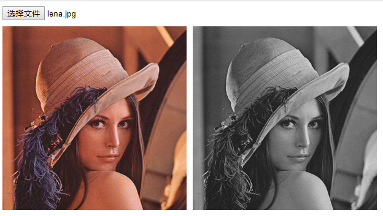

## 简介
OpenCV(Open Source Computer Vision Library)，是一个在图像处理和识别上很强大的库，最开始只有C++版本，但现在构建了各种不同语言的版本，比如Python和Java，甚至是JavaScript，本文要介绍的就是JavaScript版本的OpenCV.js。

## 如何获取OpenCV.js
1、官方编译好的版本下载地址为：
https://docs.opencv.org/_VERSION_/opencv.js
其中 VERSION 换成你想要的版本。
目前最新的為 4.5.3 版本，那么下载地址就是https://docs.opencv.org/4.5.3/opencv.js

2、参照[官网](https://docs.opencv.org/4.5.3/d4/da1/tutorial_js_setup.html)自行构建`OpenCV.js`

## 实现一个简单的处理
图片灰度处理效果：



```html
<!DOCTYPE html>
<html>
    <head>
        <title>OpenCV.js</title>
        <style type="text/css">
            .wrap-image {
                display: flex;
                flex-direction: row;
                margin-top: 10px;
            }
            .wrap-image img,
            .wrap-image canvas {
                width: 300px;
                margin-right: 10px;
            }
        </style>
    </head>

    <body>
        <h3 id="status">Loading the Opencv ...</h3>
        <input type="file" id="fileInput"/>
        <div class="wrap-image">
            
            <canvas id="canvasOutput"></canvas>
        </div>
        <script type="text/javascript">
            let imgElement = document.getElementById('imageUpload');
            let inputElement = document.getElementById('fileInput');

            inputElement.onchange = function() {
              imgElement.src = URL.createObjectURL(event.target.files[0]);
            }

            imgElement.onload =function() {
                let src = cv.imread('imageUpload');
                let dst = new cv.Mat();
                cv.cvtColor(src, dst, cv.COLOR_RGBA2GRAY, 0);
                cv.imshow('canvasOutput', dst);
                src.delete(); dst.delete();
            };
            function onOpenCvReady() {
                document.getElementById('status').remove();
            }
        </script>
        <script async src="js/opencv.js" onload="onOpenCvReady();" type="text/javascript"></script>
    </body>
</html>
```

代码解析：
1、opencv.js很大，载入时需要加上async，并设定onload来检测是否载入完成。

```html
<script async src="js/opencv.js" onload="onOpenCvReady();" type="text/javascript"></script>
```

2、记得及时清理Mat对象，释放内存。

```javascript
src.delete();
dst.delete();
```

3、imread和imshow 必须传入 `` 或 `<canvas />` 的 `id` 或是 `DOM`。

## 下载图片
图片处理好了，用户想要下载，那就再html中加上下载链接：

```html
<a href="#" id="downloadButton">下载</a>
```

然后把下面的JavaScript加到之前的script标签中：

```javascript
document.getElementById('downloadButton').onclick = function() {
  this.href = document.getElementById('canvasOutput').toDataURL();
  this.download = 'image.png';
};
```

总结
一旦你习惯了将图像作为Mat对象来操作，你就可以做更多的事情了,你可以在[OpenCV的网站](https://docs.opencv.org/4.5.3/d5/d10/tutorial_js_root.html)上找到更多的教程，包括人脸识别和模板匹配等等。

## 参考
- [如何在 Nodejs 或前端使用 OpenCV（免安裝）. 在本機使用 OpenCV 很簡單，在伺服器端使用 OpenCV… | by Up Chen | Medium](https://hi-upchen.medium.com/%E5%A6%82%E4%BD%95%E5%9C%A8-nodejs-%E6%88%96%E5%89%8D%E7%AB%AF%E4%BD%BF%E7%94%A8-opencv-%E5%85%8D%E5%AE%89%E8%A3%9D-cc2fea289054)
- [An Introduction to Computer Vision in JavaScript using OpenCV.js | DigitalOcean](https://www.digitalocean.com/community/tutorials/introduction-to-computer-vision-in-javascript-using-opencvjs)
