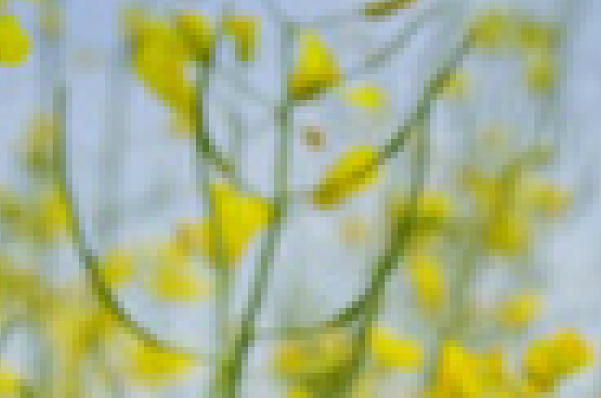
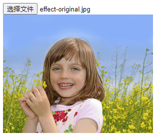
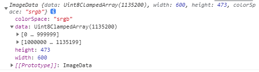
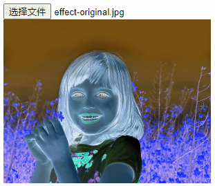

## 前言
前端也可以做图像处理？
是的，可以。
今天我们要介绍一种在前端处理图像的方式。

对于一般的图片，我们用专业的软件（比如PhotoShop、mark man等等）放大到最后，就会看到很多小格子，这一个一个的格子，就是像素，每个格子，即每个像素，都代表不同的颜色。
而颜色都可以用rgba的形式表示，比如白色`rgba(255, 255, 255, 1)`，其中r代表红色，g代表绿色，b代表蓝色，a代表透明度，rgb代表的色值取值范围是[0, 255]，a代表的透明度取值范围是[0, 1]。



## 获取像素数据
下面将带领大家一步一步来看怎么获取像素数据。

首先，我们创建一个页面。提供选择图片功能。

```html
<!DOCTYPE html>
<html>
    <head>
        <title>test</title>
        <style type="text/css">
        canvas {
            width: 300px;
        }
        </style>
    </head>

    <body>
        <input type="file" id="fileInput" name="选择图片"/>
        <div class="wrap-image">
            <canvas id="canvas"></canvas>
        </div>
        <script type="text/javascript">

        </script>
    </body>
</html>
```

选择图片后，需要将图片显示到canvas中，我们在上面的script标签中加入下面的代码：

```javascript
const fileInput = document.getElementById('fileInput');
const canvas = document.getElementById('canvas');
let context
fileInput.addEventListener('change', (e) => {
    let img = new Image
    img.src = URL.createObjectURL(e.target.files[0]);
    img.onload = function(){
        canvas.width = img.width
        canvas.height = img.height
        context = canvas.getContext("2d");
        context.drawImage(img, 0, 0);
    }
}, false);
```



现在图片显示出来了，那要怎么获取图片像素数据呢？这里我们用到canvas的getImageData对象，他的用法如下：

```javascript
let myImageData = context.getImageData(left, top, width, height);
```

那么在本例中，我们在drawImage后可以接着getImageData，在img.onload中继续加入下面的代码：

```javascript
let imageData = context.getImageData(0, 0, img.width, img.height);
```

将imageData打印出来，可以看到：



现在，我们就获取到了图片的像素数据，它在imageData对象的data中。

## 读取像素点
上面我们获取到了像素数据，但要怎么读取像素点呢？
首先，我们来看看imageData对象的data对象是什么。

data是`Uint8ClampedArray`类型的一维数组，包含着RGBA格式的整型数据。每个部份被分配到一个在数组内连续的索引，左上角像素的红色部份在数组的索引0位置。像素从左到右被处理，然后往下。data包含`width × height × 4` bytes数据，索引值从`0`到`(width × height × 4) - 1`。

例如，要读取图片中位于第50行，第200列的像素的蓝色部份，你会写以下代码：

```javascript
let b = imageData.data[((50 * (img.width * 4)) + (200 * 4)) + 2];
```

那么根据行(`row`)、列(`col`)读取一个像素点的r/g/b/a值的公式是：

```javascript
let rIndex = row * (img.width * 4) + col * 4 // data中r值的索引
let r = imageData.data[rIndex];
let g = imageData.data[(rIndex + 1];
let b = imageData.data[(rIndex + 2];
let a = imageData.data[(rIndex + 3];
```

## 操作像素
上面我们获取到了图片数据，并读取到了像素点，能读取像素点，是不是也可以设置像素点呢？
是的，下面我们将用canvas的putImageData来更新像素。
这里我们将实现一个invert的效果，在获取imageData之后调用。

```javascript
function invert(imageData) {
    const { data } = imageData
    for (let i = 0; i < data.length; i += 4) {
        data[i] = 255 - data[i]; // red
        data[i + 1] = 255 - data[i + 1]; // green
        data[i + 2] = 255 - data[i + 2]; // blue
    }
    context.putImageData(imageData, 0, 0);
}
```



总结
1、前端的canvas不仅可以显示图片，还可以获取到图片数据。
2、数据中有图片的宽和高，还有像素信息，它对应着图片从左到右，再从上到下的像素点的rgba值。
3、我们可以读到某行某列的像素数据，同样的我们也可以写。
4、对不同的颜色通道及透明度做一系列运算，就可以得到颜色变化了的新图片。
5、改变图片的颜色，主要应用在图片滤镜上，前端的基础滤镜，都是这个原理。
