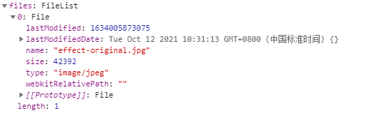
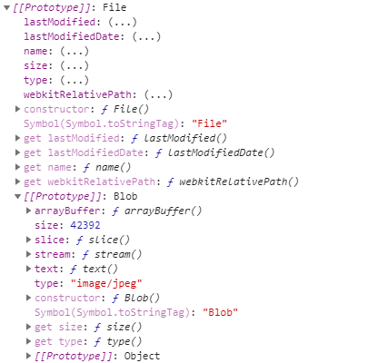
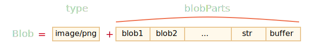
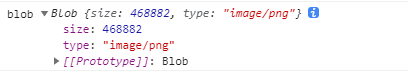
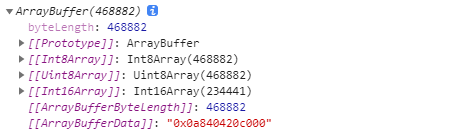
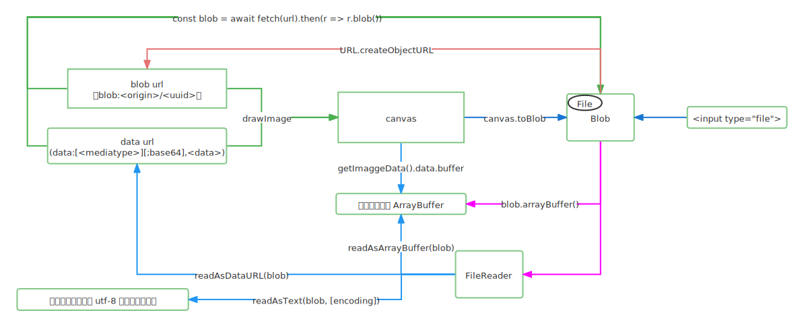

## 前言
在 Web 开发中，当我们处理文件时（创建，上传，下载），经常会遇到二进制数据。另一个典型的应用场景是图像处理。
在 JavaScript 中有很多种二进制数据格式，比如ArrayBuffer，Uint8Array，DataView，Blob，File 等等，不过 JavaScript 中的二进制数据是以非标准方式实现的。

下面我们来了解下这些数据格式及相互转换。
本文涉及到File,Blob,TypedArray,data url(Base64),blob url等等。

## File
首先，我们还是拿前文的例子来看，显示用户选择的图片。

我们创建一个页面。提供选择图片功能。

```html
<!DOCTYPE html>
<html>
    <head>
        <title>test</title>
    </head>

    <body>
        <input type="file" id="fileInput" name="选择图片"/>
        <div class="wrap-image">
            <canvas id="canvas"></canvas>
        </div>
        <script type="text/javascript">

        </script>
    </body>
</html>
```

选择图片后，需要将图片显示到canvas中，我们在上面的script标签中加入下面的代码：

```javascript
const fileInput = document.getElementById('fileInput')
const canvas = document.getElementById('canvas')
fileInput.addEventListener('change', (e) => {
    let img = new Image
    const file = e.target.files[0]
    img.src = URL.createObjectURL(file)
    img.onload = () => {
        canvas.width = img.width
        canvas.height = img.height
        const context = canvas.getContext('2d')
        context.drawImage(img, 0, 0)
    }
}, false)
```

选择一张图片后，change事件中获取到选择的文件e.target.files[0]：



File 对象是特殊类型的 Blob，可以用在任意的 Blob 类型的 context 中。
比如 FileReader, URL.createObjectURL(), createImageBitmap(), 及 XMLHttpRequest.send() 都能处理 Blob 和 File。
File 接口也继承了 Blob 接口的属性。上图的Prototype展开可以看到继承自Blob:



上面是最常见的file获取方式————从<input type="file">中获取。
此外，我们还可以用构造器：

```javascript
new File(fileParts, fileName, [options])
```

- fileParts —— Blob/BufferSource/String 类型值的数组
- fileName —— 文件名字符串
- options —— 可选对象：
  - lastModified —— 最后一次修改的时间戳（整数日期）
### FileReader
FileReader 的用途是从 Blob（因此也从 File）对象中读取数据。
它使用事件来传递数据，因为从磁盘读取数据可能比较费时间。

可以读取为3种格式：

|读取方法|目标格式|
|:---|:---|
|readAsArrayBuffer(blob)|读取为二进制格式的 ArrayBuffer|
|readAsText(blob, [encoding])|读取为给定编码（默认为 utf-8 编码）的字符串|
|readAsDataURL(blob)|读取为 base64编码 的 data url|

比如将 Blob 读取为 base64：

```javascript
const reader = new FileReader()
reader.readAsDataURL(file) // 将 Blob 读取为 base64
```

使用时选择哪一种，要看如何使用数据。

读取过程中有下列事件：

1、loadstart: 开始加载
2、progress: 在读取过程中出现
3、load: 读取完成，没有 error
4、abort: 调用了 abort()取消操作
5、error: 出现 error
6、loadend: 读取完成，无论成功还是失败

使用最广泛的是load和error，比如下面的例子：

```html
<input type="file" onchange="readFile(this)">

<script>
const readFile = (input) => {
  const file = input.files[0]
  const reader = new FileReader()
  reader.readAsText(file)
  reader.onload = () => {
    console.log(reader.result) // 结果
  }

  reader.onerror = () => {
    console.log(reader.error) // error
  }
}
</script>
```

不过大多数情况下，我们不需要读取Blob，通过网络发送一个File很容易，像 XMLHttpRequest 或 fetch 等 API 本身就接受 File 对象。或者用URL.createObjectURL(file) 创建一个短的 url，并将其赋给 <a> 或 。这样，文件便可以下载文件或者将其呈现为图像，作为 canvas 等的一部分。

## Blob
用URL.createObjectURL创建了一个url：

```javascript
img.src = URL.createObjectURL(file)
```

这里，URL.createObjectURL 取一个 Blob，并为其创建一个唯一的 URL，形式为 blob:<origin>/<uuid>。
本例中创建的url如下：


```javascript
blob:null/a05be8a9-78b4-4470-bdfe-5fca427781c2
```

浏览器内部为每个通过 URL.createObjectURL 生成的URL存储了一个 URL → Blob 映射。可以通过URL访问 Blob。

但 Blob 本身只保存在内存中的。浏览器无法释放它。
关闭页面时会自动释放内存中的Blob，也可以手动释放，通过URL.revokeObjectURL(url) 从内部映射中移除引用，Blob 被删除，并释放内存。

映射被删除后该 URL 也就不再起作用了，也就无法通过URL再访问Blob。

现在，我们了解了Blob作为URL的应用，那Blob到底是什么呢？

Blob 由一个可选的字符串 type（通常是 MIME 类型）和 blobParts 组成，blobParts是 一系列其他 Blob 对象，字符串和 BufferSource。



我们可以通过构造函数创建一个Blob：

```javascript
new Blob(blobParts, options)
```

- blobParts是 Blob/BufferSource/String 类型的值的数组。
- options 可选对象：
  - type： Blob 类型，通常是 MIME 类型，例如 image/png，
  - endings：是否转换换行符，使 Blob 对应于当前操作系统的换行符（\r\n 或 \n）。默认为 “transparent”（啥也不做），不过也可以是 “native”（转换）。
比如从字符串创建 Blob：

```javascript
// 注意：第一个参数必须是一个数组 [...]
const blob = new Blob(['<html>…</html>'], {type: 'text/html'})
```

### 图片 to Blob
图像操作是通过canvas来实现的：
1、使用 canvas.drawImage 在 canvas 上绘制图像（绘制后可以做一些图像处理，比如旋转、裁剪等等）；
2、调用 canvas 的 toBlob(callback, format, quality)方法 创建一个 Blob。

比如，在上面的context.drawImage(img, 0, 0);后，我们把canvas转成Blob:

```javascript
canvas.toBlob((blob) => {
  console.log('blob', blob)
}, 'image/png')
```



或者，更喜欢同步的写法：

```javascript
img.onload = async () => {
  ...
  context.drawImage(img, 0, 0)
  const blob = await new Promise(resolve => canvas.toBlob(resolve, 'image/png'))
  console.log('blob', blob)
}
```

### Blob to Base64
URL.createObjectURL 的一个替代方法是，将 Blob 转换为 base64。
base64编码将二进制数据表示为一个由 0 到 64 的 ASCII 码组成的字符串，非常安全且可读。
我们可以在 data-url 中使用base64编码，data-url就像下面这样：

```javascript
data:[<mediatype>][;base64],<data>
```

我们可以像常规url一样使用data-url 。
比如一张支持alpha透明度的webp的图片:

```html

```

我们可以用 FileReader 将 Blob 转换为 base64:

```javascript
// img.src = URL.createObjectURL(file)
const reader = new FileReader()
reader.readAsDataURL(file) // 将 Blob 转换为 base64 并调用 onload

reader.onload = () => {
  img.src = reader.result
}
```

现在我们可以从Blob创建2种url，一种是blob url，一种是data url，下面我们对比下这2种方式：
||blob url|data url|
|:---|:---|:---|
|创建方式|URL.createObjectURL|FileReader|
|内存|需手动撤销（revoke）|无需操作|
|访问|直接访问 Blob，无需“编码/解码”|对大的 Blob 进行编码时，性能和内存会有损耗|

所以要使用哪种url，需要具体情况再分析。

## ArrayBuffer
基本的二进制对象 ArrayBuffer是对固定长度的连续内存空间的引用，是一个内存区域，一个原始的二进制数据。

我们可以这样创建一个长度为 16 的 buffer：

```javascript
let buffer = new ArrayBuffer(16); // 创建一个长度为 16 的 buffer
```

> 注意：ArrayBuffer 和 Array 没有任何关系

我们可以通过 FileReader 的 readAsArrayBuffer 读取 Blob 的二进制数据：

```javascript
const reader = new FileReader()
reader.readAsArrayBuffer(file)
reader.onload = () => {
    const buffer = reader.result
}
```



或者用Blob的arrayBuffer方法：

```javascript
const buffer = await file.arrayBuffer()
```

上面我们看到了Int8Array、Uint8Array、Int16Array，它们的通用术语是TypedArray，此外，还有其他的TypedArray。


|TypedArray|用途|
|:---|:---|
|Uint8Array，Uint16Array，Uint32Array|用于 8、16 和 32 位的无符号整数|
|Uint8ClampedArray|用于 8 位整数，对于大于 255 的任何数字，它将保存为 255，对于任何负数，它将保存为 0|
|Int8Array，Int16Array，Int32Array|用于有符号整数（可以为负数）|
|Float32Array，Float64Array|用于 32 位和 64 位的有符号浮点数|

## 总结
现在回顾一下：
1、`<input type="file">`是最常见的File获取方式;
2、File对象是特殊类型的 Blob;
3、Blob可以生成blob url;
4、FileReader可以读取Blob为3种格式，二进制格式的 ArrayBuffer，给定编码的字符串，base64编码的 data url;
5、blob url和data url都可以作为url使用;
6、Blob对象的arrayBuffer方法可以读取Blob的ArrayBuffer;
7、canvas.toBlob(callback, format, quality)可以把canvas读取为Blob;

下图可以很直观的看到它们之间的相关转换关系：


