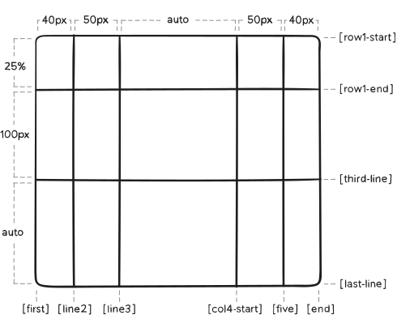
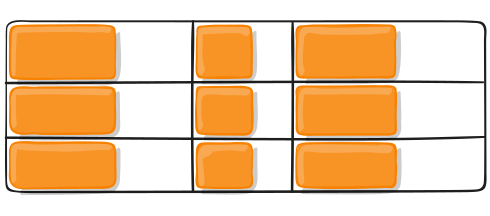
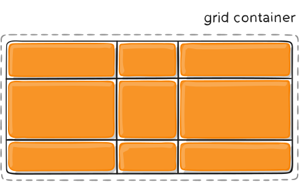

## CSS Grid 布局简介
CSS Grid是一种二维的布局方式，和以前的布局方式完全不同，CSS常用来给页面布局，但做的总不够好，以前我们用table布局，后来用float、position、inline-block，这些方式本质上都是hack，缺少一些重要的特性（比如垂直居中），flex布局是一个很好的布局方式，但它基于轴的布局方式在其他方面用处更大，并且可以和Grid布局很好的配合使用，Grid布局是专门用来解决我们一直以来布局页面时所碰到的各种问题的。

本指南围绕Grid布局的最新特性讲解，所以不会考虑老旧的浏览器兼容性。

## CSS Grid基础
到2017年3月，大部分浏览器都支持Grid布局（无需前缀）：Chrome(包括Android)、Firefox、Safari(包括IOS)、Opera。IE10和IE11也能通过一定的途径支持，所以现在是时候使用Grid布局了。

首先你需要一个父元素，并设置dispaly: grid，通过grid-template-columns和grid-template-rows设置列和行的大小，然后向父元素中添加子元素，并设置grid-column和grid-row属性，和flex布局类似，子元素的原始顺序并不重要，CSS可以任意控制它们的顺序，这使得通过媒体查询排列元素变得超级简单。想象下你把整个页面设置成grid布局，然后对不同的屏幕宽度自适应时完全重新排列，只需要几行CSS。Grid是有史以来引入的最强大的CSS模块之一。

## 重要的CSS Grid术语
在深入学习Grid布局之前，先了解一些重要的术语，它们有些相似，如果不先了解，后面就比较容易混淆，不过不用担心，这些概念并不多。

### Grid Container
应用display: grid的元素，是所有grid items的直接父级。下面的例子中，container就是grid container。

```html
<div class="container">
  <div class="item item-1"> </div>
  <div class="item item-2"> </div>
  <div class="item item-3"> </div>
</div>
```

### Grid Item
Grid Container的子元素，下面的例子中，item元素就是grid item，但sub-item不是。

```html
<div class="container">
  <div class="item"> </div>
  <div class="item">
    <p class="sub-item"> </p>
  </div>
  <div class="item"> </div>
</div>
```

### Grid Line
Grid Line是用来构成网格布局的分隔线。它们可以是垂直的(“列网格线”)或水平的(“行网格线”)，位于行或列的任意一侧。这里的黄线是列网格线的一个例子。


### Grid Cell
Grid Cell是相邻两行和相邻两列之间的区域，称为网格单元，下图黄色部分是行网格线1和2，列网格线2和3之间的网格单元。


### Grid Track
Grid Track是相邻网格线之间的区域，你可以理解成一行或一列网格。下图黄色部分是第2和第3行网格线之间的Grid Track。


### Grid Area
Grid Area是由4条网格线围起来的区域。一个Grid Area可以由若干个网格单元组成，下图黄色部分的是行网格线1和3，列网格线1和3围起来的Grid Area。


## CSS Grid属性
CSS Grid属性分为2类，分别是用在父元素和子元素上的。

### 用在父元素Grid Container上的属性

- display
- grid-template-columns
- grid-template-rows
- grid-template-areas
- grid-template
- grid-column-gap
- grid-row-gap
- grid-gap
- justify-items
- align-items
- place-items
- justify-content
- align-content
- place-content
- grid-auto-columns
- grid-auto-rows
- grid-auto-flow
- grid

1、display

```css
.container {
  display: grid | inline-grid;
}
```

可取值：

- grid——生成块级grid
- inline-grid——生成行内grid

2、grid-template-columns、grid-template-rows
用一行空格分开的值来定义网格的行和列，这些值代表Grid Track的大小，空格代表分隔线Grid Line。

- `track-size` —— 可以是一个长度、百分比、或者fr单位的值
- `line-name` —— 你对网格线的命名

```css
.container {
  grid-template-columns: ...  ...;
  /* e.g.
      1fr 1fr
      minmax(10px, 1fr) 3fr
      repeat(5, 1fr)
      50px auto 100px 1fr
  */
  grid-template-rows: ... ...;
  /* e.g.
      min-content 1fr min-content
      100px 1fr max-content
  */
}
```

网格线自动取正值，-1是最后一行的备选值。


但是你也可以直接给网格线命名，注意名称时的括号语法：

```css
.container {
  grid-template-columns: [first] 40px [line2] 50px [line3] auto [col4-start] 50px [five] 40px [end];
  grid-template-rows: [row1-start] 25% [row1-end] 100px [third-line] auto [last-line];
}
```


需要注意的是分隔线可以有多个名字。比如下面第二条线有2个名字：row1-end 和 row2-start

```css
.container {
  grid-template-rows: [row1-start] 25% [row1-end row2-start] 25% [row2-end];
}
```

如果需要定义重复的部分，可以用repeat()来简化：

```css
.container {
  grid-template-columns: repeat(3, 20px [col-start]);
}
```

上面的写法和下面的等价：

```css
.container {
  grid-template-columns: 20px [col-start] 20px [col-start] 20px [col-start];
}
```

如果多条分割线使用同样的名字，则可以通过名字加计数来区分。

```css
.item {
  grid-column-start: col-start 2;
}
```

fr单位可以把父元素空闲部分按比例划分给Grid Track。比如下面的写法会把Grid Track设为父元素宽度的三分之一。

```css
.container {
  grid-template-columns: 1fr 1fr 1fr;
}
```

空闲部分是非自适应元素计算完毕后剩下的空间。比如下面的例子中，对fr可用的空间不包括50px:

```css
.container {
  grid-template-columns: 1fr 50px 1fr 1fr;
}
```

3、grid-template-areas
grid-template-areas用名字定义网格区域，重复网格名字使该区域包括覆盖的网格单元，句号代表空网格单元。语法本身让网格结构十分明了。

可取值：

- `grid-template-areas` —— 网格区域名字
- `.` —— 空的网格单元
- `none` —— 未定义网格区域

```css
.container {
  grid-template-areas:
    "<grid-area-name> | . | none | ..."
    "...";
}
```

举个例子：

```css
.item-a {
  grid-area: header;
}
.item-b {
  grid-area: main;
}
.item-c {
  grid-area: sidebar;
}
.item-d {
  grid-area: footer;
}

.container {
  display: grid;
  grid-template-columns: 50px 50px 50px 50px;
  grid-template-rows: auto;
  grid-template-areas:
    "header header header header"
    "main main . sidebar"
    "footer footer footer footer";
}
```

上面的代码会创建一个3行4列的网格区域，第一行是header区域，中间的一行由2块main区域、1块空单元和1块sidebar区域组成，最后一行是footer区域。


每一行的网格单元数量要相同。可以用任意数量的紧挨着的句号来声明一个空单元格。只要句号之间没有空格，它们就代表一个空单元格。

需要注意的是，grid-template-areas命名的是区域，当使用该属性时，区域两端的线会被自动命名。如果网格区域被命名成foo，该区域的第1行和第1列分隔线都会自动名称成foo-start，最后1行和最后1列的分隔线被命名成foo-end，这也意味着一些分隔线会有多个名字，比如上面的例子中，有一条分隔线有3个名字：header-start， main-start， 和 footer-start。

4、grid-template
grid-template可以把grid-template-rows，grid-template-columns和 grid-template-areas简写到一起。

可取值：

- `none` —— 3个属性都设为默认值。
- `<grid-template-rows>` / `<grid-template-columns>` —— 分别设置grid-template-rows和grid-template-columns的值，并把grid-template-areas设为none。

```css
.container {
  grid-template: none | <grid-template-rows> / <grid-template-columns>;
}
```

它的值还可以更复杂，但使用起来更方便：

```css
.container {
  grid-template:
    [row1-start] "header header header" 25px [row1-end]
    [row2-start] "footer footer footer" 25px [row2-end]
    / auto 50px auto;
}
```

上面的写法和下面的等价：

```css
.container {
  grid-template-rows: [row1-start] 25px [row1-end row2-start] 25px [row2-end];
  grid-template-columns: auto 50px auto;
  grid-template-areas:
    "header header header"
    "footer footer footer";
}
```

由于grid-template不会重置隐式网格属性(grid-auto-columns， grid-auto-rows和grid-auto-flow)，这可能是您在大多数情况下想要做的，因此建议使用grid属性而不是grid-template。

5、column-gap、row-gap、grid-column-gap、grid-row-gap
定义分隔线的粗细。可以理解成设置行或列的间距。

- `<line-size>` —— 长度值

```css
.container {
  /* 新写法 */
  column-gap: <line-size>;
  row-gap: <line-size>;

  /* 旧写法 */
  grid-column-gap: <line-size>;
  grid-row-gap: <line-size>;
}
```

举个例子：

```css
.container {
  grid-template-columns: 100px 50px 100px;
  grid-template-rows: 80px auto 80px;
  column-gap: 10px;
  row-gap: 15px;
}
```


间距只在行或列中间存在，边缘部分不存在。

需要注意的是，grid前缀会被移除，grid-column-gap 和 grid-row-gap 会被重命名成 column-gap 和 row-gap，无前缀的语法已经被Chrome 68+， Safari 11.2 Release 50+， and Opera 54+支持。

6、gap、grid-gap
row-gap 和 column-gap的简写形式。

可取值：

- `<grid-row-gap> <grid-column-gap>` —— 长度值

```css
.container {
  /* 新写法 */
  gap: <grid-row-gap> <grid-column-gap>;

  /* 旧写法 */
  grid-gap: <grid-row-gap> <grid-column-gap>;
}
```

举个例子：

```css
.container {
  grid-template-columns: 100px 50px 100px;
  grid-template-rows: 80px auto 80px;
  gap: 15px 10px;
}
```

如果没有定义row-gap的值，它会自动等于column-gap。

7、justify-items
grid items的水平对齐方式，适用container中所有的grid items。

可取值：

- `start` —— 向单元格的起始边对齐。
- `end` —— 向单元格的尾部对齐。
- `center` —— 单元格内居中。
- `stretch` —— 宽度填满单元格（这是默认值）。

```css
.container {
  justify-items: start | end | center | stretch;
}
```

举个例子：

```css
.container {
  justify-items: start;
}
```



```css
.container {
  justify-items: end;
}
```


```css
.container {
  justify-items: center;
}
```


```css
.container {
  justify-items: stretch;
}
```


该对齐方式也可以用justify-self单独给grid items设置。

8、align-items
grid items的垂直对齐方式，值和用法和justify-items一样。该对齐方式也可以用align-self单独给grid items设置。

9、place-items
align-items 和 justify-items的简写方式。

可取值：

- `<align-items> / <justify-items>` —— 第1格值代表align-items，第2个值代表justify-items，如果第2个值省略了，第1个值会默认代表这2个属性。

```css
.center {
  display: grid;
  place-items: center;
}
```

10、justify-content
有时整体网格的大小比容器小，比如所有的网格都是用px指定了大小，这时可以设置网格在容器中的对齐方式，justify-content设置网格的水平对齐方式。

可取值：

- `start` —— 向容器的头部对齐。
- `end` —— 向容器的尾部对齐。
- `center` —— 在容器中水平居中。
- `stretch` —— 重新适配items的大小把容器的宽度填满。
- `space-around` —— 使每个网格的列间距相等，两边的留白是列间距的一半。
- `space-between` —— 使每个网格的列间距相等，两边不留白。
- `space-evenly` —— 使每个网格的列间距相等，两边的留白等于列间距。

```css
.container {
  justify-content: start | end | center | stretch | space-around | space-between | space-evenly;
}
```

举个例子：

```css
.container {
  justify-content: start;
}
```


```css
.container {
  justify-content: end;
}
```


```css
.container {
  justify-content: center;
}
```


```css
.container {
  justify-content: stretch;
}
```


```css
.container {
  justify-content: space-around;
}
```


```css
.container {
  justify-content: space-between;
}
```


```css
.container {
  justify-content: space-evenly;
}
```


11、align-content
值和用法和justify-content一样，区别是align-content用来设置垂直方向的对齐方式。

12、place-content
justify-content和align-content的简写方式。

可取值：

- `<align-content>` / `<justify-content>`
13、grid-auto-columns、grid-auto-rows
指定任何自动生成的grid tracks的大小。

用法：

```css
.container {
  grid-auto-columns: <track-size> ...;
  grid-auto-rows: <track-size> ...;
}
```

举个例子，来看看隐式grid tracks是怎么创建的。

```css
.container {
  grid-template-columns: 60px 60px;
  grid-template-rows: 90px 90px;
}
```


上面的代码创建了一个2x2的网格。
接下来用grid-column和grid-row设置item的位置：

```css
.item-a {
  grid-column: 1 / 2;
  grid-row: 2 / 3;
}
.item-b {
  grid-column: 5 / 6;
  grid-row: 2 / 3;
}
```


这时item-b就超出了2x2的网格范围，超出部分会默认创建隐式的grid tracks，但是这些隐式的grid tracks的宽度是0，这时我们就可以通过grid-auto-columns和grid-auto-rows为它们设置宽度：

```css
.container {
  grid-auto-columns: 60px;
}
```


14、grid-auto-flow
grid-auto-flow控制item的自动排列方式。

可取值：

- row —— 按顺序填充每一行，必要时新增行。
- column —— 按顺序填充每一列，必要时新增列。
- dense —— 较小的item排在前面。

```css
.container {
  grid-auto-flow: row | column | row dense | column dense;
}
```

注意dense只是虚拟的改变items的顺序，这可能导致顺序混乱。

举个例子：

```html
<section class="container">
  <div class="item-a">item-a</div>
  <div class="item-b">item-b</div>
  <div class="item-c">item-c</div>
  <div class="item-d">item-d</div>
  <div class="item-e">item-e</div>
</section>
```

接着你定义了一个2x5的网格，并把grid-auto-flow设为row（row也是默认值）：

```css
.container {
  display: grid;
  grid-template-columns: 60px 60px 60px 60px 60px;
  grid-template-rows: 30px 30px;
  grid-auto-flow: row;
}
```

在给item定位的时候，你只设置了2个：

```css
.item-a {
  grid-column: 1;
  grid-row: 1 / 3;
}
.item-e {
  grid-column: 5;
  grid-row: 1 / 3;
}
```

这时我们的网格看起来就是这样的：


如果我们把grid-auto-flow设为column,item-b， item-c 和 item-d 就会按顺序沿着列来排：

```css
.container {
  display: grid;
  grid-template-columns: 60px 60px 60px 60px 60px;
  grid-template-rows: 30px 30px;
  grid-auto-flow: column;
}
```


15、grid
可以把 grid-template-rows， grid-template-columns， grid-template-areas， grid-auto-rows， grid-auto-columns， 和 grid-auto-flow 写到一起。

可取值：

- `none` —— 所有属性设为默认值。
- `<grid-template>` —— 跟 grid-template 一样。
- `<grid-template-rows> / [ auto-flow && dense? ] <grid-auto-columns>?`
- `[ auto-flow && dense? ] <grid-auto-rows>? / <grid-template-columns>`
比如下面两种写法等价(`<grid-template-rows> / <grid-auto-columns>`)：

```css
.container {
  grid: 100px 300px / 3fr 1fr;
}

.container {
  grid-template-rows: 100px 300px;
  grid-template-columns: 3fr 1fr;
}
```

下面的两种写法等价(`auto-flow <grid-auto-rows> / <grid-template-columns>`)：

```css
.container {
  grid: auto-flow / 200px 1fr;
}

.container {
  grid-auto-flow: row;
  grid-template-columns: 200px 1fr;
}
```

下面的两种写法等价(`auto-flow dense <grid-auto-rows> / <grid-template-columns>`)：

```css
.container {
  grid: auto-flow dense 100px / 1fr 2fr;
}

.container {
  grid-auto-flow: row dense;
  grid-auto-rows: 100px;
  grid-template-columns: 1fr 2fr;
}
```

下面的两种写法等价(`<grid-template-rows> / auto-flow <grid-auto-columns>`)：

```css
.container {
  grid: 100px 300px / auto-flow 200px;
}

.container {
  grid-template-rows: 100px 300px;
  grid-auto-flow: column;
  grid-auto-columns: 200px;
}
```

还有更复杂但更简洁的写法，下面的两种写法等价：

```css
.container {
  grid: [row1-start] "header header header" 1fr [row1-end]
        [row2-start] "footer footer footer" 25px [row2-end]
        / auto 50px auto;
}

.container {
  grid-template-areas:
    "header header header"
    "footer footer footer";
  grid-template-rows: [row1-start] 1fr [row1-end row2-start] 25px [row2-end];
  grid-template-columns: auto 50px auto;
}
```

### 用在子元素Grid Item上的属性

- grid-column-start
- grid-column-end
- grid-row-start
- grid-row-end
- grid-column
- grid-row
- grid-area
- justify-self
- align-self
- place-self

1、grid-column-start、grid-column-end、grid-row-start、grid-row-end
通过指定分隔线的方式定义网格单元在网格中的位置， grid-column-start/grid-row-start是网格单元开始的地方，grid-column-end/grid-row-end是结束的地方。

可取值：

- `<line>` —— 代表分隔线的数字或者名字。
- `span <number>` —— 包括指定数量的网格单元。
- `span <name>` —— 包括单元格直到碰到指定名字的分隔线。
- `auto` —— 自动放置，默认1个单元格。
举个例子：

```css
.item-a {
  grid-column-start: 2;
  grid-column-end: five;
  grid-row-start: row1-start;
  grid-row-end: 3;
}
```


```css
.item-b {
  grid-column-start: 1;
  grid-column-end: span col4-start;
  grid-row-start: 2;
  grid-row-end: span 2;
}
```


如果没有指定grid-column-end/grid-row-end，item默认包含1个单元。

item还能彼此覆盖，可以用z-index控制层级。

2、grid-column、grid-row
grid-column-start、grid-column-end、grid-row-start、grid-row-end的简写形式。

可取值：

- `<start-line> / <end-line>` —— 写法和非简写值一样。

```css
.item {
  grid-column: <start-line> / <end-line> | <start-line> / span <value>;
  grid-row: <start-line> / <end-line> | <start-line> / span <value>;
}
```
举个例子：

```css
.item-c {
  grid-column: 3 / span 2;
  grid-row: third-line / 4;
}
```


3、grid-area
grid-area给item命名，这样使用grid-template-areas可以直接引用item的名字。并且此属性还可以作为 grid-row-start+grid-column-start+grid-row-end+grid-column-end的简写形式。

可取值：

- `<name>` —— item的名字。
- `<row-start> / <column-start> / <row-end> / <column-end>` —— 代表分隔线的数字或名字。

```css
.item {
  grid-area: <name> | <row-start> / <column-start> / <row-end> / <column-end>;
}
```

举个例子：

给item命名：

```css
.item-d {
  grid-area: header;
}
```

简写 grid-row-start+grid-column-start+grid-row-end+grid-column-end：

```css
.item-d {
  grid-area: 1 / col4-start / last-line / 6;
}
```


4、justify-self
设置item在单元格内的水平对齐方式。

```css
.item {
  justify-self: start | end | center | stretch;
}
```

举个例子：

```css
.item-a {
  justify-self: start;
}
```


```css
.item-a {
  justify-self: end;
}
```


```css
.item-a {
  justify-self: center;
}
```


```css
.item-a {
  justify-self: stretch;
}
```


5、align-self
值和用法和justify-self一样，区别是align-self用来设置垂直方向的对齐方式。

6、place-self
`place-self`是 `align-self` 和 `justify-self`的简写形式。

可取值：

- `auto` —— 默认对齐模式。
- `<align-self> / <justify-self>` —— 第1个值是align-self，第2个值是justify-self，如果只有一个值，这个值会赋值给align-self和justify-self。

## 特殊的单位和函数

### 单位fr
你可能会在grid布局中使用很多分数单位，比如fr，来代表剩余空间的一部分，就像这样用，表示25%和75%:

```css
grid-template-columns: 1fr 3fr;
```

这种写法比%更可靠，比如你增加了列数，就会破坏百分比的宽度，但是分数单位fr可以和其他单位更好的组合使用：

```css
grid-template-columns: 50px min-content 1fr;
```

### 大小关键字
在设置行或列的大小时，可以用各种单位，比如px、rem、%等等，还可以用一些关键字：

- `min-content`: 内容的最小宽度。比如一行文字E pluribus unum，会占用的最小宽度是单词pluribus的宽度。
- `max-content`: 内容的最大宽度。比如一行文字E pluribus unum，能占用的最大宽度就是一整行句子。
- `auto`: 和fr类似，但优先级低于fr。
- `fit-content`: 使用可用空间，但不小于min-content，不大于max-content。
- `fractional units`: 分数单位fr。

### 大小函数
- `minmax()` —— 设置大小范围，minmax(最小值,最大值)。
- `min()`
- `max()`

### repeat()函数和关键字
`repeat()`函数可以使写法更简洁：

```css
grid-template-columns: 1fr 1fr 1fr 1fr 1fr 1fr 1fr 1fr;

/* 简洁的写法: */
grid-template-columns: repeat(8, 1fr);

/* 下面的情况更新凸显简洁: */
grid-template-columns: repeat(8, minmax(10px, 1fr));
```

`repeat()`和关键字结合时，会更加奇特：

- `auto-fill`: 在一行中放入尽可能多的列，即使它们是空的。
- `auto-fit`： 把所有列都放进去，增加列来填充空间即使是空的列。
这就有了CSS网格中最著名的写法，也是有史以来最伟大的CSS技巧之一:

```css
grid-template-columns: repeat(auto-fit, minmax(250px, 1fr));
```

### masonry
著名的瀑布流布局：

```css
.container {
  display: grid;
  grid-template-columns: repeat(4, 1fr);
  grid-template-rows: masonry;
}
```

> 详情可以看这篇文章[native-css-masonry-layout-css-grid](https://www.smashingmagazine.com/native-css-masonry-layout-css-grid/)

### subgrid
`grid-template-columns: subgrid;`目前还只有 Firefox 支持，不做详细说明，有兴趣的可以看原文。
